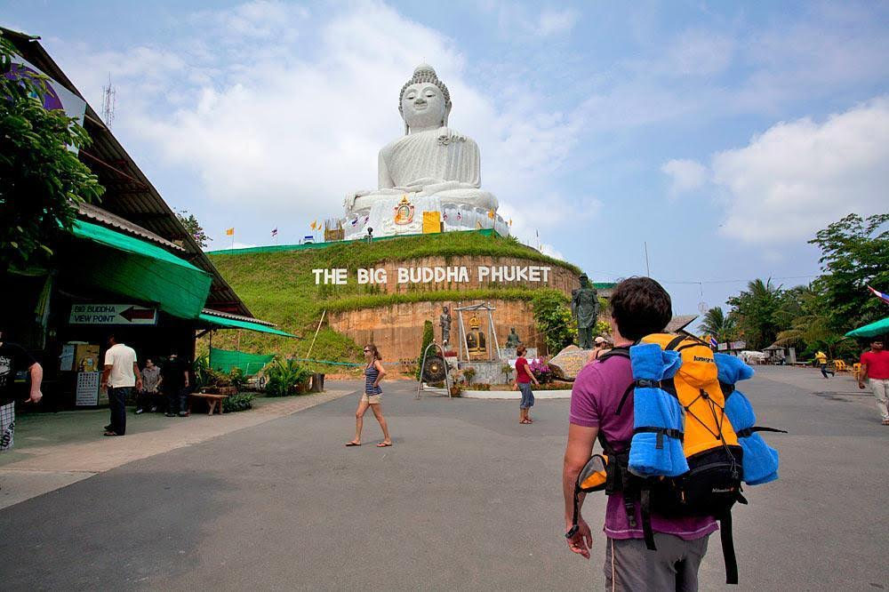
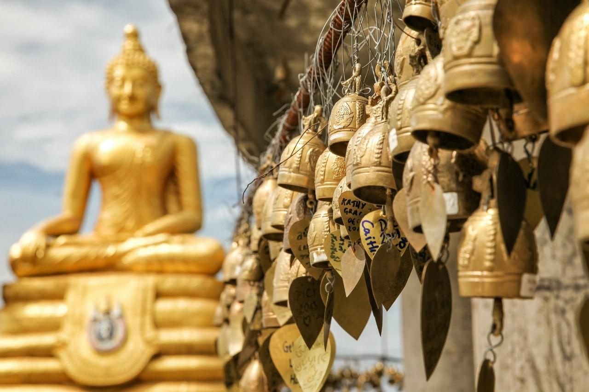
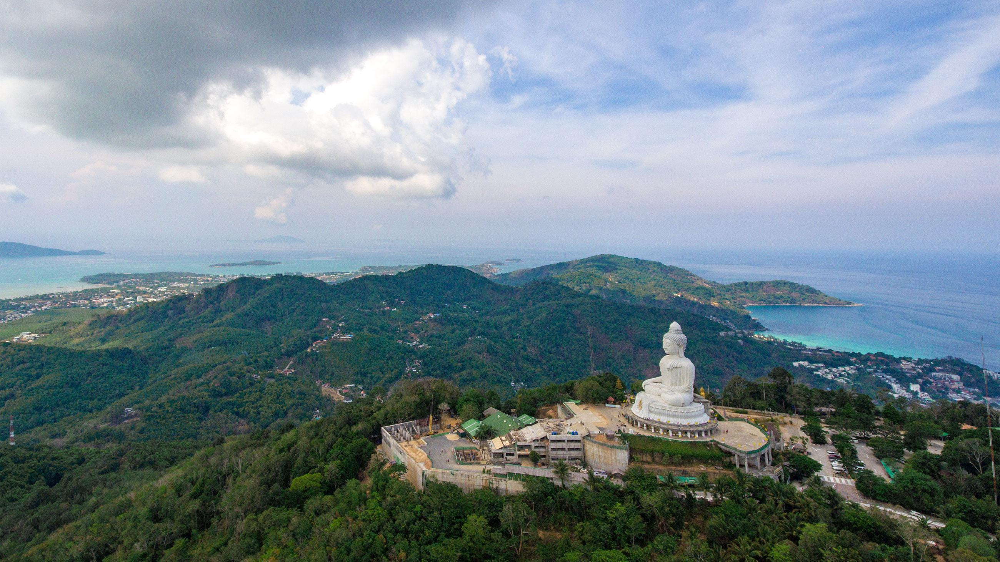

## Интересные факты

- Храм строится исключительно на пожертвованиях прихожан. А бюджет строительства составил 30 млн бат.
- По легенде храм построили на холме, где всю ночь медитировал Будда.
- Высота статуи 45 метров, а ширина 25 метров.

## Немного о достопримечательности

Высоко над островом Пхукет возвышается главный храм на острове — Ват Пхра Пхуттхамингмангкхол Акенакакхири или храм Большого Будды. Местные называют его Биг Будда. Храм примечателен своей огромной статуей Будды, построенный на вершине холма высотой больше 400 метров. Ее видно даже с другой стороны острова.

Территория храма состоит из трёх уровней: первый – общая территория с парковкой и сувенирными лавками, второй – храм и сад. Третий уровень – сама статуя Биг Будды.
Несмотря на то что храм начали строить в 2002 году, строительство еще не завершили. Поэтому заранее будьте готовы, что рядом с буддийской атмосферой и панорамными видами на остров, соседствует строительный мусор и бетонные блоки.

## Чем можно заняться

Можно получить благословение буддийского монаха, который завязывает веревочку-оберег на руку. Считается, что она защищает от бед и приносит удачу.

Еще можно загадать желание для себя или своих родных, написав его на специальной плитке, которая в дальнейшем будет установлена на фасад статуи. Большая плитка стоит — 300 бат, а маленькая — 100 бат.

Со смотровых площадок открываются отличные виды на весь остров, на море и некоторые удаленные островки. А если приехать за час до заката, сможете насладиться шикарным закатом солнца прямо в море.

## Информация для посещения

Храм работает с 9 до 19. Монах, который благословляет, работает до 18. Территория храма не ограждена, поэтому сюда можно приехать и позже.

Посещение бесплатное, пожертвование оставлять не обязательно.
До Большого Будды можно добраться самостоятельно на любом транспорте или экскурсией. А можно пешком из Карона, там находится пешая тропа. Можно ориентироваться на въезд в апартаменты Sea and Sky. Напротив есть табличка с направлением движения.

<iframe src="https://www.google.com/maps/embed?pb=!4v1607149515594!6m8!1m7!1sCAoSLEFGMVFpcE5nY0pXbDJFYWZQSWpqVHFiZlJ0cXVOVHBMdXFKXzZvX25mWHFr!2m2!1d7.827708200000001!2d98.312833!3f350.47868375259714!4f7.107371812078142!5f0.7820865974627469" width="680" height="450" frameborder="0" style="border:0;" allowfullscreen="" aria-hidden="false" tabindex="0"></iframe>
  

Не забываем про дресс-код, по территории храма нельзя ходить с голым торсом и с открытыми коленями и плечами. Для туристов без подходящей одежды предлагают бесплатно воспользоваться саронгом.
