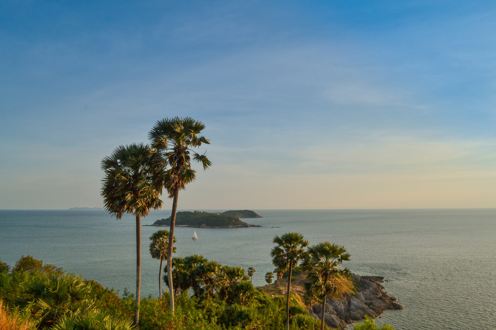

Когда можно посетить:  
**Круглосуточно**

Цена:  
**Бесплатно**

## Немного о достопримечательности

Мыс Промтеп — популярная обзорная точка, собирающая большое количество туристов, которые приезжают любоваться местными красотами и прекрасными видами. С холма открываются виды на острова Ко Ман и Ко Рача, бухты Най Харн, Януй, Равай и Ао Сан.

Тут хорошо развита инфраструктура, есть парковка, торговые павильоны, где торгуют всякой всячиной. Выше парковки расположена просторная площадь со скамейками и стационарными биноклями. Рядом находится маяк, башня с позолоченной верхушкой, на 1 этаже которого находится музей, а на 2 — панорамный вид с круговым обзором.

По тропинке можно спуститься непосредственно к мысу, побывать на самой южной точке острова, насладиться бескрайним морем и волнами, разбивающимися о скалы. Рекомендуем одеть удобную обувь и взять с собой репелленты.

## Информация для посещения

До мыса не ходит общественный транспорт, до ближайшей остановки примерно 2 км. Удобнее всего посетить мыс на арендованном байке, можно экскурсией, но время будет ограничено.