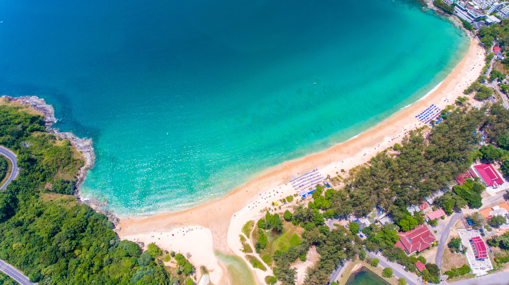
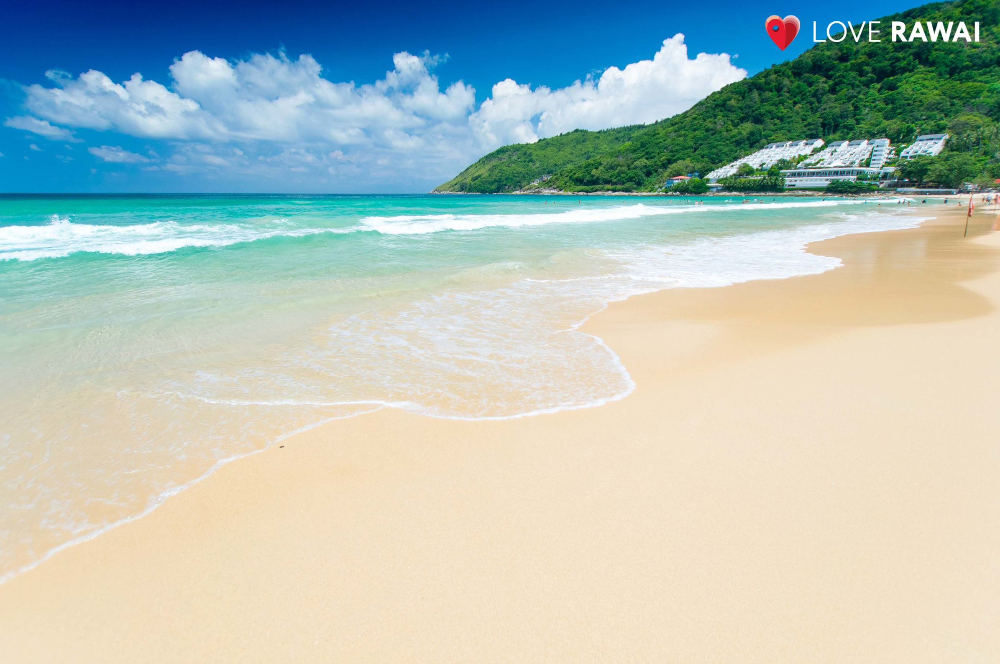
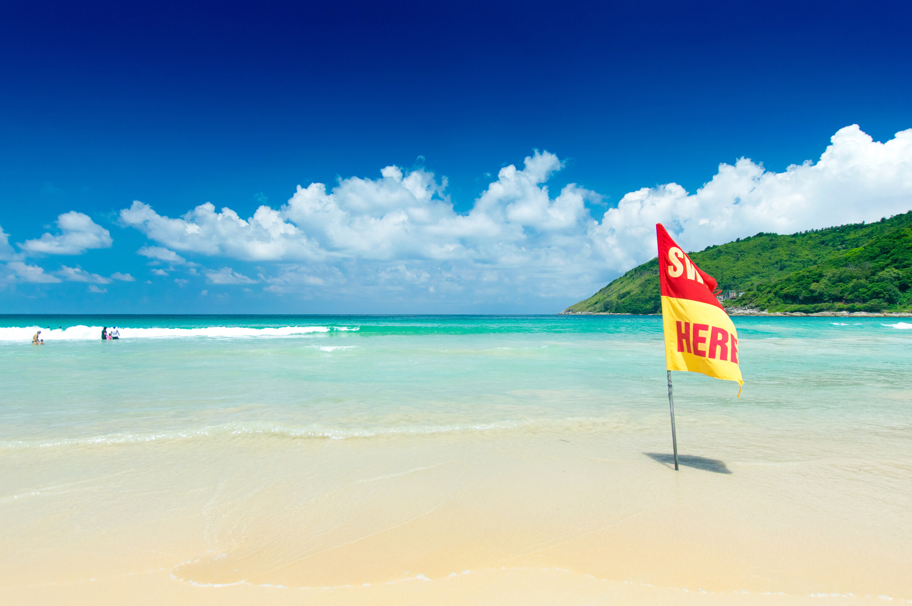
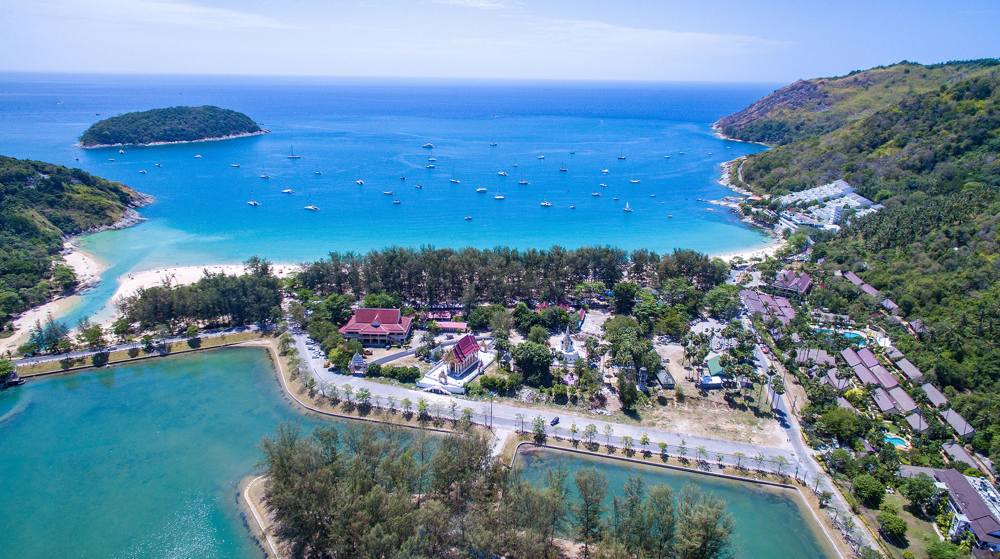

Когда можно посетить:  
**В любое время**

Цена:  
**Бесплатно. Лежак и зонтик 200 бат.**

## Немного о достопримечательности

Най Харн по праву можно назвать райским пляжем за свою девственную красоту и привлекательность. Благодаря буддийскому монастырю Wat Nai Harn, который не позволяет на своей земле строить отели, пляж сохранил свой очаровательный вид. Приятную атмосферу не нарушают ни шум мотора катеров, ни ночные клубы, ни прочие развлекательные заведения.

Пляж растянулся почти на 700 метров, ширина около 50 метров. Песок мелкий, бежевого цвета. Вход в воду плавный, волн зимой почти не бывает, а вода чистая и прозрачная.

С мая по октябрь поднимаются волны и появляются опасные обратные течения, их отмечают красными флажками и купаться там запрещено. В это время на пляже появляются серфингисты, можно взять доску в аренду и поучиться у инструкторов.

Най Харн закрыт с двух сторон холмами и утопает в зелени. C одной стороны построен отель, а с другой ветряная электростанция, где находится смотровая площадка. Также рядом с пляжем находится храм Wat Nai Harn и парк Най Харн с искусственным озером.

## Инфраструктура

На пляже много естественной тени, по желанию можно арендовать лежак с зонтом за 100 бат. Есть душ — 20 бат, туалет — 10 бат.