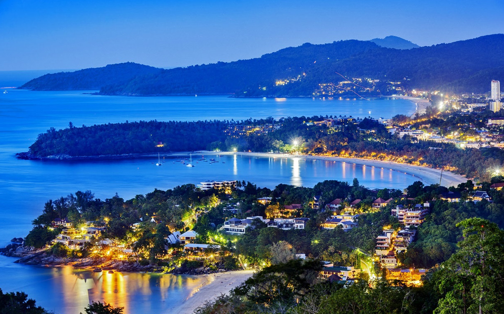
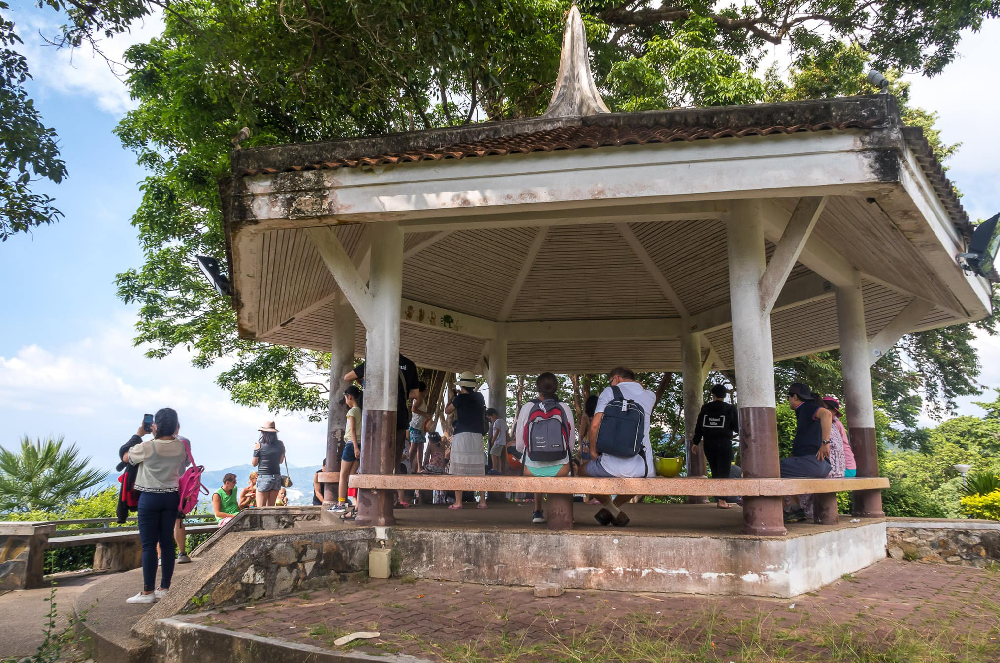

Когда можно посетить:  
**В любое время**

Цена:  
**Бесплатно**

## Немного о достопримечательности

Смотровая площадка Карон — самая знаменитая и посещаемая обзорная точка, одна из визитных карточек на Пхукете. С вьюпоинта открывается хороший вид на 3 самых популярных пляжа на острове.

<iframe src="https://www.google.com/maps/embed?pb=!4v1607106274682!6m8!1m7!1sCAoSLEFGMVFpcE5tRVJSYlJyb0oybms0NW9UVXIzSkYyS1YzMm5PSzBRakdoeFpN!2m2!1d7.797329299999999!2d98.302105!3f324.3795387293594!4f-0.9307772996092893!5f0.4000000000000002" width="680" height="450" frameborder="0" style="border:0;" allowfullscreen="" aria-hidden="false" tabindex="0"></iframe>
  

Место очень людное, сюда привозят туристов в рамках обзорных экскурсий, поэтому на холме обычно шумно и многолюдно. 
В ясную погоду завораживает цвет моря. Возле берега изумрудная вода просвечивает дно, восхищая своей чистотой, а подальше она синеет. И на горизонте море начинает сливаться с небом.

Вечером, благодаря своему местоположению Карон Вьюпойнт позволяет наблюдать красочные  закаты, когда солнце садясь прямо в море, солнце раскрашивает небо и облака в фантастические цвета, создавая оптические иллюзии.

После заката береговая полоса начинает светиться ночными огнями, позволяя лицезреть ночной город. А море быстро наполняется зелеными светлячками — это рыбацкие шхуны ловят кальмаров, их свет привлекает моллюсков.

## Инфраструктура

Смотровая площадка сделана в виде беседки, где можно укрыться от солнца, а вокруг расположен небольшой сад с многоуровневой дорожкой. Есть скамейки, туалет, фонари и стационарные бинокли.

В светлое время работают торговцы едой, напитками и сувенирами. Есть ресторан Heaven, где можно насладиться закатом, не толкаясь с китайцами. Недалеко находится кафе Small View Point.

## Информация для посещения

Обзорную площадку можно посетить в любое время, кафе Small ViewPoint работает с 9:30 до 22 часов. 

Чтобы насладиться видами в уединении, лучше приезжать до  9 утра.
Можно посетить самостоятельно на своем транспорте — парковка есть, можно в рамках обзорной экскурсии. Пешком подниматься в жару до обзорной точки будет утомительно, расстояние с Каты порядка 4 км.

## Видео
`video: https://youtu.be/ca6BzEwt66E`