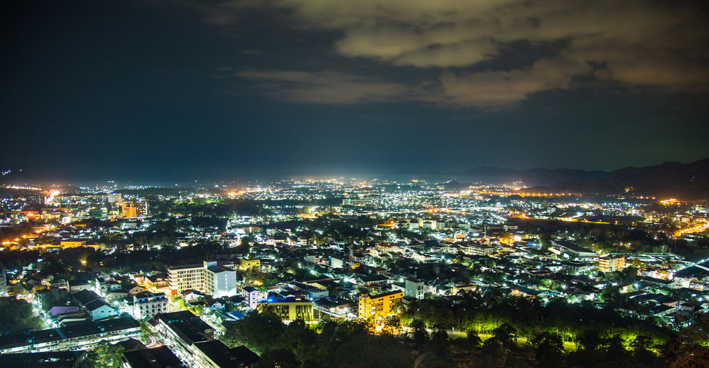

## Немного о достопримечательности

Холм Ранг Хилл небольшой, он ниже соседнего Манки Хилла, но с него открываются потрясающие виды. Сюда стоит обязательно заехать хотя бы по пути. Со смотровой площадки панорамный вид на город, а вдали видно Андаманское море. Часть вида закрывают густые джунгли, поэтому панорама лишь на 180 градусов. Для лицезрения заката лучше выбрать другие места, но зато отсюда можно наблюдать, как город погружается в сумерки, полюбоваться ночным городом и звездным небом. 

Тут можно отдохнуть от тропической жары в тени деревьев наслаждаясь прохладным ветерком. Территория облагорожена, но парковочное место маленькое. На площадке есть скамейки для посетителей, спортивные площадки и качели на большом баньяне. На вершине есть два ресторана с прекрасным видом: Tun Ka и Breeze. 

На холме можно встретить диких обезьян. Их можно покормить, но будьте осторожны, все-таки они дикие животные.

## Информация для посещения

Посетить можно в любое время, вход бесплатный. Если вы хотите поехать на машине, держите в голове, что парковка маленькая — мест может не хватить. Но если что, машину можно оставить ниже по склону. Смотровую площадку можно посетить в составе обзорной экскурсии по острову. На этом же холме есть храм Као Ранг. Туристов тут мало, в отличии от Биг Будды.

<iframe src="https://www.google.com/maps/embed?pb=!4v1607150705814!6m8!1m7!1sCAoSLEFGMVFpcE8wVlBkVzZvSmxLQzN6RjdjX0dkWG1lVkl4aFpzUjV2YXV4ZVpi!2m2!1d7.892387764050835!2d98.38023681094246!3f225.42473751195976!4f-2.1556488792544!5f0.7820865974627469" width="680" height="450" frameborder="0" style="border:0;" allowfullscreen="" aria-hidden="false" tabindex="0"></iframe>
  
