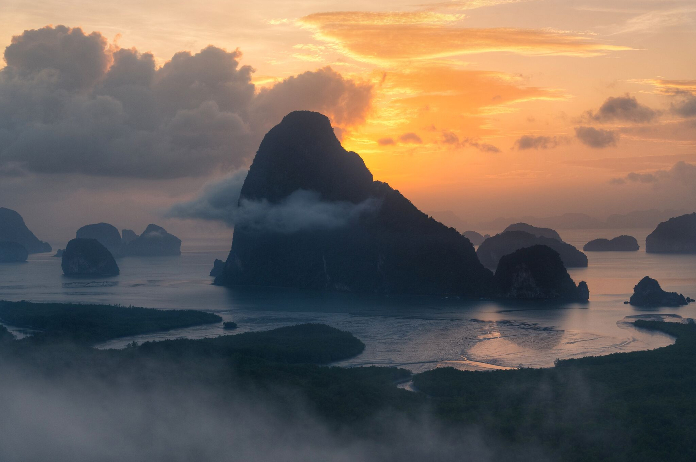

Когда можно посетить:  
**В любое время**

Цена:  
**30 бат**

## Немного о достопримечательности

Samet Nangshe Viewpoint — это смотровая площадка изумительной красоты. С него открывается вид на море и десяток островов необычной формы, а все вокруг утопает в зелени. Особенно красив пейзаж, когда за островами и морем встает солнце.

Это удивительное место в последнее время становится все популярнее и популярнее. Многие приезжают сюда с ночевкой, чтобы сначало насладиться закатом, а потом рассветом.

## Инфраструктура

На верхней площадке есть кемпинг, заночевать там со своей палаткой на 2 человек обойдется за 200 бат/сутки, арендовать палатку на 2 человек можно за 350 батов, на 3 человек — 450 бат.  В кемпинге есть нормальный туалет и душ, еще есть возможность зарядить устройства. Если такие условия не устраивают, недалеко есть отель.

Возле смотровой площадки есть кафешки и рестораны, где можно поесть с прекрасным видом.   

<iframe src="https://www.google.com/maps/embed?pb=!4v1607105555124!6m8!1m7!1sCAoSLEFGMVFpcE83TXRaLTA1QURJa3VSTzU2TlpucFU5ZVc5MUVHd2pJQUFSd1NN!2m2!1d8.238843!2d98.44561!3f20.30992194222616!4f0!5f0.7820865974627469" width="680" height="450" frameborder="0" style="border:0;" allowfullscreen="" aria-hidden="false" tabindex="0"></iframe>
  

## Информация для посещения

Самет Нангше находится в 25 км от Пхукета, добраться до него можно только на своем транспорте или экскурсией. 
Машину или байк придется оставить на парковке возле горы, дальше либо пешком заплатив 30 бат, либо на пикапе за 90 бат. Подъем тяжелый, особенно после дождя, поэтому многие предпочитают облегчить себе подъем.

Если не успеваете к рассвету, то лучше приезжайте ко второй половине дня, иначе солнце будет светить со стороны островов прямо в глаза и объектив фотоаппарата.