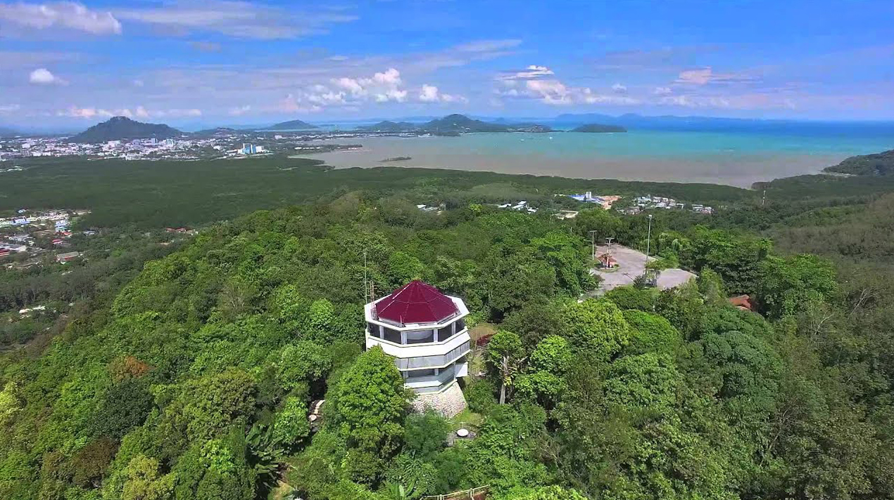
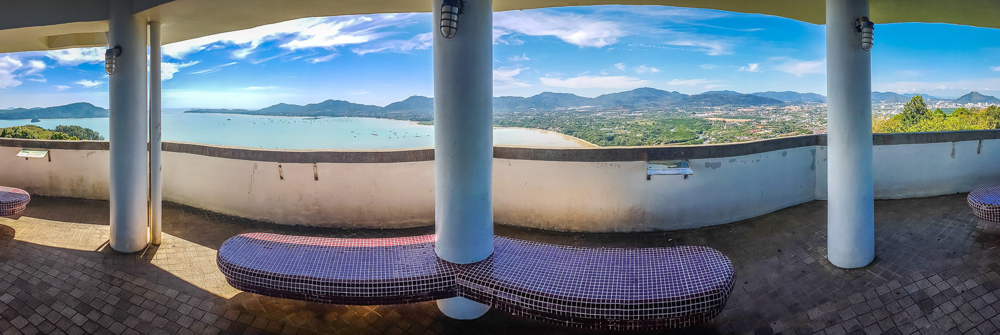
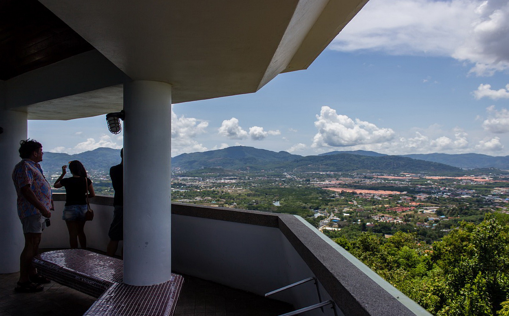
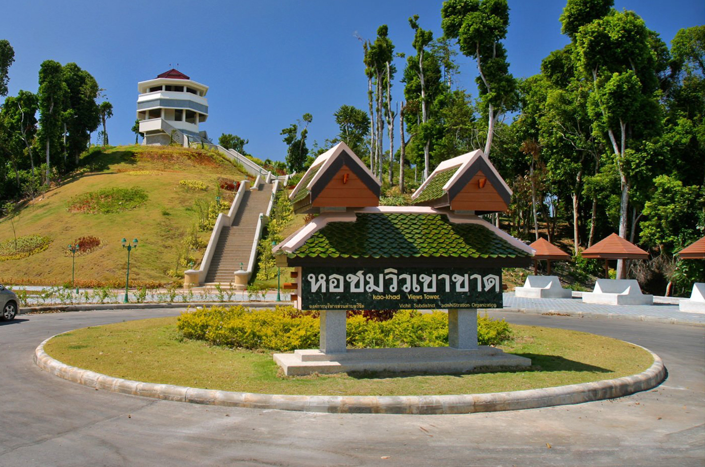

Когда можно посетить:  
**с 9:00 до 19:00**

Цена:  
**Бесплатно**

## Немного о достопримечательности

Смотровая башня Као Кхад (Khao Khad View Tower) — одна из самых лучших смотровых площадок на острове Пхукет. Ее главные плюсы в том, что обзор площадки на все 360 градусов, и в том что здесь малолюдно. Красивыми видами можно насладиться в тишине и спокойствии, под звуки природы.

Башня большая, в высоту 12 метров. Имеет 3 уровня, стоит она на высоком холме, поэтому обзору ничего не мешает — можно смотреть во все стороны.

Вид с башни шикарен, с высоты птичьего полета можно увидеть Пхукет-таун, мыс Панва и весь район Чалонг, посмотреть на небольшие острова близ Пхукета. А в ясную погоду можно рассмотреть вдалеке острова Пхи-Пхи и побережья провинции Краби. Внутри башни есть схема объектов, которые видны с обзорной точки — это интересно и познавательно, написано оно на 3 языках: Английский, Тайский и Китайский.

Као Кад чудесное место для встречи заката, здесь можно уединиться и с комфортом наблюдать заход солнца. Утром тут можно встретить рассвет, восход солнца не менее красив чем закат.

## Инфраструктура

Пусть Као Кад не популярна из-за своей удаленности, на удивление инфраструктура здесь хорошо развита. Есть туалет, парковка, сувенирные лавки. Территория облагорожена: зеленые лужайки, яркие цветочные клумбы и подстриженные кусты. Множество мест для пикника, оборудованы столы и скамейки. 

## Информация для посещения

Добраться сюда получиться только на своем транспорте или такси. Общественный транспорт и экскурсии сюда не ходят. Въезд в Khao Khad Views Tower разрешен с 9:00 до 19:00, если шлагбаум закрыт можно оставить транспорт возле него, а дальше пойти пешком, но подниматься придется по крутой дороге.