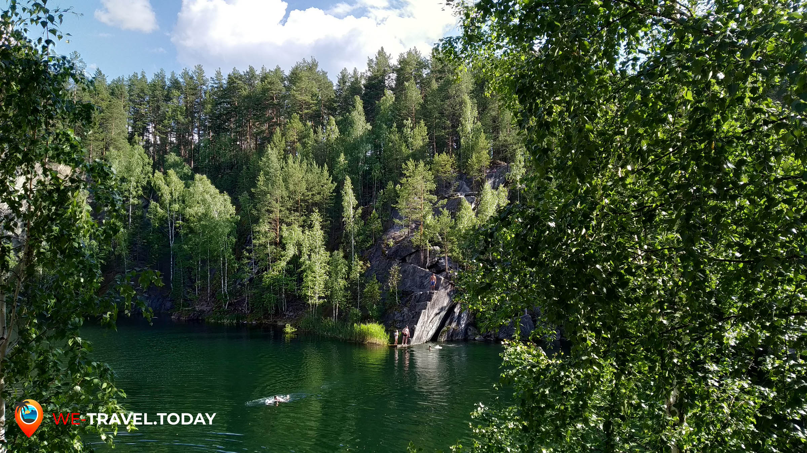
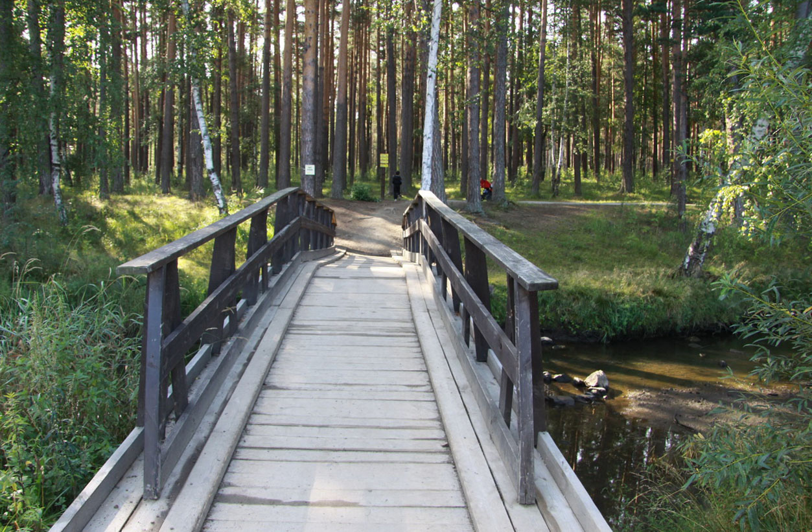
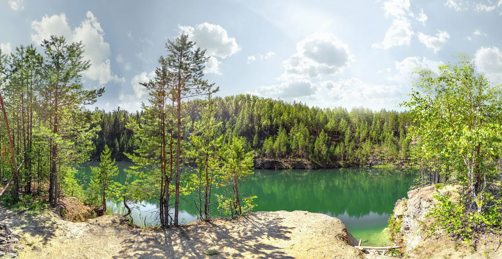
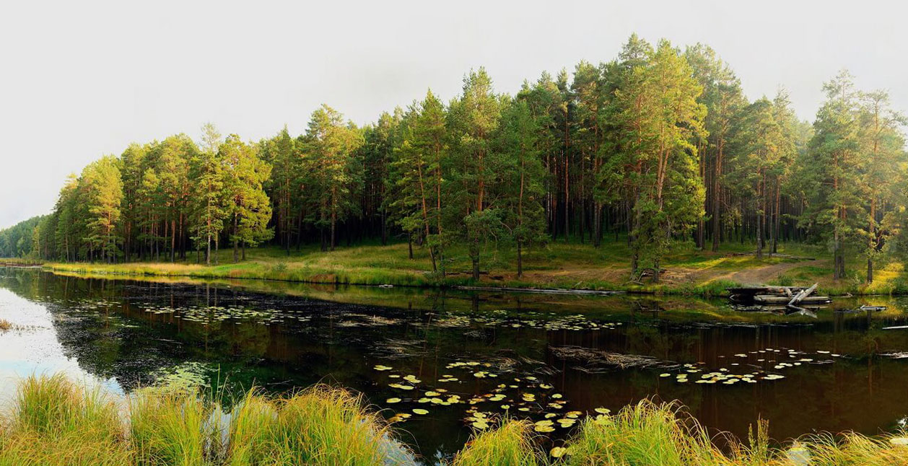

## Немного о парке
 «Бажовские места» – так называется природный парк в самом сердце Урала. И неспроста – «Бажовские места» и вправду уникальны своими флорой и фауной, что вмещают в себя известные по всей Свердловской области памятники природы – и самым известным из них является обрамленное скалами озеро – Тальков камень. Это место может особенно понравится любителям подводного плавания и неспроста – в озеро можно с легкостью погрузится на 6 метров, изучив подводную жизнь природного парка. Фанатов исторических мест могут увлечь индустриальные развалины железнодорожного завода, заброшенные карьеры по добыче руды, а экотуристы с нескрываемой радостью взглянут на величественные скалы, густую листву леса и солнечных зайчиков, прячущихся в пешеходных тропинках.

 

Природный парк «Бажовские места» – особо охраняемая территория областного значения, расположенная в городе Сысерти и идеально подходящая для экотуризма. Живописные пейзажи нетронутой природы, свежепротоптанные дорожки, ароматы хвоистых деревьев и мха, древние породы камней, застывшие в самом причудливом танце – именно в этом освещенном красотой месте можно найти тишину и умиротворение, отдохнуть от знойной городской жизни и внести свой вклад в сохранение окружающей среды и природного наследия Среднего Урала.

В сомкнутых лесах «Бажовских мест» можно отыскать редкие виды растений (венерин башмачок), лекарственные (алтей, боярышник) и степные травы (ковыль, василек сибирский). Любите приключений могут зайти глубже в лес и попытать удачу для встречи с косулей, кабаном и огромным количеством певчих птиц. Также в лесу обитают медведи и волки, что делает некоторые природные сезоны опасными для посещения.

## Стоит посмотреть!
Парк «Бажовские места» занимает одно из первых мест по посещаемости туристами. В большей степени он интересен своими историческими и природными памятниками, но это лишь малая часть от предложенного! Поклонники экологичного туризма обожают это место за разнообразие пеших маршрутов – большого и малого круга, уроки выживания в лесу, услуги театрализованных или просветительских экскурсий. Обычным туристам без опыта в лесных прогулках обязательно приглянуться прогулки на конях, отдых на берегу озера с палатками и готовкой на природе. Младшему поколению также есть, чем себя занять – детишки очень любят здешние мастер-классы, где создаются поделки из каменных пород и минералов.

 

«Бажовские места» – за экологическое просвещение! Администрация парка регулярно организовывает проекты по сохранению разнообразия природы, новым способам природопользования. Такие мини-курсы рассчитаны на посетителей всех возрастов и уровня знаний.

## Информация для посещения
Природный парк «Бажовские места» находится в 50 км от Екатеринбурга, рядом с городом Сысерть.

Администрация природного парка находится по адресу: г. Сысерть, ул. Тимирязева, 68-А. Часы работы: будние дни 9:00-17:30, СБ–ВС – выходной.

В природном парке можно не только прогуляться (прокатиться) и сделать свежий глоток воздуха, но и остаться наслаждаться природой под звездным небом даже на несколько ночей! Парк «Бажовские места» предлагает платные услуги экскурсий, аренды палатки, средств передвижения и бани.

У парка «Бажовские места» имеется собственный [веб-сайт](http://www.bm-park.ru/). Перед посещением рекомендуется ознакомится с «Правилами посещения» и «Режимом природоведения».

`video: https://youtu.be/xPgrxRdGGe0`

## На карте