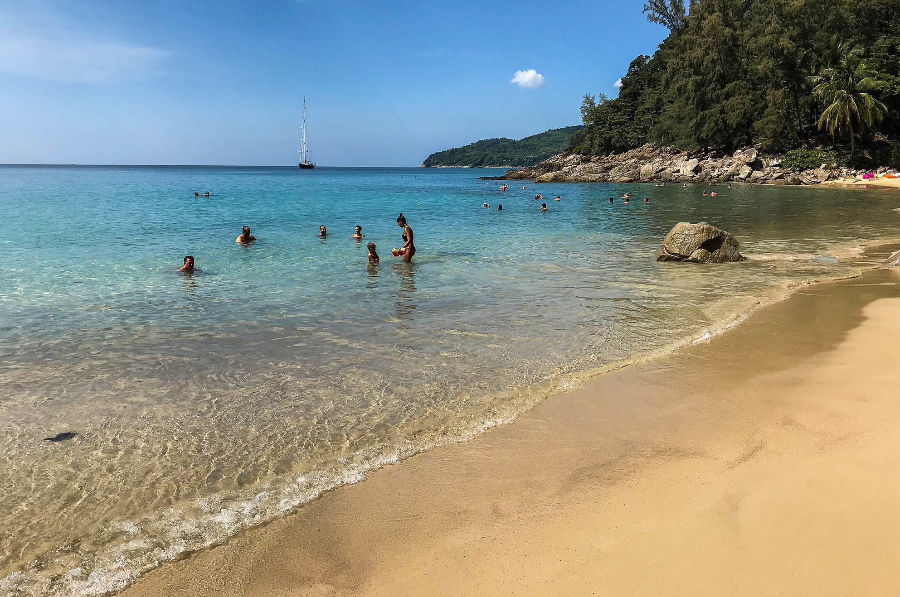
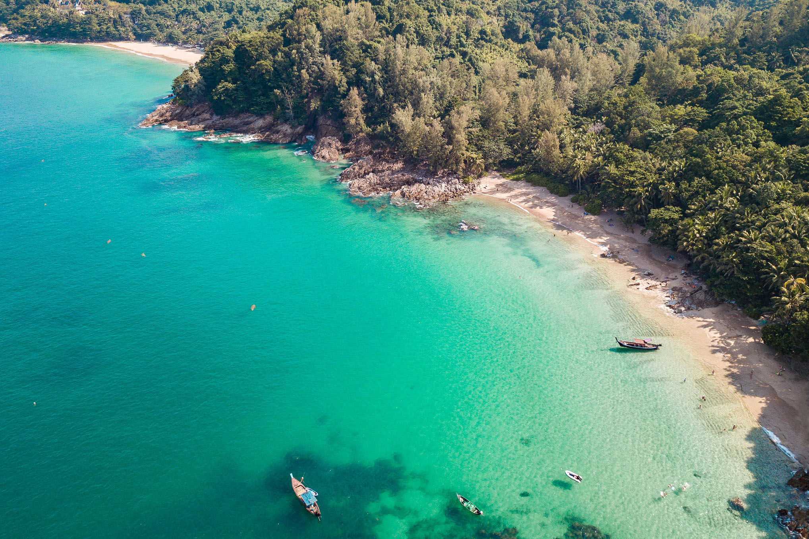
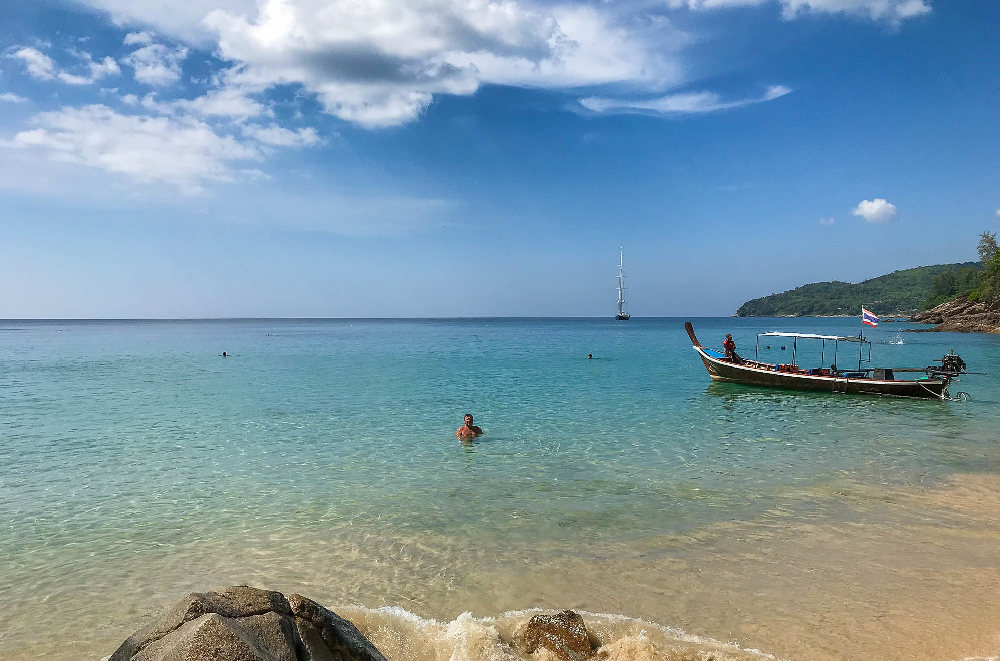
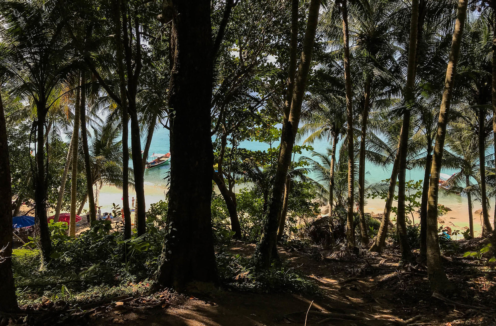

## Немного о достопримечательности
Райский пляж Банана (Banana Beach) долгое время был секретным пляжем ценителей девственной красоты и уединения, скрытый скалами и джунглями. Эти времена прошли, теперь Банана Бич стал очень популярным.

Пляж хорошо подходит для пляжного отдыха: чистая изумрудная вода, ровный вход в воду. По центру пляжа нет камней и кораллов, но ближе к краям пляжа они появляются и ходить не получится. Зато отличное место для снорклинга.

В высокий сезон поднимаются волны, только если ветер попутный. В сезон дождей море беспокойно как и в остальных пляжах. Волны начинают вымывать песок и образовывать полуметровые обрывы на границе прибоя.

<iframe src="https://www.google.com/maps/embed?pb=!4v1607151417176!6m8!1m7!1sCAoSK0FGMVFpcE0tU3Y3TVBSekhueFlnbHBNcm5xRW4yY3NyNTlLODB3LXBGX0U.!2m2!1d8.0418057!2d98.2764706!3f281.3291815878809!4f1.7324882331119795!5f0.7820865974627469" width="680" height="450" frameborder="0" style="border:0;" allowfullscreen="" aria-hidden="false" tabindex="0"></iframe>
  

Благодаря сохраненным джунглям, до обеда тени доходят почти до воды, позволяя укрыться от палящего солнца. Но после обеда укрыться от солнца будет тяжело. Лежаков и зонтов на пляже нет, их убрали по распоряжению администрации острова, поэтому все отдыхающие привозят с собой полотенца и коврики.

## Инфраструктура 
На пляже инфраструктуры почти нет. Есть небольшое кафе, цены высокие, но кормят вкусно, и есть душ из пресной воды. Есть прокат пляжного инвентаря.

 
## Информация для посещения
Попасть на Banana Beach можно если ехать на север от пляжа Банг Тао в сторону пляжа Найтон. Тропа на спуск будет после перевала, найти ее можно по припаркованным машинам и байкам и по указателю. 

`video: https://youtu.be/cwpT3LYTZdQ`