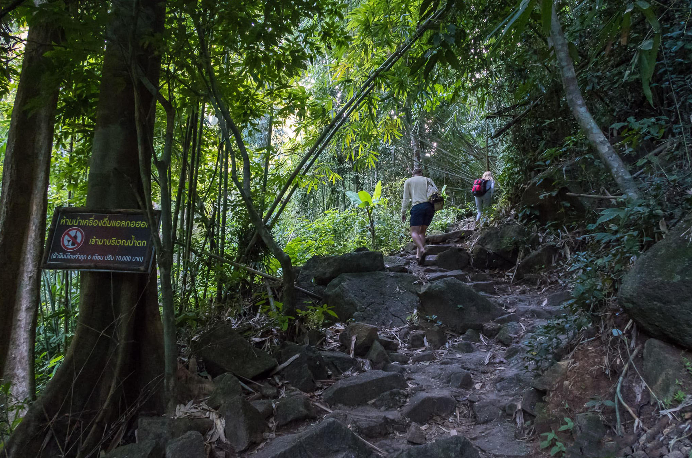

Когда можно посетить:  
**Ежедневно 08:00 – 18:00**

Цена:  
**Взрослые 200 бат, дети 100 бат**

## Немного о достопримечательности
Водопады на юге Таиланда небольшие, Панг Пэ пусть и крупнейший на острове, но в высоту он всего 15 метров. Поэтому посещение водопада лучше воспринимать как прогулку по джунглям, с небольшим бонусом в виде водопада и купания в пресной воде.

С мая по октябрь, в сезон дождей водопад выглядит красивее и мощнее. А с ноября по апрель теряет свою мощь и превращается в ручей, падающий с отвесной скалы.

Зато джунгли восхищают и очаровывают своей атмосферой и девственной красотой. Птицы поют, на камне сидит ящерица, возле воды квакают лягушки, а рядом пролетает большая бабочка с размахом крыла под 10 см. Тропа довольно простая, выложена из камней, а по пути будут встречаться заводи, где можно искупаться. Протяженность у дорожки небольшая, до водопада идти примерно 10 минут.

Если хотите маршрут длиннее, можно посетить водопад Тон Сай, второй по величине водопад на Пхукете. До него ведет тропа посложнее, длиной примерно в 3 км. Входной билет действует в течения дня, поэтому за один билет можно посетить оба водопада.

<iframe src="https://www.google.com/maps/embed?pb=!4v1607153668179!6m8!1m7!1sCAoSLEFGMVFpcE9maUxoUEI4elZ6TVYzMXJmQS1UQVJWRW5nYzZqUDViTjJRWUpn!2m2!1d8.0384498!2d98.3902935!3f256.89813717302906!4f-13.736638670813306!5f0.4000000000000002" width="680" height="450" frameborder="0" style="border:0;" allowfullscreen="" aria-hidden="false" tabindex="0"></iframe>
  

 
## Информация для посещения
Вход в заповедник стоит 200 бат для взрослых и 100 бат для детей,но вечером ближе к 17:00 касса закрывается и можно пройти бесплатно. Вечером и меньше народа и прохладнее.

Возьмите с собой достаточно воды и еды, в заповеднике их не купить, только на входе продают воду, снеки, смузи, и работает кафе.

Если вы приехали сюда искупаться — соблюдайте приличия. Здесь часто отдыхают местные, среди них много мусульман, откровенные наряды девушек могут вызывать у них возмущение.

По пути на водопад можете заглянуть на слоновью ферму, покормить и покататься на слонах, и пожертвовать любую денежную сумму в реабилитационный центр гиббонов.

 
`video: https://youtu.be/jhl9i8Jmk7Q`

`video: https://youtu.be/tpabSFlfi7g`