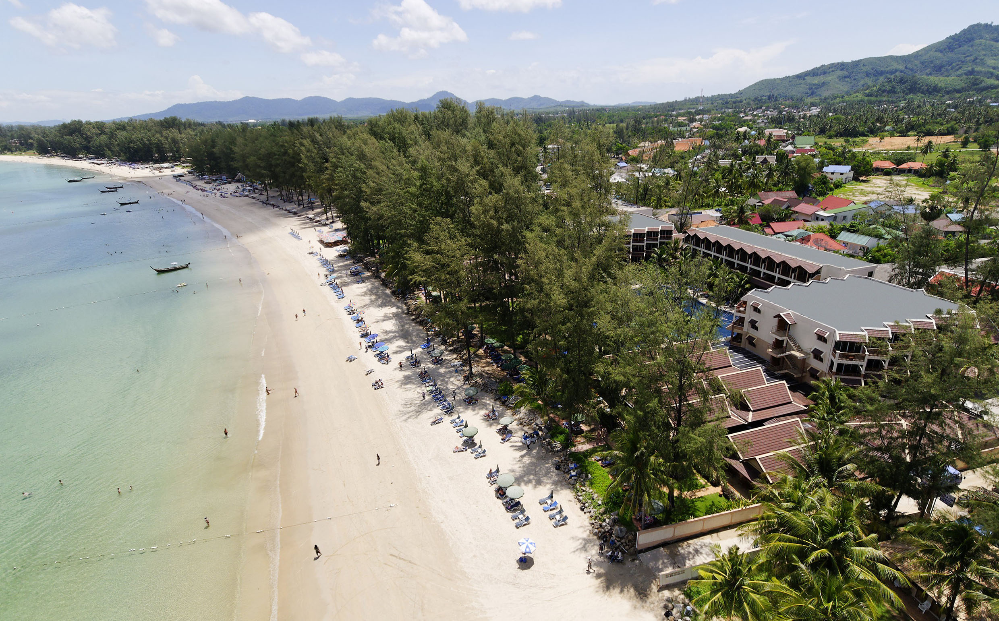
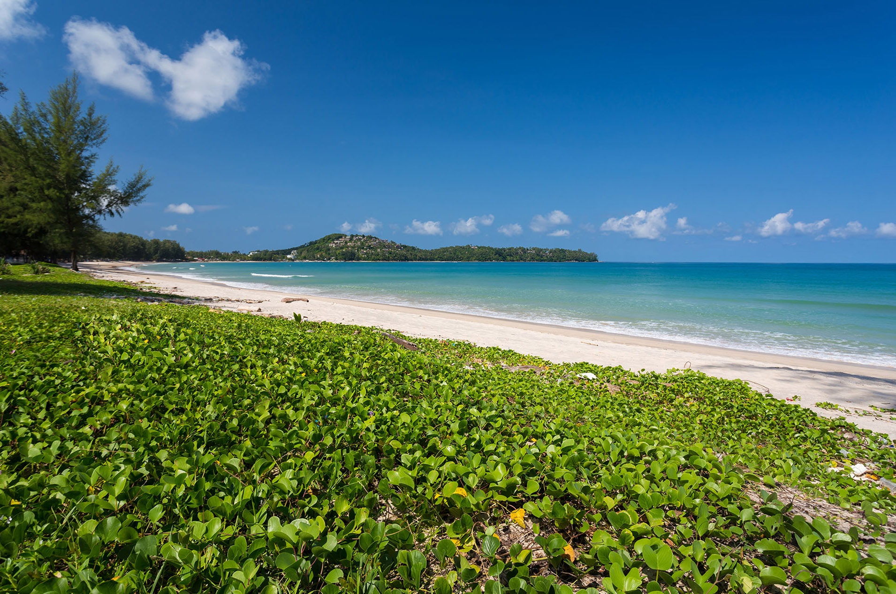
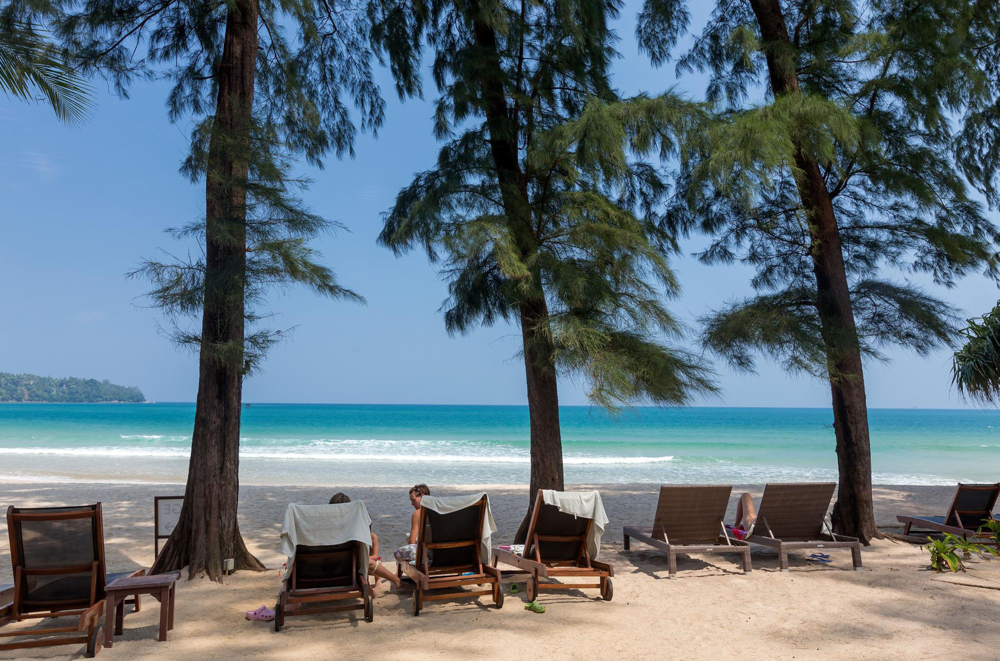

Когда можно посетить:  
**В любое время**

Цена:  
**Бесплатно. Лежак и зонтик 100 бат.**

## Немного о достопримечательности
Пляж Банг Тао растянулся серпом на 7 км, и почти по всей ее длине растет казуариновая роща и изредка пальмы возле отелей. Атмосфера на пляже тихая и умиротворяющая, людей почти нет.

Песок на пляже бежевого цвета, напоминает ржаную муку. Вода чистая и прозрачная, в солнечную погоду окрашивается в бирюзовый цвет. Вход в воду пологий, а дно хорошее — нет камней и кораллов. В высокий сезон пляж регулярно чистят от мусора, но летом никто не убирается, и мусор накапливается.

В высокий сезон море обычно спокойное — штиль, даже если на других пляжах неспокойно. Но с мая по октябрь бушуют сильные волны, купаться очень сложно, зато благодать для серфингистов. 

Схема приливов и отливов тут сложная, зависит от времени года. Во время отлива чтобы поплавать придется пройти метров 50, а во время приливов вода закрывает большую часть пляжа.

На юге пляжа, возле мыса, стоят на якоре рыбацкие лодки, там море не очень чистое. 
Большинство людей купаются возле отелей, в остальных местах людей почти нет, как и нет инфраструктуры.

 
## Инфраструктура 
К сожалению, из-за расположения пляжа большая часть тени от деревьев исчезает уже к 11 утра, становится жарко. Возле пляжного клуба Bliss Beach Club можно арендовать лежак с зонтом, при желании можно договориться купить напиток и получить лежак бесплатно.

Инфраструктура лучше развита в южной части пляжа, там недалеко есть магазин 7/11, кафе, массажные салоны и т.д. 

На Банг Тао можно найти весь широкий спектр водных развлечений, от катания на бананах до парасейлинга и дайвинга.

`video: https://youtu.be/ebBFyNamVbg`