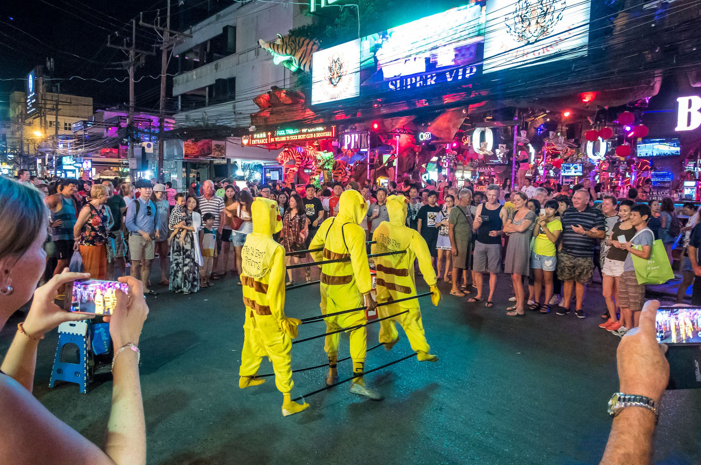
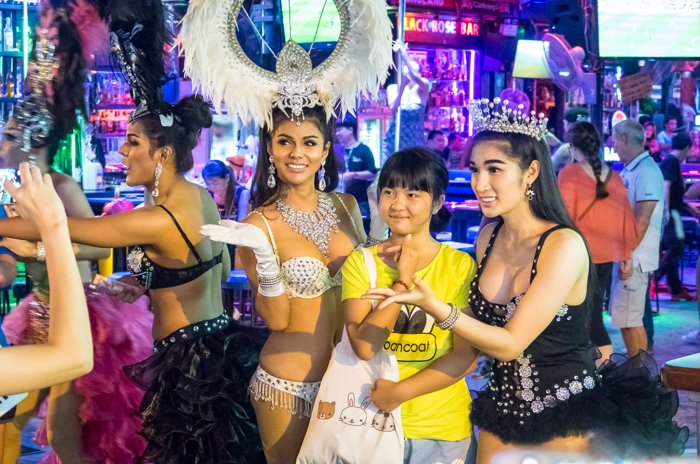

Когда можно посетить:  
**Ежедневно 18:00 – 06:00**

Цена:  
**Бесплатно**

Возрастное ограничение:  
**18+**

## Немного о достопримечательности
Бангла Роуд в Патонге — это знаменитая улица разврата, трансвеститов и развлечений для взрослых. Такие улицы есть в каждом курорте Тайланда. Бангла Роуд по масштабам уступает только Walking Street в Паттайе.

Днем эта улица ничем не примечательна, закрытые рольставни на окнах и дверях зданий, работают всего несколько кафешек и магазинов. Зато после заката Бангла Роуд преображается: повсюду горят разноцветные огни, везде играет музыка, вокруг огромное количество людей гуляют, танцуют, фотографируются с трансвеститами, смотрят шоу фокусников, заходят в бары и на эротическое шоу.

Пинг-понг шоу, гоу-гоу бары и трансвеститы — это визитная карточка улицы. Многие туристы приезжают в Тайланд чтобы вкусить этот запретный плод, окунуться в эту атмосферу разврата и взрослых развлечений. 

Сама по себе улица короткая, но в ней около 10 переулков заполненных всевозможными ночными заведениями. 

 
## Информация для посещения
Ежедневно после 18:00 улица начинает свое преображение и ее пик приходится примерно в полночь.

Будьте осторожны с трансвеститами, у них вспыльчивый характер, они нередко фигурируют в новостях о драках, избиениях и ограблениях туристов. Никогда не связывайтесь с драг дилерами, они просто на вас донесут и позже получат долю от вашего откупа, размер которого превышает бюджет вашего отпуска раза в два.

`video: https://youtu.be/7ZTtUZYJMWQ`
