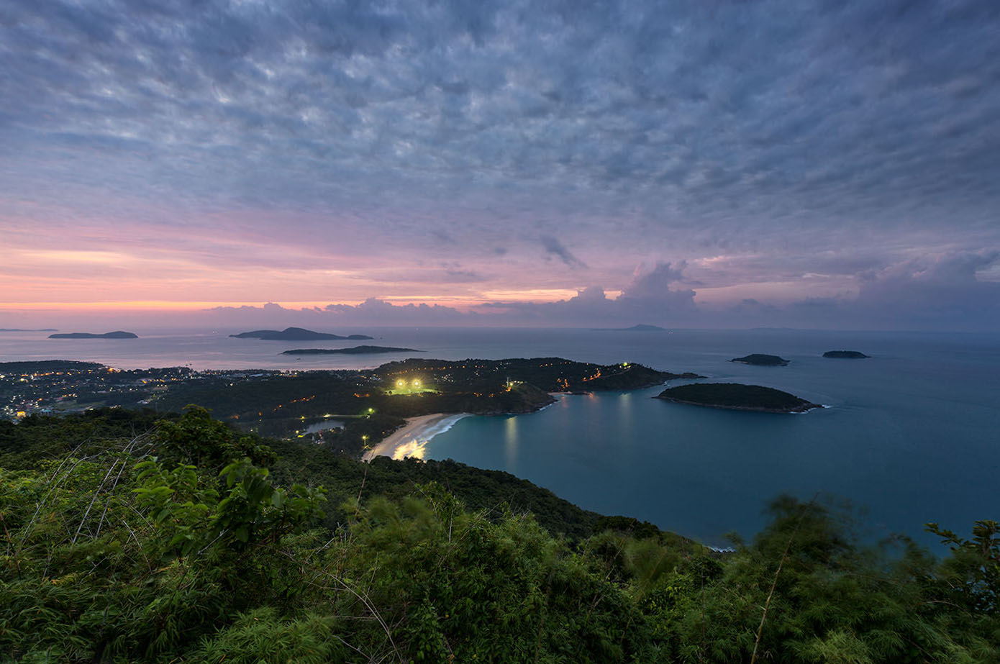
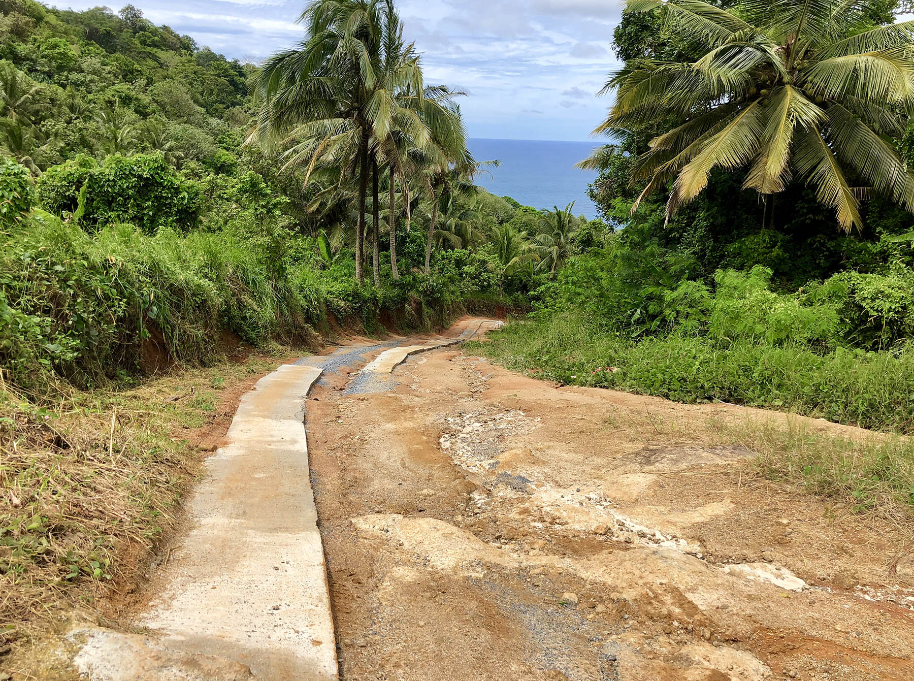

Когда можно посетить:  
**В любое время**

Цена:  
**Бесплатно**

## Немного о достопримечательности
Black Rock Viewpoint — это малоизвестная смотровая площадка, но ее красота с легкостью посоревнуется с другими смотровыми точками Пхукета. Здесь вряд ли вы встретите еще кого то — только природу, ее тишину и прекрасный вид. Благодаря этому это одна из лучших смотровых на Пхукете.

Отсюда открываются классные виды на пляж [Януи](https://we-travel.today/tajland/phuket/plyazh-yanui/) и [Най-Харн](https://we-travel.today/tajland/phuket/plyazh-naj-harn/), хорошо видна самая южная точка острова — [Мыс Промтеп](https://we-travel.today/tajland/phuket/mys-promtep/). Рядом с мысом расположились острова Бон, Коралловый и Рача-Яй.

Высота Черный скалы около 290 метров над уровнем моря. Пусть не самая высокая гора Пхукета, но все равно выше многих других смотровых площадок. С Черной скалы вы увидите как выглядит [смотровая площадка Ветряки](https://we-travel.today/tajland/phuket/smotrovaya-ploshadka-vetryaki/) сверху.

 
## Информация для посещения
Инфраструктуры на смотровой площадке никакой нет, добраться можно только на такси или на своем транспорте. 

Не так давно привели в порядок дорогу до Черной скалы, повесили указатели. Благодаря этому здорово облегчили доступность достопримечательности.

Чтобы добраться до Black Rock Viewpoint, нужно ехать по дороге ведущей к частному пляжу Нуй, на перекрестке ведущей вниз к пляжу свернуть налево. Возле указателя можно оставить транспорт и по тропе подняться к скале. Дорога наверх занимает примерно 10 минут в спокойном темпе. Обувь лучше одеть удобную.

`video: https://youtu.be/-GQfO__03D0`

