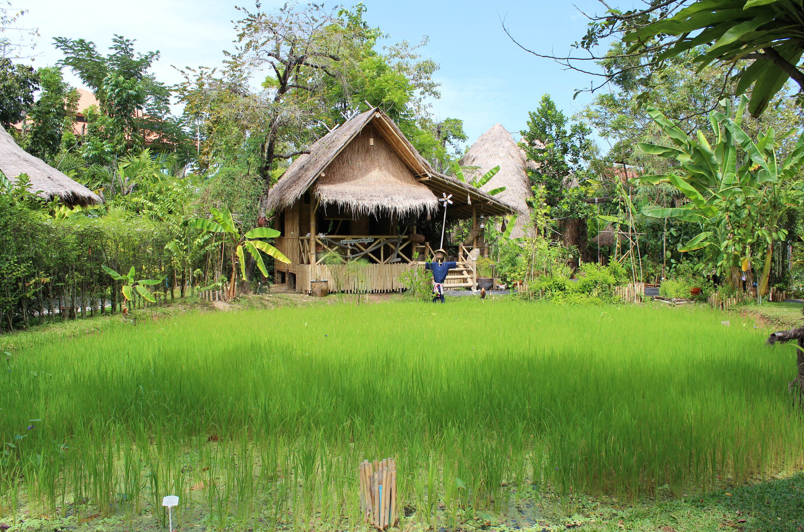
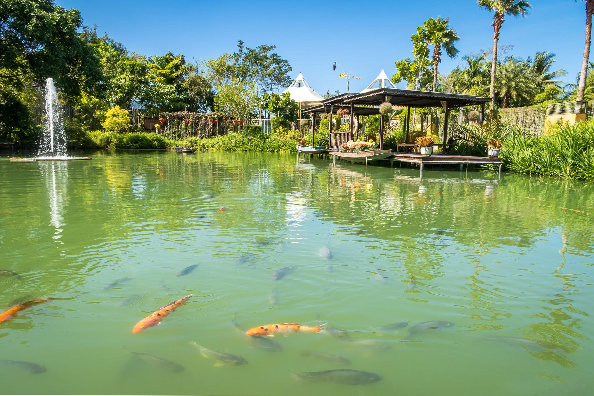
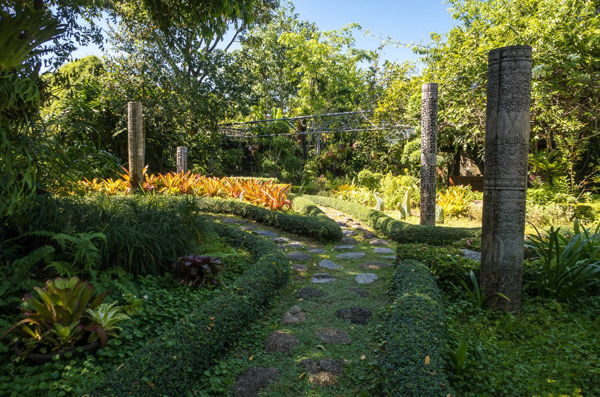

## Немного о достопримечательности
Ботанический сад Пхукета — это тропический сад на открытом воздухе. Phuket Botanic Garden разделен на 20 тематических зон и занимает около гектара земли.

Выход и вход в сад находятся в разных местах, поэтому все посетители двигаются в одну сторону и не мешают друг другу. Благодаря этому создается атмосфера уединения и спокойствия. А тихая и спокойная музыка добавляет настроение созерцать. 

Каждая тематическая зона разделена и оформлена с определенным стилем. В фруктовом саду сможете увидеть, как растут экзотические фрукты. Есть рисовое поле рядом, с которым расположена крестьянская тростниковая хижина. В саду японского стиля растут деревья бонсай и разные композиции из камней. В китайском — маленькие водоемы с лотосами и кувшинками. 

У ботанического сада есть свое атмосферное кафе, а рядом расположен пруд с рыбками Кои, которых можно покормить за 20 бат.

Тут есть и отель Phuket Botanic Resort, прекрасный ночлег для любителей природы и экзотики. Окна и двери некоторых бунгало выходят на пруд с рыбками. После 17:00 весь сад в полном распоряжении постояльцев.

Есть небольшой музей, где можно посмотреть изделия ремесленников, но экспонатов маловато. 

Ботанический сад Пхукета чудесное место, стоит хотя бы раз его посетить. Из плюсов: великолепное художественное оформление, приятная атмосфера. Из минусов: высокая цена и обилие комаров, берите с собой репелленты. Еще в некоторых последних отзывах отмечают неухоженность и запущенность сада.

 
## Информация для посещения
В конце пути, возле выхода, находится сувенирная лавка.

Билет в Ботанический сад Пхукета стоит 500 бат для взрослых, 300 бат для детей ростом от 90 до 110 см. График работы — с 9 утра до 17:00.

До сада можно добраться как самостоятельно, так и в составе экскурсии. 
 
`video: https://youtu.be/SlfgUJ-vnjM`
