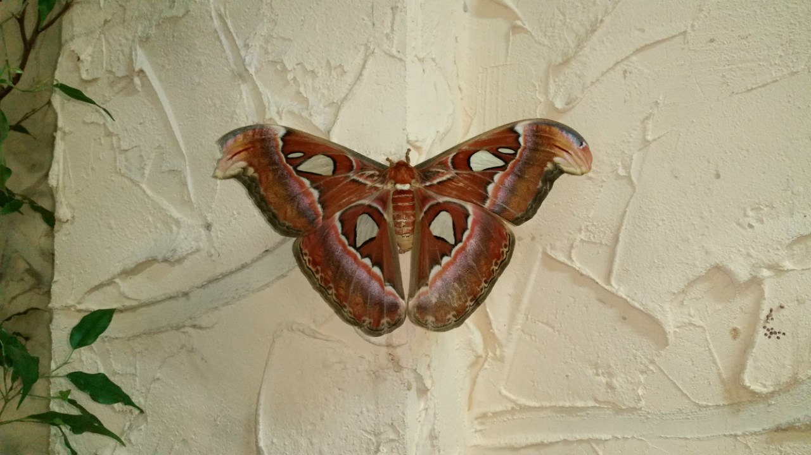
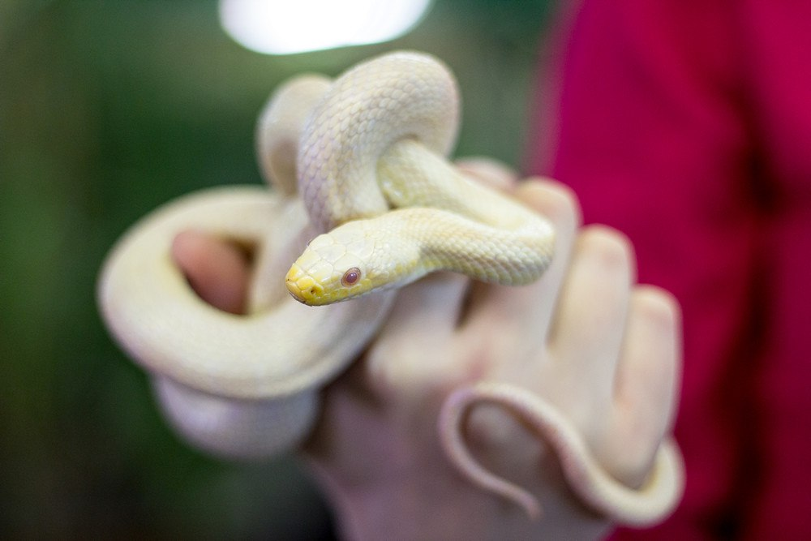
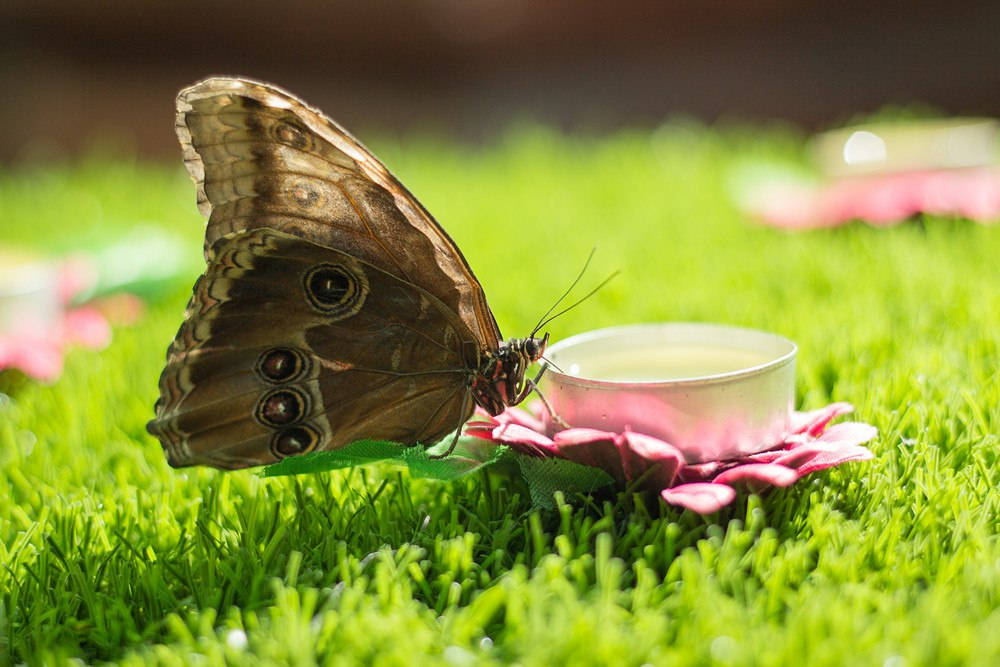
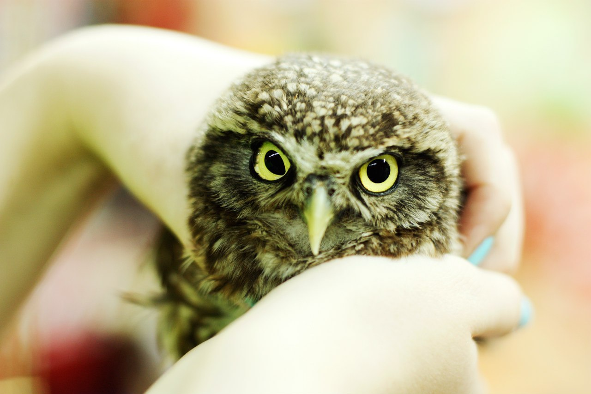
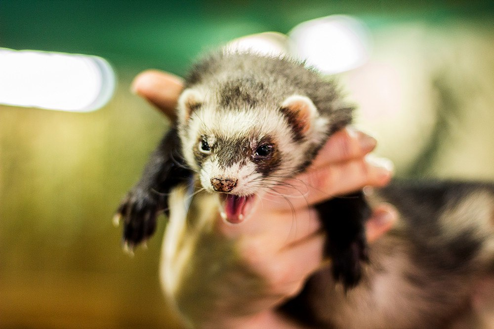

Когда можно посетить:  
**Ежедневно, с 10:00 до 20:00 без перерывов**

Цена:  
**Билет 250 руб., дети до 1 года и именинники – бесплатно.**

## Содержание
1. [Немного о достопримечательности](#немного-о-достопримечательности)
2. [Стоит посмотреть!](#стоит-посмотреть)
3. [Информация для посещения](#информация-для-посещения)

## Немного о достопримечательности
В самом центре Екатеринбурга расположилась уникальная достопримечательность – Контактный зоопарк «Парк бабочек», отличающаяся своей специфической направленностью – выращиванием и содержанием самых редких, экзотических бабочек в свободном для посетителей инсектарии. 

Куколки будущих красавиц доставляют в парк прямиком с далеких Филиппин, ждут их естественного рождения на свет в специально оборудованном для этого инкубаторе, а после выпускают на волю, бережно разложив дольки апельсина по периметру инсектария. В свободном полете над своей головой можно встретить бабочек Монархов, огромных Павлиноглазок и красивейших бабочек Морфо – насекомых с самым завораживающим лазурным оттенком крыльев. Также в «Парке бабочек» содержится целая коллекция из уже высушенных бабочек – их можно приобрести в кассе парка за сумму от 300 до 2 тыс. рублей.

Контактный зоопарк «Парк бабочек» – не только про бабочек! Любителей скачущей и ползающей живности может порадовать отделение «Трогательного зоопарка» – места, где обитают сурикаты, большие черепахи, умнейшая мартышка, австралийские эму, необычные китайские петухи, козлята и индюки. Всех их можно трогать, тискать и гладить животики (особенно это любят ежики). В террариумной зоне содержаться пресмыкающиеся, пауки и приученные к рукам змеи – да, да, змей здесь можно подержать на руках и сделать в обнимку с ними прекрасные фотографии. Королевой террариумной зоны является игуана Годзи – живет она отдельно от остальных, очень дружелюбна и любит позировать. Детям и взрослым обязательно понравится молочная змейка, удав, хамелеон, коллекция живых плотоядных пауков, прячущиеся в листве жуки-палочники и лягушка-водонос Клава.

## Стоит посмотреть!
«Парк бабочек» отлично подходит для семейного досуга. Дети просто обожают общаться с животными на близком расстоянии, гладить и обнимать их. У каждого питомца есть свое имя, в зоопарке за ними ухаживают и чистят домики. В «трогательном» зоопарке можно встретить свободно разгуливающих петухов и козликов – все они безобидные и подходят к посетителям только за сладкой морковкой. Более взрослым людям будет интересно узнать много нового про животных – в контактном зоопарке можно заказать экскурсию или же просто попросить сотрудника зоопарка немного рассказать про здешних обитателей. Если никогда прежде не держали в руках змею – добро пожаловать в «Парк бабочек»!

В контактном зоопарке «Парк бабочек» проводятся романтические вечера с 20:30 до 23:00 каждый день. На это время администрация предоставляет посетителям всю территорию парка, выпускает бабочек и приглушает свет. Что может быть лучше свидания, проведенного почти на лоне дикой природы? Цена от 5 тыс. рублей, шампанское и музыка прилагаются. Также возлюбленные могут попытать счастье на «Скамье удачи», находящейся в самом центре террариума с бабочками – именно на этой скамье есть большая вероятность, что бабочка сядет и коснется посетителей, ведь она вся окружена свежей зеленью и переспелыми фруктами.

Контактный зоопарк в большей мере рассчитан на детскую аудиторию, поэтому «Парк бабочек» самостоятельно проводит анимированные детские Дни Рождения для больших и шумных компаний. В мероприятие включают контактное общение с животными, накрытие стола и работу аниматора.

Контактный зоопарк не рекомендуется к посещению людям с аллергическими реакциями, детям до 10 лет без сопровождения взрослых.

`video: https://youtu.be/8bGh5js1Km0`
 
## Информация для посещения
«Парк бабочек» находится по адресу: г. Екатеринбург, ул. Ленина, 49, второй этаж.

На кассе контактного зоопарка можно приобрести корм для различных животных: грызунов, травоядных и черепах. Некоторых животных кормить строго запрещается – подробная информация находится на вывесках вольеров.

В «Парке бабочек» есть возможность аренды помещения под праздники и детские мероприятия с аниматорами и фотографиями от 2500 руб. Фотографии на профессиональный фотоаппарат с различными зверьками зоопарка доступны при обычном посещении за 250 руб.

Будьте осторожны, гуляя по зоопарку – бабочки часто садятся там, где не стоит садится – не наступите на них и не трогайте руками! Перед посещением рекомендуется ознакомится с [«Правилами посещения»](http://bater.ru/o-parke-babochek/pravila-posescheniya/).

`video: https://youtu.be/lWJuj06eTz8`

