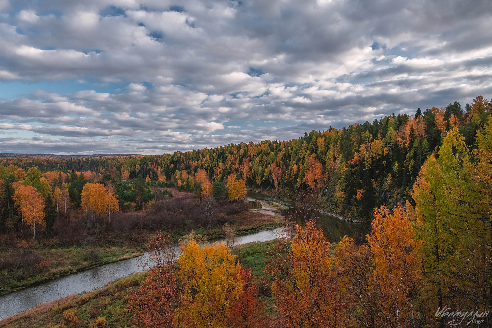

Когда можно посетить:  
**В любое время**

Цена:  
**Взрослый билет – 250 руб., студенческий – 125 руб., дети до 18 лет, инвалиды, пенсионеры, многодетные родители – бесплатно**

## Немного о парке
Природный парк «Оленьи ручьи» – особо охраняемая (и самая популярная) природная территория, привлекающая тысячи туристов со всей страны. Выбрав удачное расположение вдоль реки Серги, «Оленьи ручьи» получили свое название в честь одного из самых древних наскальных рисунков на территории парка. Но это еще не все – в природном парке находятся крупнейшие исторические и палеозоологические памятники Среднего Урала, возраст некоторых из них насчитывает более 15 тысяч лет! Наиболее примечательными являются река Серга, по берегам которой растут вековые реликтовые растения, а также знаменитая скульптура Ангела, прикоснувшись к которой, путник защитит себя от житейских бед и мировых войн.

«Оленьи ручьи» богаты разнообразием растительности и животного мира. В лесах природного парка прячутся лоси, лисы, медведи, белки и охраняемые Красной книгой редкие звери, а в чистых водах Серги можно увидеть щуку, леща, карася и окуня. Рядом со сводом доисторических плит и каменных настилов расположились пихты и старые мудрые ели, а также нетронутые человеком 300-летние лиственницы, папоротники и лесные ягоды.

## Стоит посмотреть!
Под завесой истории парка «Оленьи ручьи» скрываются десятки захватывающих легенд и загадок этой местности! О некоторых из них можно услышать во время увлекательных экскурсий с гидом, а после организовать стоянку и послушать эти легенды около уютного костра. «Оленьи ручьи» придутся по вкусу многим посетителям – от заядлых фанатом туристических походов и палаточного сна, до больших семей, выбравшихся на выходные в лес.

Экологи и любители природы оценят здешнюю фауну – ее представляют свыше 1 тысячи видов растений! Это и эндемики, и редкие скалистые растения, степные травы и цветы. Для любителей водных процедур парк подготовил спокойное лоно воды р. Серги, а те, кто любят прогуляться ногами, существуют специально оборудованные маршруты – малый (до «Ангела) и большой – до пещеры «Дружба». Экстремалы могут всласть набродиться по необорудованным тропам до самого заброшенного рудника с местом для отдыха. Семейные туристические походы также проходят увлекательно, особенно при взятой заранее экскурсии и набитому доверху контейнеру с бутербродами!

Утонченные путешественники приезжают сюда для одной цели – увидеть завораживающие пейзажи вдоль скалы Дыроватый камень, пересчитывая многочисленных птиц, садящихся на водную гладь. В природном парке «Оленьи ручьи» есть место эстетизму – даже знаменитый Дыроватый камень здесь похож на морду огромной лошади, пьющей из реки. Из прекрасного в парке можно увидеть многое – древние лиственницы, распушившие ветви, золотой «Ангел», парящий над обрывом, и загадочные наскальные рисунки древнего человека, оставившего свою охотничью историю на плитах «Писаницы».

## Информация для посещения
Природный парк находится по адресу: Свердловская область, Нижнесергинский р-н, поселок Бажуково, ул. Станционная, 1.

Администрация природного парка предоставляет услуги размещения, проката снаряжения и транспорта. Также в природном парке присутствует все для удачного сплава – река с пресной водой, лодки и приятная компания в виде инструктора парка. Стоимость сплава 60 рублей со взрослого человека, 30 – со студента и бесплатно детям до 18 лет и пенсионерам.

У природного парка «Оленьи ручьи» есть свой веб-сайт с необходимой информацией. Перед посещением достопримечательности рекомендуем ознакомится с «Правилами посещения природного парка».

На территории «Оленьих ручьев» есть кафе, платная автостоянка, места для отдыха (на пешеходных маршрутах), оборудованные туалеты.

`video: https://youtu.be/xlKZWuvI7pM`