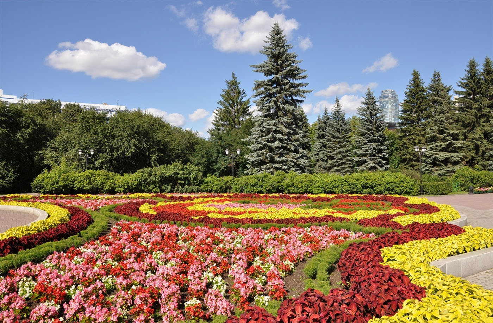
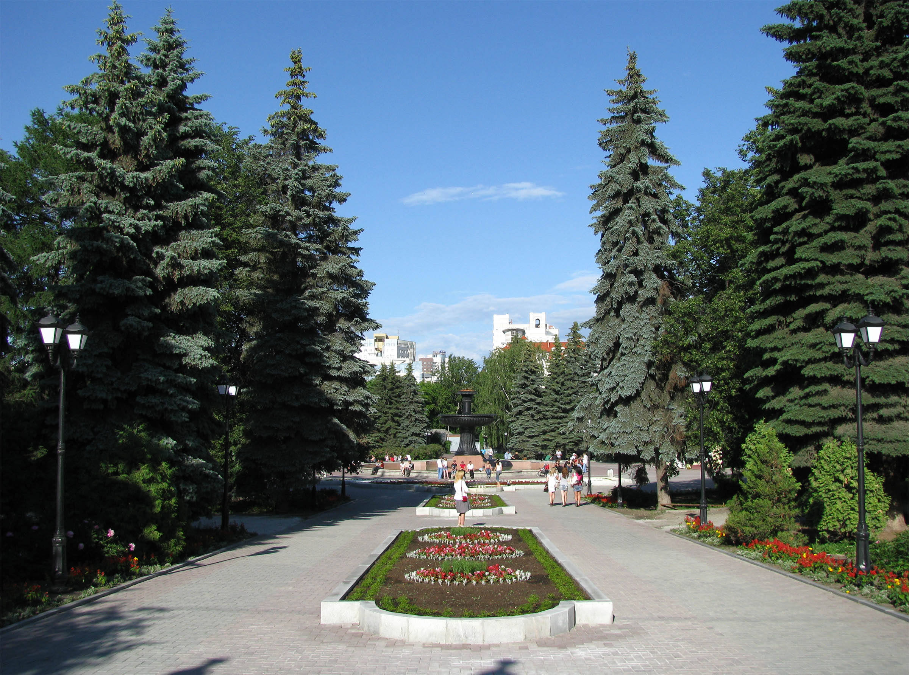
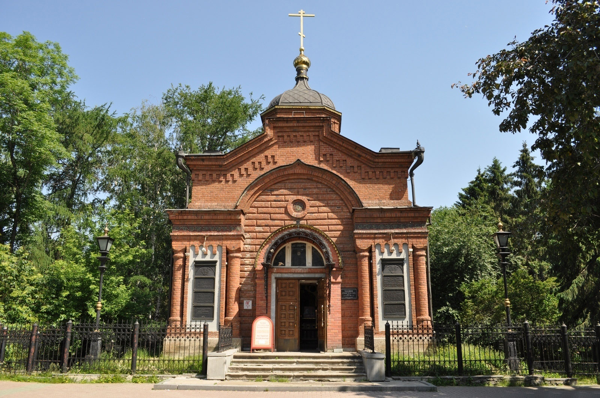
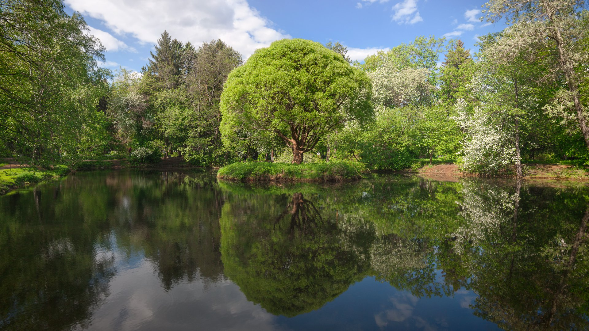
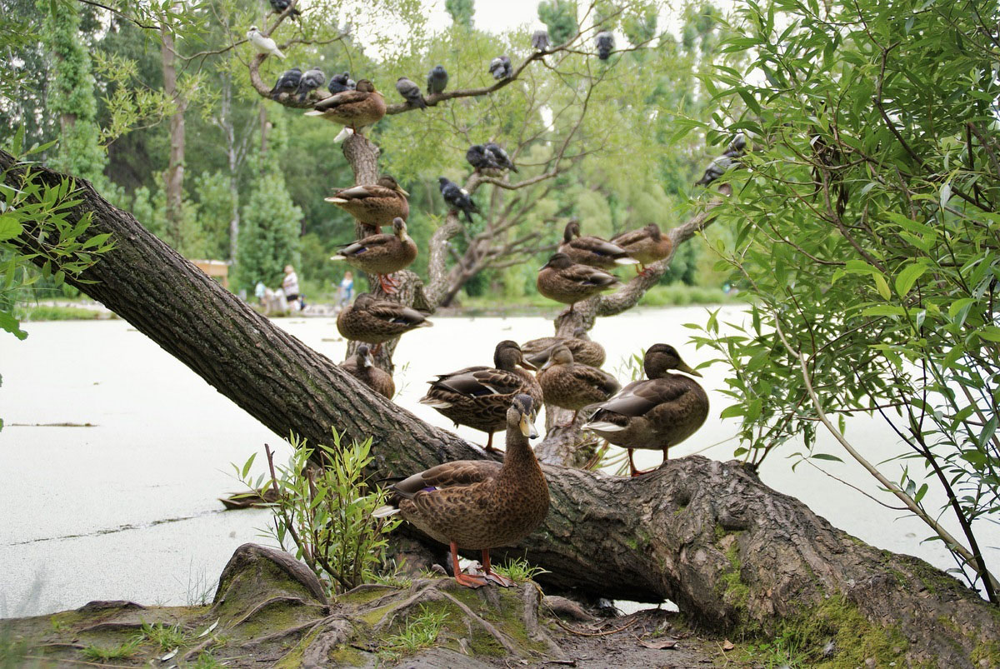
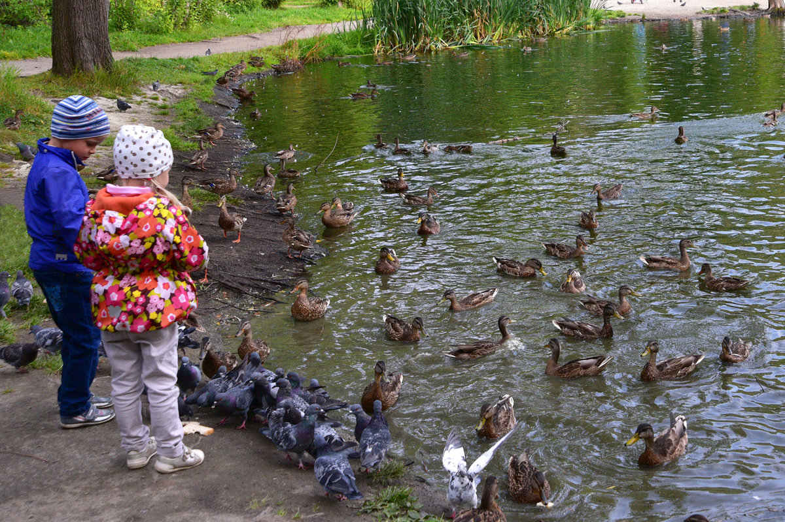
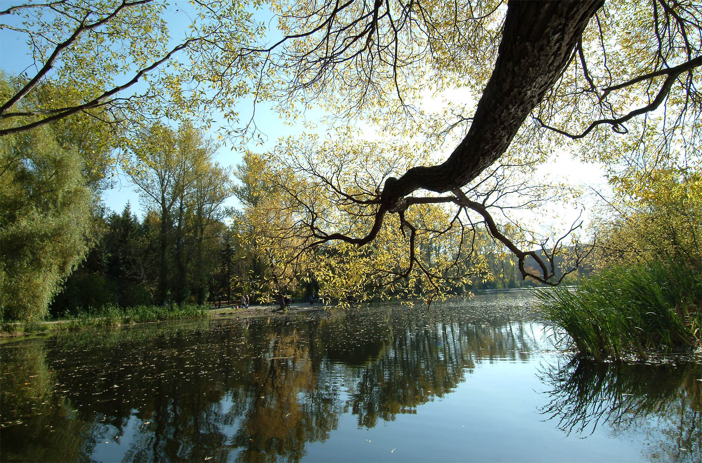

Когда можно посетить:  
**Ежедневно, с 08:00 до 22:00**

Цена:  
**Бесплатно**

## Немного о парке
Дендропарк города Екатеринбурга представляет собой 2 части разнообразного и красочного парка-выставки, которые расположены в Центре (ул. 8 Марта, 37а) и в Кировском районе (пересечение ул. Мира и ул. Первомайской) города. Каждый из дендрологических парков славится своей посещаемостью – жители и гости Екатеринбурга обожают здешнюю «близость к природе», спокойные прогулки меж разбитых клумб и цветочных запахов, а также дружелюбных уток, которых можно покормить прямо с ладони. 

Екатеринбургский дендропарк отлично подойдет как для семейного, так и для активного и познавательного отдыха – здесь для каждого найдется свой досуг: большое количество чистых лужаек, где можно устроить пикник; дорожки для бега и велоспорта; организованные экскурсии для большой компании; детские площадки и дорожки для прогулки с коляской; обновляемые ботанические экспозиции и выставки. И в каждом из парков можно провести незабываемый день!  

### Дендропарк на 8 Марта

Дендрологический парк на 8 Марта отличает обилие экзотических цветов и растений, а также разнообразие проводимых здесь мероприятий – от эко-фестивалей до выставок-продаж, где выставляются необычные для уральских краев гибискусы, стрелитции, суккуленты и многое другое. Также в парке регулярно проводятся фотовыставки с многообразием тем – например, там часто можно увидеть работы свердловских фотографов и ландшафтных дизайнеров.

Дендропарк облагорожен местными властями под стиль французского сада, в центре которого расположился величественный 7 метровый фонтан. Рядом можно заметить известную среди молодоженов кованную «скамью влюбленных», стоящую на постаменте в форме сердца – именно после ее появления дендрарий стал популярным местом свадебных фотосессий среди цветочного благоухания.

Старинная часовня Александра Невского, выполненная в духе Византии, привлечет внимание любителей исторических достопримечательностей – на этом месте ее воздвигли в честь Александра II после исторического переворота – отмены крепостного права. 

Дендропарк разделяется Исетью, где круглогодично обитают утки, на два берега – с обеих сторон недавно прошла реставрация, были возведены новые детские комплексы и площадки для спорта и прогулок, продуман дизайнерский ландшафт и уличное освещение, а также поставлены стильные скамьи в современном эко-стиле.

### Дендропарк на Первомайской

Другая часть парка-выставки расположена на перекрестке нескольких улиц и отличается проработанным дизайнерским решением, большим разнообразием сортовых растений и цветов, наличием розариев и теплиц, где проводятся экскурсии. Всех любителей флоры и фауны тянет к этому парку из-за его развитого природного ландшафта, где произрастает более 100 сортов роз и многие другие растения, которые используются в озеленении всего города.

	
Здесь часто можно встретить студентов екатеринбургских ВУЗов – именно это отделение дендропарка-выставки используется как наглядное пособие по природоведению и экологии из-за редкости культивируемых растений – ольхи, кленов, ореховых деревьев.

В дендропарке можно увидеть необычные «скульптуры», созданные самой природой – каменистый сад, композиции из раскидистых ветвей деревьев, которые украшают местный пруд с перелетными утками.

`video: https://youtu.be/jeWaYRUhTIY`

## Стоит посмотреть!
Дендропарк города Екатеринбурга – место интереса как для простых горожан, которые гуляют по тропинкам вечерами или занимаются спортом, так и для людей, интересующихся растениями с научной точки зрения. Для большего понимания, чем занимается дендрарий, можно посетить экскурсию по теплицам и оранжереям – 150 руб. взрослый билет и 100 – пенсионный и студенческий.

## Информация для посещения
На территории дендропарка на 8 Марта есть летнее кафе с верандой и ресторан, специализирующийся на итальянской кухне.

