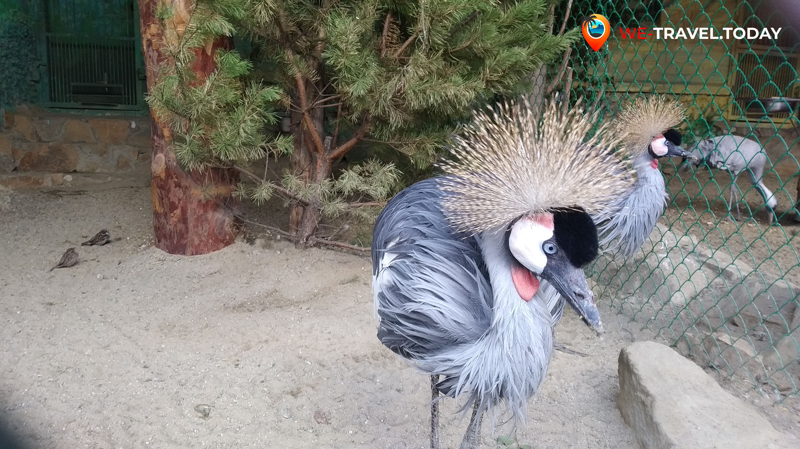
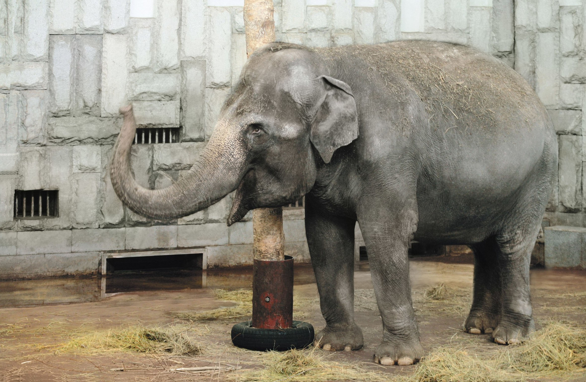
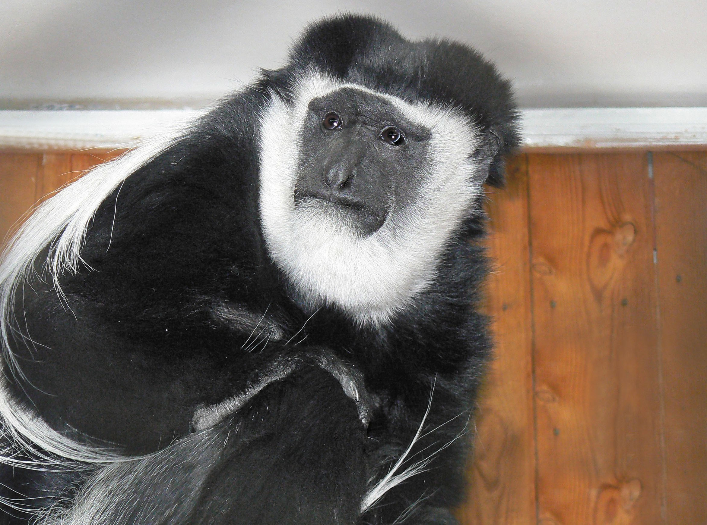
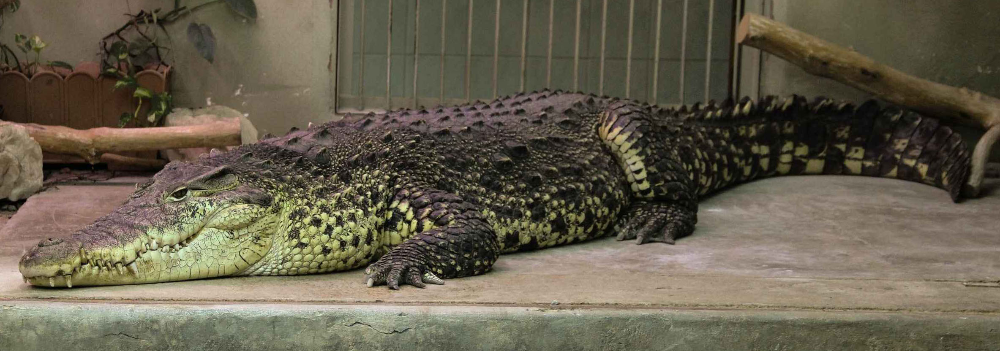

Когда можно посетить:  
**Будние дни 10:00–19:00; выходные дни 10:00–20:00**

Цена:  
**Взрослый билет – 350 руб., льготный и детский – 150 руб**

## Содержание
1. [Немного о достопримечательности](#немного-о-достопримечательности)
2. [Стоит посмотреть!](#стоит-посмотреть)
3. [Информация для посещения](#информация-для-посещения)

## Немного о достопримечательности
Коллекция зверей Екатеринбургского зоопарка – одна из самых многочисленных и разнообразных, и входит в Евроазиатскую Региональную Ассоциацию Зоопарков. Всего на 2 гектарах земли разместилось несколько десятков экзотических особей и видов – ленивцы, трубкозубы, крокодилы, и многие другие млекопитающие, птицы и пресмыкающиеся, которых зоопарк Екатеринбурга принимает со всех уголков России и мира.

Зоопарк города Екатеринбурга – место, где дикая природа становится ближе к человеку. Каждый желающий может посетить зоопарк и найти для себя что-то близкое сердцу: любители животных с радостью взглянут на слониху со слоненком, детишки – вдоволь накататься на аттракционах, а поклонники шумных компаний могут порадовать себя вкусным угощением и тематической экскурсией по зоопарку.

Создавая в конце 1920-х годов будущий знаменитый зоопарк по подобию Московского собрата, руководство даже не подозревало, что к 2020 году численность всех животных составит более 1000 особей, а видовое разнообразие – около 350. Также никто не мог даже представить, что в зоопарке Екатеринбурга будут обитать и размножаться животные, занесенные в Красную книгу – белые тигры, фоссы, египетские цапли, священные ибисы, фиолетовые турако, гиббоны и величественные слоны. Это делает зоопарк поистине уникальным для города Екатеринбурга – здесь не только содержат, но и бережно заботятся о братьях наших меньших, даруя им любовь и мирную жизнь.

## Стоит посмотреть!
Екатеринбургский зоопарк славится не только своими замечательными, а порой даже редкими животными, но и услугами, предоставляемыми руководством зоопарка – самой увлекательной и необычной из них является возможность установления опекунства над понравившимся зверем. Каждый может оформить заботу о животном – стоит только захотеть! Уже многие частные предприниматели, российские кампании и просто неравнодушные люди внесли свой вклад в развитие Екатеринбургского зоопарка.

Прогулка по зоопарку может быть интересна каждому заинтересованному в приятном отдыхе наедине со зверями – детям, их родителям, студентам, большим компаниям и уединенным парочкам! Для юных посетителей зоопарк Екатеринбурга может предложить контактный зоопарк с уникальной методикой занятий и научную работу в кружке юного биолога, где ребята изучают рацион питания, жизнь и внутреннее строение пернатых и хвостатых. Студентов и взрослых посетителей может порадовать как сравнительно невысокий ценник, так и разнообразие досуга и научного просвещения, которое предлагает Екатеринбургский зоопарк – это получение знаний в области биологии, конкурсы, выставки, помощь в написании научных работ, составление книг и проспектов. Огромное разнообразие животного микромира зоопарка также не оставит никого равнодушным – совсем недавно у вымирающих трубкозубов родилось потомство, ежиха Пуговка стала предсказательницей, а главная звезда зоопарка слониха Даша наконец-то начала поворачиваться к посетителям лицом! 

## Информация для посещения
Взрослый билет – 350 руб., льготный и детский с 5 до 18 лет – 150 руб., детский до 5 лет – бесплатно. Билеты можно приобрести как в кассе учреждения, так и онлайн.

Зоопарк находится по адресу: г. Екатеринбург, ул. Мамина-Сибиряка, 189.

На территории Екатеринбургского зоопарка присутствует кафе, действуют детские аттракционы. Часто можно попасть на различные выставки, конкурсы и праздники.

Екатеринбургский зоопарк каждый день открыт для своих гостей в качестве экскурсионного места – сотрудники учреждения с радостью просветят желающих в области биологии, зоологии и экологии за 500 руб. до группы в 12 человек.

В период карантина, Екатеринбургский зоопарк – это не только приятный вечер в компании мохнатых, но и онлайн-посещение в форме видео-прогулок с животными по арене зоопарка. Полную информацию можно получить на официальном веб-сайте.

Перед посещением рекомендуется ознакомиться с правила поведения в зоопарке: не кормить животных, не стучать по вольерам, не курить и не фотографировать животных со вспышкой.

Социальные сети зоопарка обширны – активные странички учреждения существуют в VK, Instagram, YouTube и [Facebook](https://www.facebook.com/zooekb).

`video: https://youtu.be/njbVo06Zi5k`

`video: https://youtu.be/wSqPg6b-8_Y`
