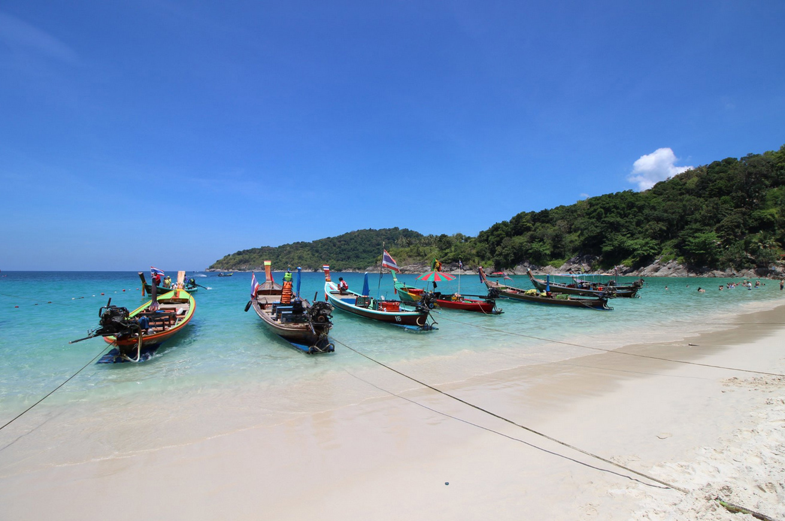

Когда можно посетить:  
**В любое время**

Цена:  
**Бесплатно. Лежак и зонтик 200 бат**

## Немного о достопримечательности
Пляж Фридом довольно экзотический пляж: белая песчаная коса шириной 30 метров; бурная тропическая зелень растущая вплотную к пляжу; чистое и прозрачное море окрашено в голубовато-зеленые тона. Благодаря этому пляж выглядит очень живописно и красиво. 

Пляж в последние годы стал популярным, поэтому в пик сезона тут довольно многолюдно, пусть и добраться до сюда не так просто. Чтобы застать пляж безлюдным лучше приходить до 10 часов утра. 

Вечером с пляжа наблюдать закат одно удовольствие, здесь солнце заходит прямо в море, раскрашивая небо и облака в яркие теплые тона.

Длина пляжа около 300 метров, покрыт мелким песком. Вход в море пологий, приливы и отливы не сильно влияют на удобство купания. Так как пляж находится в бухте, то сильных волн здесь почти не бывает.

Середина пляжа обычно занята лодками, поэтому люди купаются по краям. В северной части есть уединенный участок разделенный камнями, добраться до туда можно только по камням или по воде.

## Инфраструктура 
Тут нет торговцев, продающих напитки, поэтому воду лучше брать в лавке перед спуском. В южной части есть кафе, где можно перекусить, рядом находятся душ и туалет. Еду с собой брать запрещают, но судя по отзывам за этим никто не следит. 

Раньше пляж был платным, но сейчас вход стал бесплатным.
Из развлечений тут только дайвинг, снорклинг и пляжные игры.

   <Image src="images/eugeneRudih.jpg" alt="Freedom Beach Пляж Фридом"/>
   <figcaption>Фото Евгений Рудых</figcaption>

## Информация для посещения
До пляжа можно добраться на лодке с пляжей [Патонг](https://we-travel.today/plyazh-patong/), [Карон](https://we-travel.today/plyazh-karon/), [Ката](https://we-travel.today/plyazh-kata/) и Три Транг. Стоимость около 2000 бат со всей лодки, который вместит 8-10 человек.

Если приезжать на своем транспорте, то придется оставить возле дороги и спуститься пешком по тропам.

