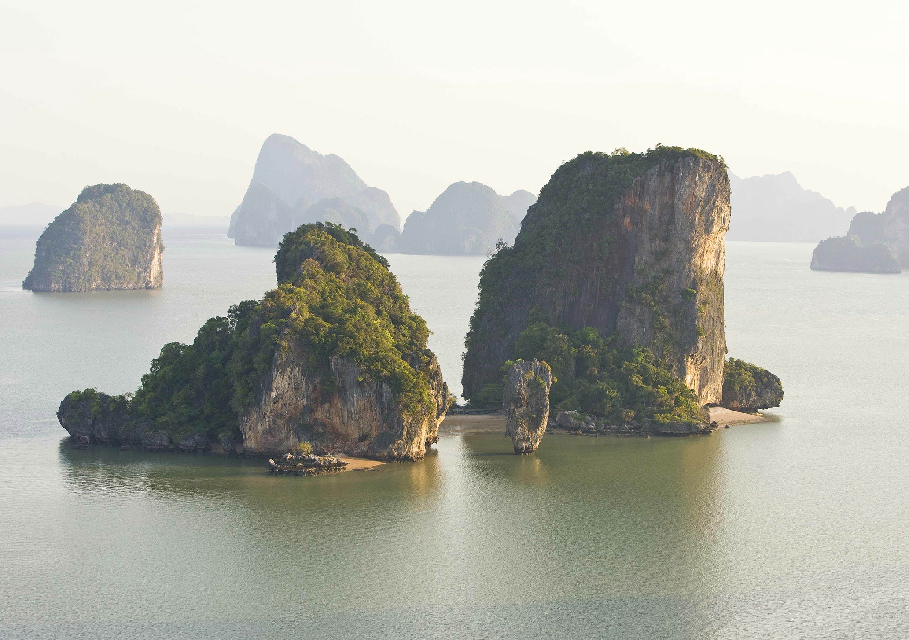
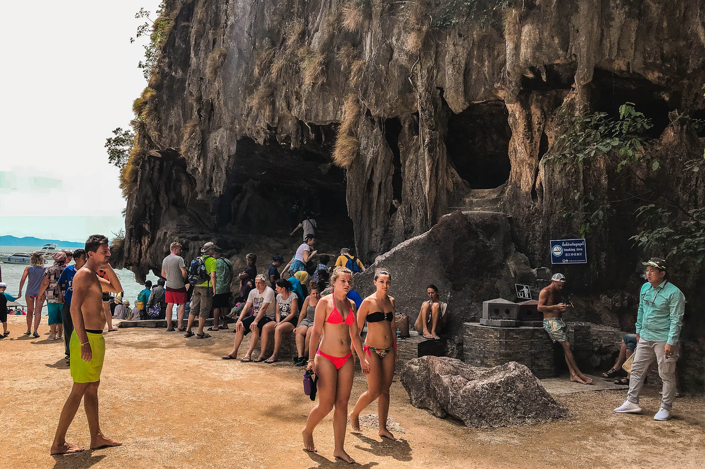
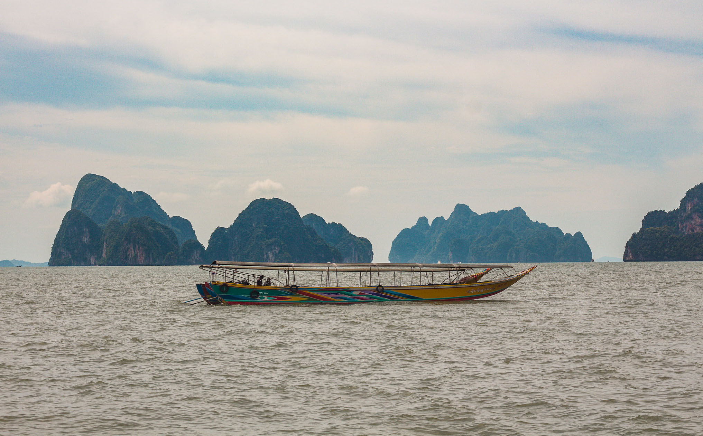
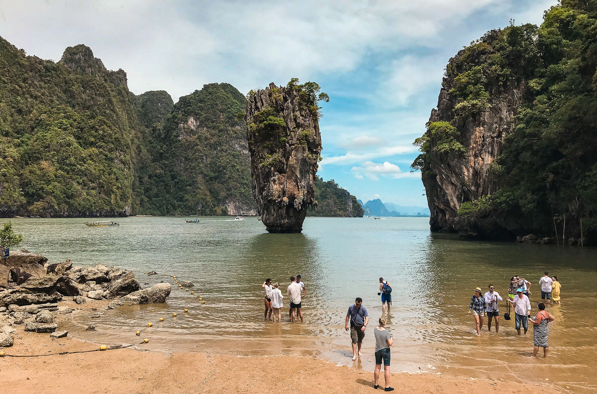

Когда можно посетить:  
**Экскурсии проходят ежедневно**

Цена:  
**Экскурсия от 1450 бат для взрослых и 1250 бат для детей**

## Коротко об острове
В далеком 1974 году на острове Као Пинг Кан (Khao Phing Kan) сняли несколько эпизодов из фильма про знаменитого спецагента 007. Внимание зрителей привлекла необычная скала торчащая из воды — это был Ко Тапу (Koh Tapu), остров-скала высотой 20 метров и диаметром основания 4 метра. Фильм вызвал интерес у туристов со всего мира к этому необычному острову, поэтому все начали называть это место островом Джеймса Бонда.

Ко Тапу находится под охраной Национального Морского Парка Панг Нга, поэтому слишком близко приближаться и трогать скалу нельзя. Разрешается только покружить вокруг острова на расстоянии несколько метров на каноэ.

И все же остров многих больше разочаровывает, чем восхищает. Основная причина — это огромная популярность, посетители островка вынуждены тесниться среди сотни других туристов, что безусловно рушит весь шарм этого места.  

Лучше обратить внимание на сам Национальный Морской Парк. Тут десятки мелких скалистых островов выглядывают из под моря, образуя удивительные пейзажи. Все острова испещрены множеством гротов, пещер и лагун, заросших мангровыми деревьями, которые интересно изучать на каноэ или маленькой лодке.

Вода в заповеднике, к сожалению, мутноватая, мангровые заросли образуют ил, который мутит воду. Поэтому здесь плавать и купаться не так приятно как на других островах и пляжах Пхукета.

 
## Об экскурсии
Добраться до островов можно только на приватном катере или в составе экскурсии. Второй вариант дешевле и бывает двух видов: 
- *Классическая экскурсия*. Основная цель — это посетить остров Джеймса Бонда, помимо этого покатают по гротам и лагунам на каноэ и угостят обедом в деревне морских цыган Ко Пани.  В конце дадут искупаться на одном из островов, но вода в национальном парке мутная. Цена зависит от морского транспорта: на двухпалубном корабле от 1450 бат (46$), быстрый катер от 1650 бат (52$).
- *4 Жемчужины Андаманского моря / 11 островов*. Более насыщенная и сбалансированная экскурсия. Почти то же самое, но добавляются острова Пхи-Пхи, бухта Майя, полуостров Рейли в Краби и остров Бамбу. Экскурсия бывает однодневная от 3 000 бат (94$) и двухдневная от 3 400 бат (106$).

`video: https://youtu.be/3iU7dWV9Jk4`