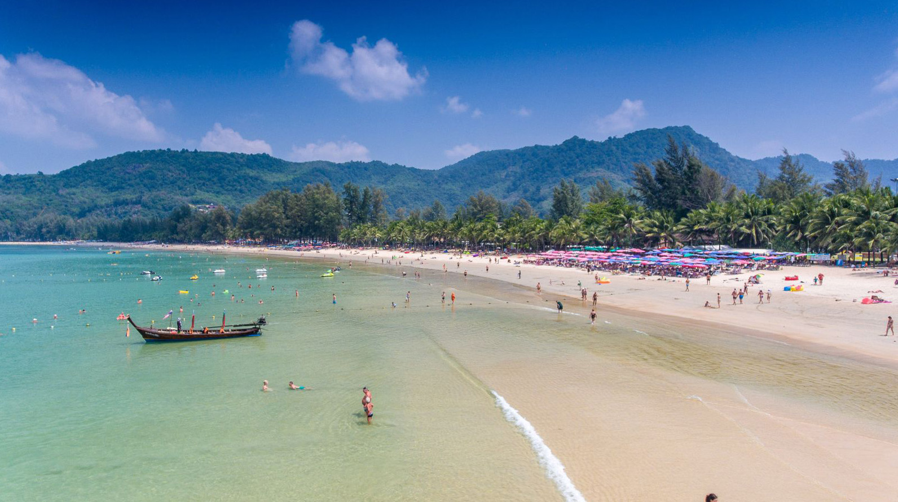

## Немного о достопримечательности
Камала — это пляж одноименного городка и пользуется популярностью не только у туристов, но и у тайцев. Не так давно, пляж служил для местных пристанью и местом для отдыха, сейчас стал популярным и среди туристов за счет хорошей инфраструктуры. 

Пляж растянулся на 2 км, в ширину около 50 метров. Песок почти белый и похож на соль, ее качество и чистота сильно различается, и зависит от ближайшего отеля. 

Южная часть пляжа не очень привлекательная из-за камней и мусора, обычно там встают на якорь рыбацкие лодки. И вход в море там слишком пологий, до глубины долго идти. Чем ближе к северной стороне пляжа, тем вход резче.

В курортный сезон море на пляже Камала тихое, волны небольшие и спокойные. В сезон дождей купаться на пляже опасно, часто можно увидеть красные флажки, предупреждающие об обратных течениях. Из-за ветра в северной части пляжа волны могут подниматься до 3 метров и выше. Настоящее испытание для опытных серфингистов.

<iframe src="https://www.google.com/maps/embed?pb=!4v1607104907112!6m8!1m7!1sCAoSLEFGMVFpcE5mY1RBa29wY1BvVjh2dnRZXzVqbUxGekdBQ1kzVWFFNFdtYTJE!2m2!1d7.9530154!2d98.28211309999999!3f251.48468879296814!4f12.297899710584247!5f0.4000000000000002" width="680" height="450" frameborder="0" style="border:0;" allowfullscreen="" aria-hidden="false" tabindex="0"></iframe>
  

В первой половине дня, благодаря аллее между дорогой и пляжем, есть тень, но как правило она обставлена лежаками. Когда солнце поднимется высоко — укрыться от нее почти негде. 

## Инфраструктура 
Инфраструктура богатая, есть все виды пляжных услуг: от продажи всякой всячины до аренды снаряжения для пляжного отдыха. Цены примерно такие же как и в остальных пляжах. 

В самом городе много необычных развлечений, можно пойти на курсы кулинарии и научиться готовить местную еду или сходить на сеанс йоги.

`video: https://youtu.be/fxOITUUVkeg`