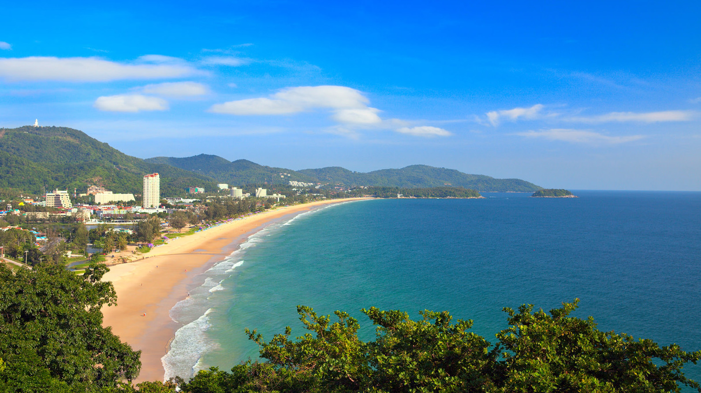
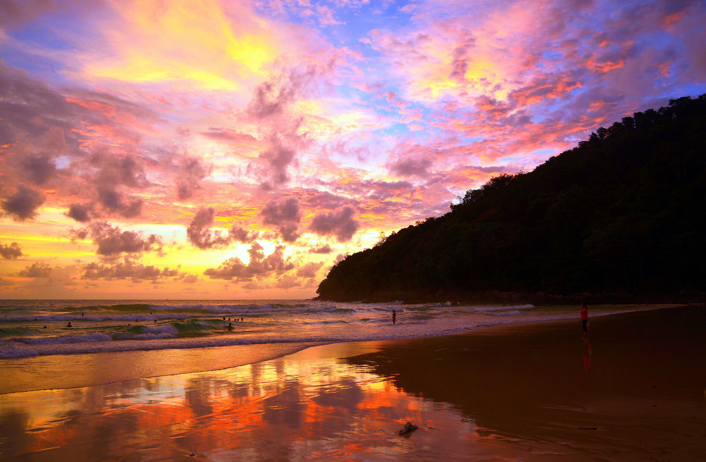
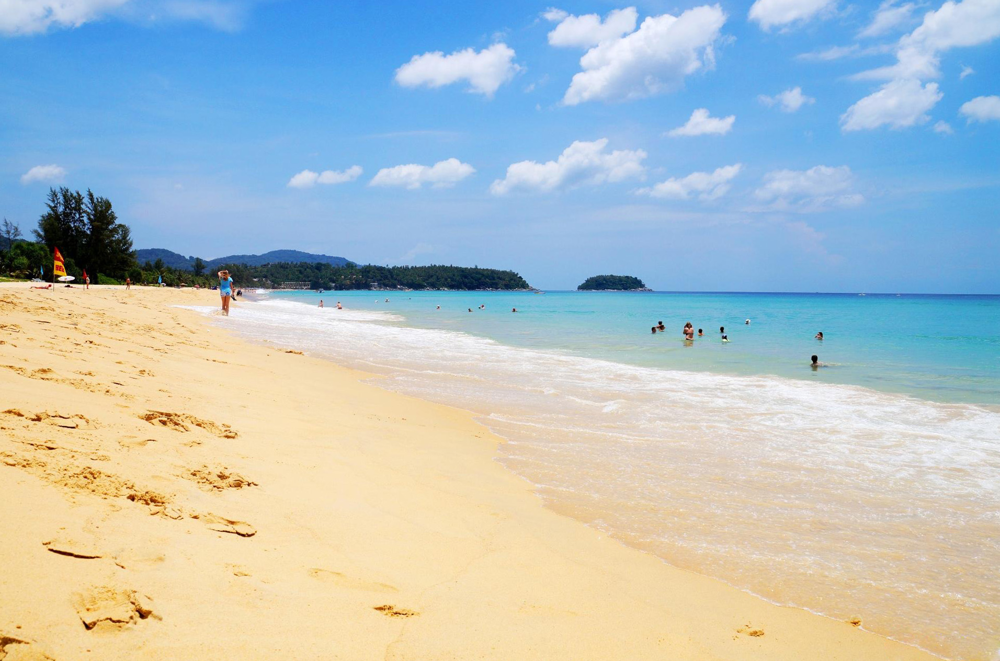

Когда можно посетить:  
**В любое время**

Цена:  
**Бесплатно. Лежак и зонтик 200 бат**

## Немного о достопримечательности
Пляж Карон находится на побережье Андаманского моря. Длина береговой линии почти 4 км, пляж занимает по величине и протяженности 2 место на острове. Благодаря этому даже в пик сезона здесь можно найти укромное место и отдохнуть в тишине и спокойствии.

Карон Бич славится своим скрипучим песком, будто идешь по снегу. Песок довольно мягкий, мелкий, желтого цвета. Заход в воду пологий и плавный.
В курортный сезон море на пляже спокойное, чистое и теплое. А с июня по сентябрь поднимаются сильные волны, в это время образуются подводные течения, которые могут легко унести в море. В декабре появляются медузы, и иногда встречаются водоросли и листья.

Карон Бич отличается чистотой, ухоженной территорией и благоустройством. За чистотой постоянно следят сотрудники специальных служб. 

Вечером на пляже собираются множество людей для того чтобы посмотреть закат, они здесь великолепны. Если никогда не видели, как солнце садиться в море, обязательно выделите для этого вечер и насладитесь шикарным зрелищем.

<iframe src="https://www.google.com/maps/embed?pb=!4v1607104570275!6m8!1m7!1sCAoSLEFGMVFpcE9TcWR0LS1DLTlYQ0FxTEd2SHZ2eGxZNGNYUlQ5dXI2el9SdHFS!2m2!1d7.8366328!2d98.294278!3f350!4f0!5f0.7820865974627469" width="680" height="450" frameborder="0" style="border:0;" allowfullscreen="" aria-hidden="false" tabindex="0"></iframe>
  

 
## Инфраструктура 
На пляже можно арендовать мягкие коврики и зонтики. Обойдется это примерно в 200 бат. А можно в супермаркетах неподалеку можно приобрести большое полотенце и зонтик — это будет дешевле.

Душевых кабин и мест для переодевания нет. Но позволяют помыть ноги в ближайших кафе.

На берегу представлен большой выбор пляжных развлечений — полеты на парашютах, катание на таблетке или банане, аренда водных мотоциклов.
 
## Информация для посещения
Если вы хотите уединения, то идите в левый или правый край пляжа, в отличие от центра там меньше народу. 

На этом пляже часто образуются подводные течения. Если вы чувствуете, что вас уносит в море, начните плыть не на берег, а вдоль, чтобы покинуть зону подводного течения.

`video: https://youtu.be/imH-5s2vzgA`