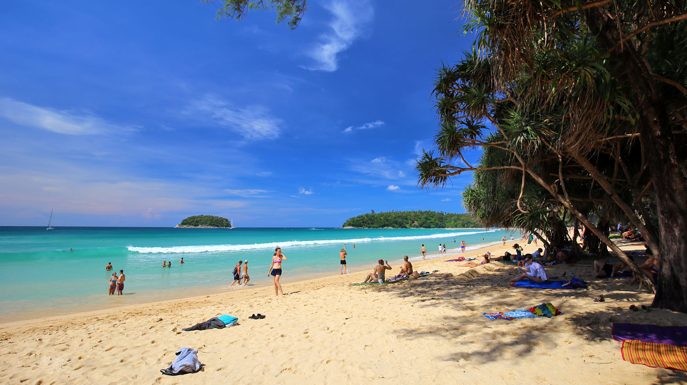

## Немного о достопримечательности
Пляж Ката по праву занимает третье место по популярности на Пхукете. Тут понравится многим отдыхающим: спокойная атмосфера, есть вся необходимая инфраструктура, а море чистое.

Ката в длину около 1,5 км, а в ширину в среднем 50 метров. Покрыт мягким белым песком, который местные жители регулярно чистят граблями. Пологий вход в воду, без камней и кораллов — чудесное место для детей. Во время прилива купаться можно, а во время отлива не комфортно.

Волны в высокий сезон появляются редко, часто полный штиль. Но с мая поднимается сильный ветер и волны, что позволяет заняться серфингом.

В северной части Каты в море впадает грязная речка, и стоят лодки на якоре, поэтому лучше купаться в центральной или южной части. 

Людей на пляже много, но они рассредотачиваются по всей длине, и столпотворений не возникает.

Естественная тень есть только в южной части, в середине она заканчивается вместе с деревьями.
 
 

## Инфраструктура 
Вдоль пляжа идет улица, на ней есть кафешки, забегаловки, продуктовые магазины. Душ и туалет есть только в южной части и они платные.

На пляже есть стандартный набор услуг: 
- за 200 бат в сутки можно арендовать шезлонг и зонтик;
- Услуги массажа;
- Аренда гидроцикла;
- Катание на банане;
- Аренда каяка;
- Прокат снаряжений для снорклинга;
- Можно полетать на парашюте за катером.

<iframe src="https://www.google.com/maps/embed?pb=!4v1607150385408!6m8!1m7!1sCAoSLEFGMVFpcE9sN3NjQml4dno1MElQRzhfU3hFeHltdmFYTURaSWtQYXY2b2xP!2m2!1d7.8210366!2d98.2973425!3f349.3773473213664!4f-40.63755745599202!5f0.7820865974627469" width="680" height="450" frameborder="0" style="border:0;" allowfullscreen="" aria-hidden="false" tabindex="0"></iframe>
  

 
 
## Информация для посещения
На Ката Бич можно зайти только по краям. С юга ведет дорога, а с севера можно дойти только пешком, вдоль речки. В центре расположена большая и закрытая территория отеля, которую никак не пройти.

Посещение пляжа можно совместить с другими достопримечательностями. Недалеко от пляжа находится Dino Park Mini Golf и [смотровая площадка Karon View Point](https://we-travel.today/tajland/phuket/smotrovaya-ploshadka-karon/).  

