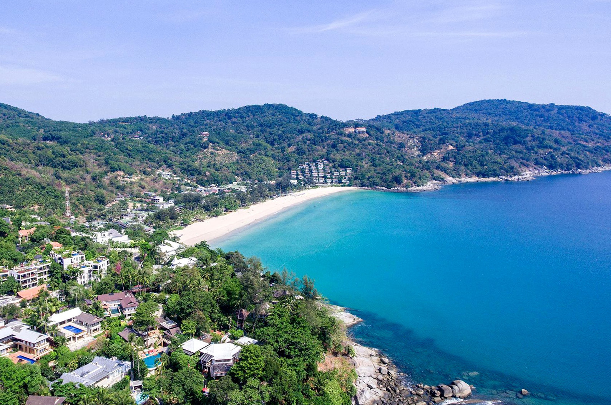
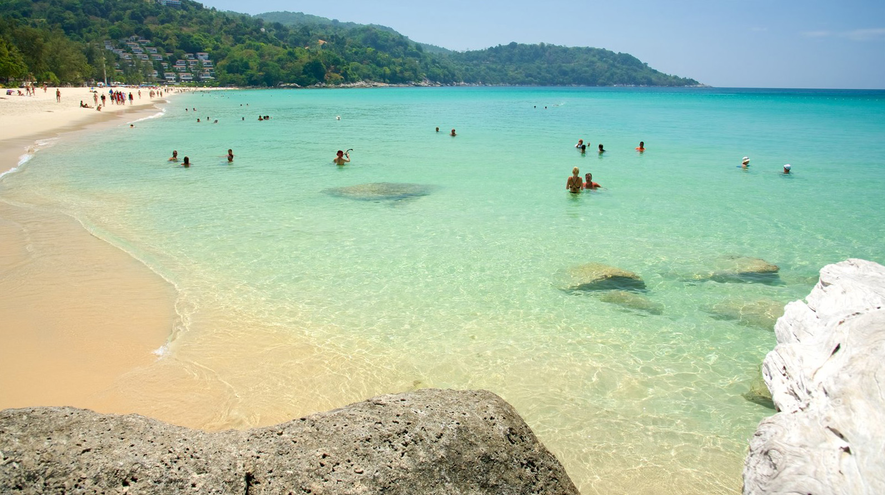
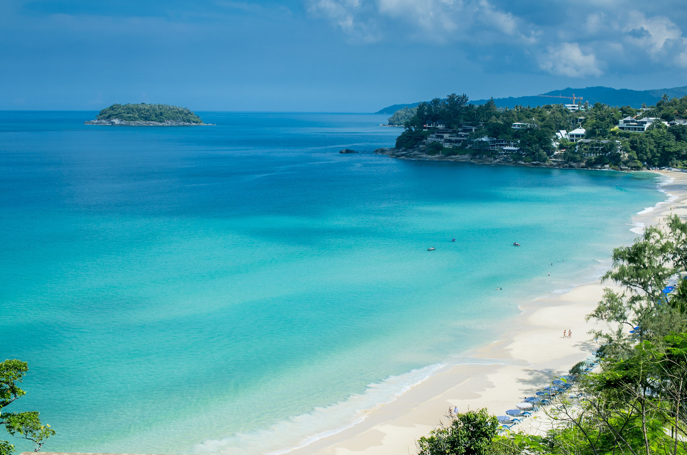

Когда можно посетить:  
**В любое время**

Цена:  
**Бесплатно. 2 лежака и зонт — 200 бат**

## Немного о достопримечательности
Пляж Ката Ной один из самых чистых и дорогих пляжей на Пхукете. Один из немногих пляжей на острове, где первая линия отелей примыкает к пляжу. Идеально подходит для спокойного пляжного отдыха.

Ката Ной небольшой, длина всего 700 метров, а ширина меняется от 10 до 50 метров — сильно зависит от приливов. Пляж по краям заканчивается камнями, там есть рифы, можно понырять с маской и понаблюдать за жизнью морских обитателей.

Заход в воду полностью песчаный, но довольно резкий, через 5 метров глубина уже по шею. В высокий сезон море словно спит, в прозрачной и лазурной воде волн почти нет. Но в мае море снова пробуждается, и волны усиливаются. Поплавать не получиться, зато можно покататься на серфинге.

К плюсам можно отнести малое количество лодок и катеров, редко шумят моторы нарушающие спокойную атмосферу. Еще один плюс — на пляже мало людей, из-за его удаленности, можно даже встретить загорающих топлесс.

От солнца на пляже укрыться негде, поэтому придется арендовать зонт или купить в магазине за 100 бат. 

## Инфраструктура
Туалет есть только возле спуска с холма на пляж и платный в кафе Seaside в центре пляжа. Душа и раздевалок нет. Макашниц тоже нет, есть только продавцы напитков и фруктов. 

Список и цены на пляжные развлечения как и везде. Бананы и таблетки 800 бат, парасейлинг и вейкборд 1800 бат. За 30 минут аренды гидроцикла 1800 бат, за час аренды лонгтейла 3 000 бат, а катера — 6 000 бат.

За 2 шезлонга и зонтик цена 200 бат. Массаж сделают вам от 400 бат.

## Информация для посещения
Если вы едете со стороны Патонга, Карона и Каты, после подъема на гору, разделяющий Ката и Ката Ной, есть спуск по лестнице. Ориентир —  припаркованные машины и байки.

Если вы едете с юга, то до пляжа можно добраться по дороге, и там более просторная парковка.

Недалеко находится самая известная смотровая площадка на Пхукете — [Karon View Point](https://we-travel.today/smotrovaya-ploshadka-karon/).  