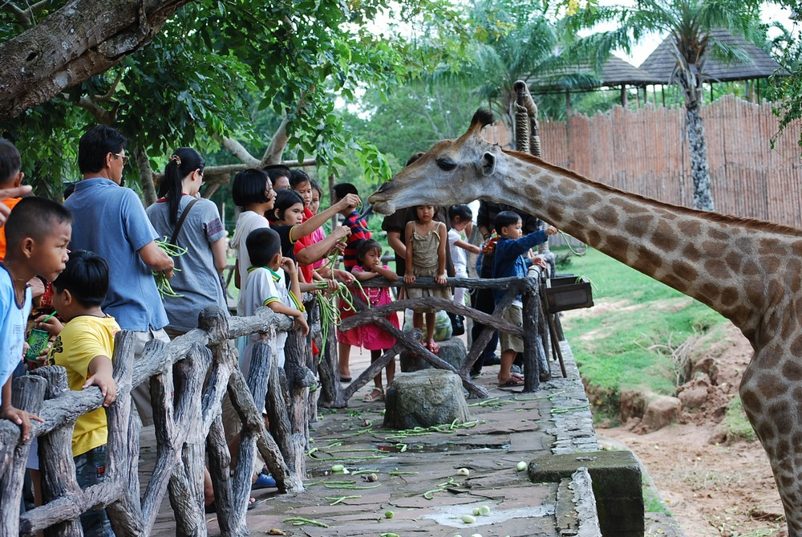
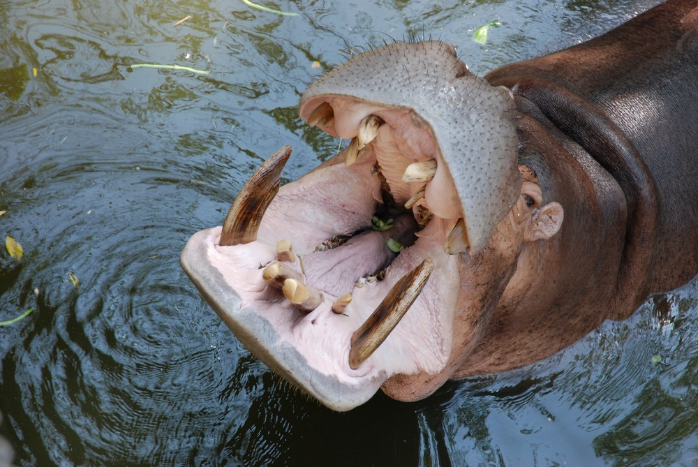
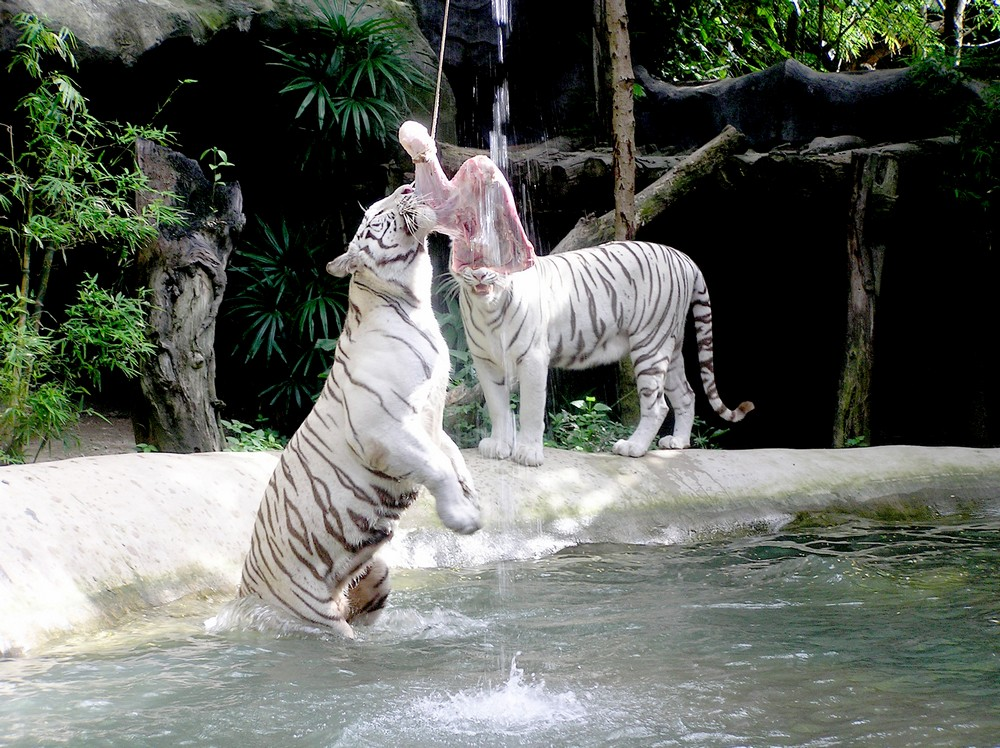
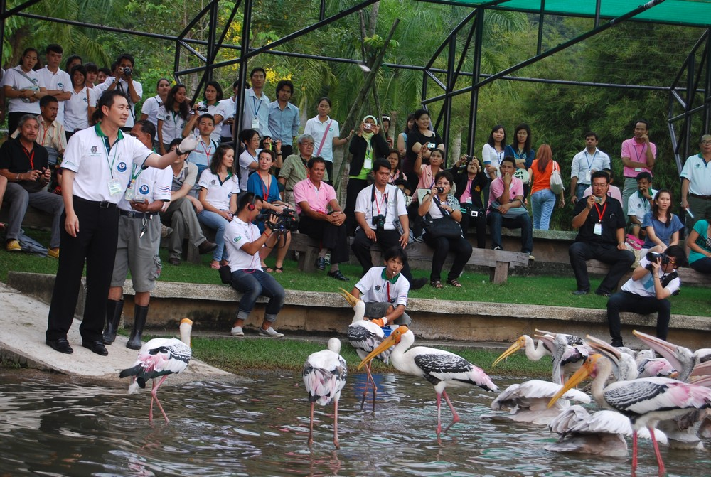
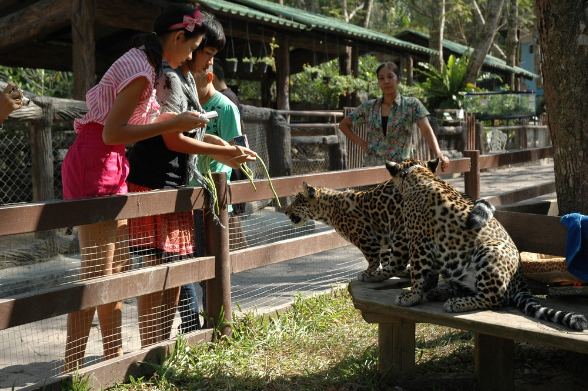

## Немного о достопримечательности
Кхао Кхео в Паттайе (Khao Kheow Open Zoo) — самый большой зоопарк в Тайланде и один из крупнейших контактных зоопарков мира. На территории 8 квадратных километров живут более 300 видов животных, птиц и рептилий, их количество превысило 8 000 особей. Но самый большой плюс зоопарка в том, что он контактный, безобидную живность можно потрогать и покормить, многие из них разгуливают среди посетителей, а хищники живут в специальных вольерах, где вместо клеток используют рвы с водой или стеклянные стены.  

Зоопарк обязателен для посещения, тут даже взрослый ощутит восторг покормив и погладив жирафа или носорога. Многие возвращаются в зоопарк несколько раз, чтобы досмотреть что не успели за один приезд и вновь ощутить восторг от контакта с животными. Так как территория зоопарка большая, между вольерами можно ездить на своем транспорте или на арендованном велосипеде, гольфкаре.

Территория поделена на тематические зоны: саванна, долина кошек, остров обезьян, озеро птиц и т.д. Многих больше всего впечатляет зона саванны, так как мало где удается покормить и погладить крупных животных таких как жираф, бегемот и носорог.

Несколько раз в день в зоопарке проводятся развлекательные мероприятия: купание слонов, кормление животных, парад пингвинов и т.д. Расписание есть на [официальном сайте](http://www.khaokheow.zoothailand.org/ru/more_news.php?c_id=39). Очень интересен шоу с хищными животными “Путешествие в джунгли”, где показывают их жизнь в максимально приближенных к естественным условиям. Еще необычно шоу “Ночное сафари”, которое проходит с 18:0 до 20:00, на ней можно понаблюдать за жизнь ночных животных. 

 
## Информация для посещения
На Кхао Кхео можно приехать самостоятельно или в составе экскурсии, второй вариант может обойтись даже дешевле, но время будет ограничено, еще могут по пути завезти в какой-нибудь “выгодный” магазин, теряя ценное время.

В зоопарке хорошо развита инфраструктура, есть туалеты и парковки, кафе и лотки с напитками. Корм для животных можно купить у входа парк от 20 бат за пакетик. 

Приезжать в зоопарк лучше под утро или вечер, когда жара спадет, и вам легче и животные перестанут прятаться в тени. 

Обезьяны бегающие вокруг — дикие, лучше их не кормить, могут напасть и отобрать всю еду или что-нибудь более ценное. Соблюдайте с ними осторожность.

Въезд на свое машине стоит дополнительно 50 бат, а аренда 4-х местного гольфкара обойдется в 500 бат за 2 часа.

`video: https://youtu.be/sQ17XOE3uN4`
