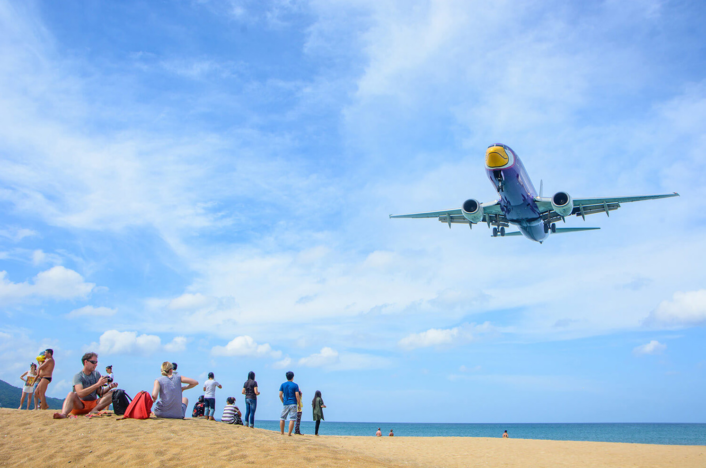
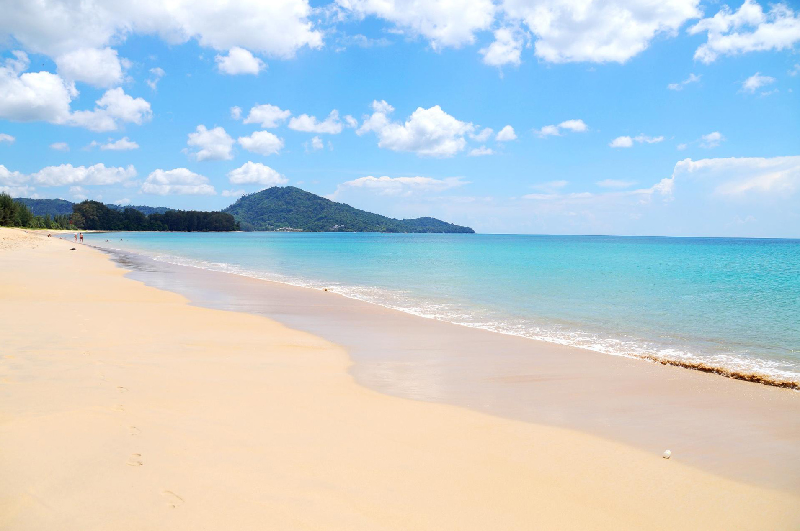

Когда можно посетить:  
**В любое время**

Цена:  
**Бесплатно с севера, 200 бат через парк Сиринат**

## Немного о достопримечательности
Этот пляж знаменит тем, что находится рядом с аэропортом, взлетно-посадочная полоса построена примерно в 100 метрах от пляжа. Смотреть как огромная махина пролетает прямо над головой и садиться на полосу — незабываемые зрелище и ощущение. А поток воздуха от турбин взлетающего самолета практически сбивает с ног, благо есть за что спрятаться.

Сам пляж Май Кхао имеет протяженность более 10 км до самой северной точки острова. Вход в воду крутой, мелководья нет, не самый лучший пляж для отдыха с детьми. Обычно в самых комфортных зонах собираются больше всего туристов. Инфраструктуры на пляже нет, зато много деревьев, в тени которых многие туристы ждут очередной самолет. 

Снорклинг на пляже Май Кхао не так интересен, как на [пляже Януи](https://we-travel.today/tajland/phuket/plyazh-yanui/). Но зато здесь тропические рыбки подплывают близко к берегу, иногда плавают рифовые акулы, которые безопасны для человека, пусть и выглядят страшно. 

.jpg "Источник solosholidays.co.uk")

С ноября по февраль черепахи откладывают яйца на берегу, поэтому на заповедном пляже действуют ограничения для туристов. Но зато есть возможность увидеть этих удивительных животных.

<iframe src="https://www.google.com/maps/embed?pb=!4v1607149768436!6m8!1m7!1sCAoSLEFGMVFpcE81ZEh4WHlkUUhCeEdYUS1EcEpBQklDSHVQMXZuMm1UX1VKZUZM!2m2!1d8.1118326!2d98.301857!3f158.12249268724935!4f25.01359126382357!5f0.7820865974627469" width="680" height="450" frameborder="0" style="border:0;" allowfullscreen="" aria-hidden="false" tabindex="0"></iframe>
  

## Информация для посещения
До пляжа, который находится рядом с аэропортом Пхукета, можно дойти с двух сторон: с северной стороны Май Кхао и со стороны национального парка Сиринат. Если заходить через парк Сиринат, то придется заплатить на входе в парк 200 бат.

