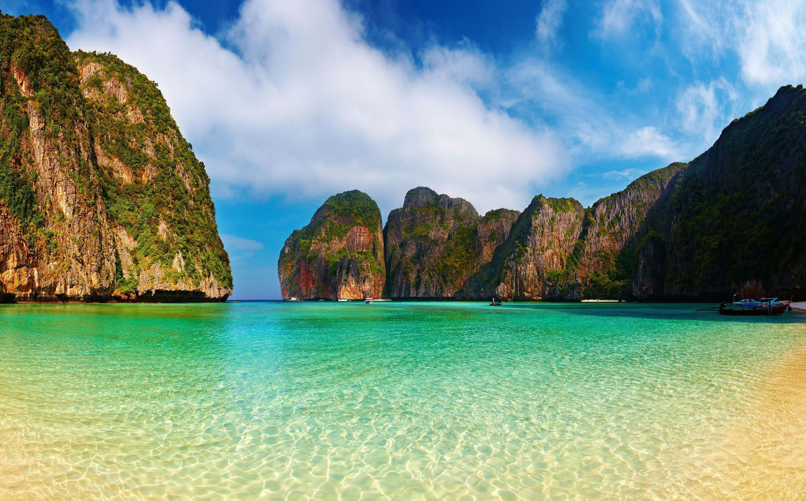

## Немного о достопримечательности
Майя Бэй — это тот райский пляж из фильма “Пляж” с Леонардо Ди Каприо, визитная карточка островов Пхи-Пхи. Если вы смотрели этот фильм, то наверняка помните красоту этого пляжа, если не смотрели — обязательно посмотрите. 

В фильме бухта была полностью закрыта скалами, в реальности, к сожалению, это не так, в бухте есть проход к морю, а скалу закрывающую ее, нарисовали с помощью компьютерной графики. Но главное разочарование в том, что с ней случилось то, чего боялись персонажи фильма — секретный пляж раскрыт, и его заполонили туристы. За день бухту посещают сотни людей, если не тысячи, ожидающие увидеть безлюдный райский пляж как в фильме, а реальность не всегда оправдывает ожидания.

Майя Бэй находится на заповедном острове Пхи Пхи Ле. Добраться до туда можно в составе экскурсии с Пхукета или Краби, еще можно нанять лодку на Пхи Пхи Доне.

**На сегодняшний день, с целью восстановить экологию, бухта закрыта для туристов до середины 2021 года.** Ограничение ввели в 2018 году, за год сюда вернулись рифовые акулы и крабы-призраки, экологи начали высаживать и восстанавливать кораллы.

 
## Как можно увидеть рай 
Первый способ — купить тур с ночевкой, для этого на острове есть палаточный городок и несколько бунгало с кафе, душем и туалетом. Рано утром или вечером, когда туристов и лодок не будет, сможете увидеть пляж во всей красе.

Второй способ — арендовать лодку, самому составить маршрут и выбрать время посещения. Ограничение лишь одно — время, арендовать можно всего на 6 часов. 

## Еще важно учитывать
Лучшее время для посещения в марте. В пик сезона, с декабря по февраль, бухту посещают больше туристов, в марте их меньше, а погода еще подходит для райских пейзажей. 

Туристов возят на пляж с 10:00 до 16:00. Поэтому приплывайте либо утром, либо вечером. Имейте в виду, что утром бухта находится в тени из-за скал.

Учитывайте приливы и отливы, если попадете на отлив, то вместо пляжа увидите песчаное дно с камнями. Выберите день когда в нужное время вода будет повыше. Экскурсоводы и лодочники этого не учитывают и запросто могут привести вас к пляжу во время отлива.

Если вы арендовали лодочку, то попросите чтобы вас высадили со стороны бухты Ло Сама и выйдете к Мая Бэй через перешеек по песчаной тропе сквозь заросли. Это дополнительно усилит ваше восхищение от райского пляжа.

`video: https://youtu.be/ZtF4Wzee7nA`