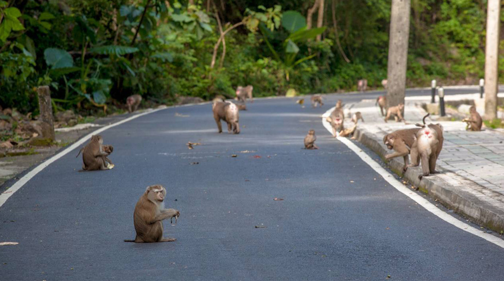
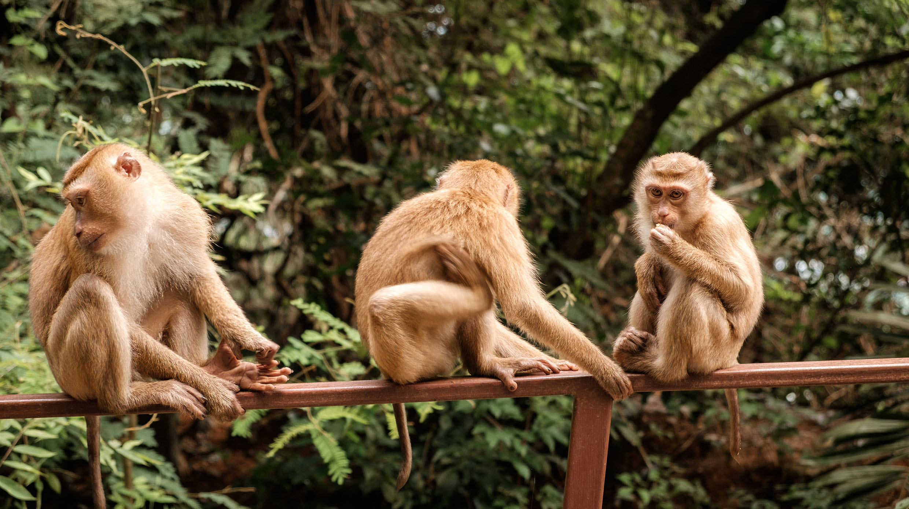
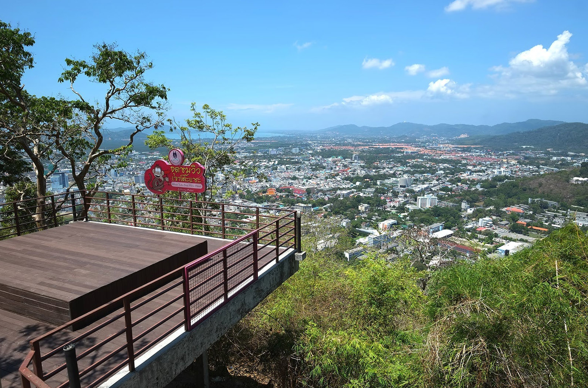
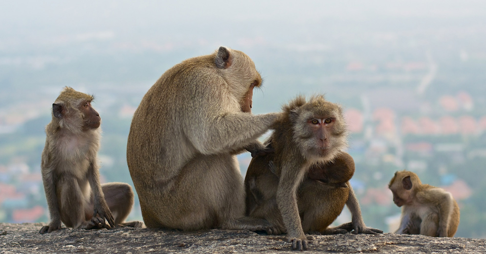

## Немного о достопримечательности
Место назвали Манки Хилл в честь популяции обезьян, которые там обитают. У горы есть и тайское название — Као То Сэ (Khao Toe Sae). Эту гору можно увидеть со всех частей Пхукет-тауна, наверху нее расположились вышки сотовой связи, а обезьяны живут в джунглях, по которым проходит дорога к ним.

По пути будут встречаться смотровые площадки, беседки, спортивные комплексы, турники и штанги. Monkey Hill — это любимое место для пробежек и занятий спортом у местных. Как только дневная жара спадает, люди бегают трусцой и катаются на велосипедах на всем протяжении маршрута, из-за этого дорогу перекрывают с 17:00 до 20:00.

Обезьян можно покормить, они привыклю к людям, только и ждут пока их покормят туристы. У подножья продаются связки бананов и пакет арахиса по 20 бат. Орехи лучше высыпать в карман, пока не видят обезьяны, и выдавать понемногу. Иначе пакетик с орехами могут отобрать или украсть из кармана. Если вас окружили обезьяны в ожидании еды, то лучше покажите пустые ладони. Они умные животные, поймут что у вас ничего нет и быстро потеряют к вам интерес. 

На Манки Хилл 3 обзорных площадок, с них открывается вид на Пхукет-таун и видно кусочек моря. На первом есть кафе, на втором вид немного получше, на третьем вид лучший из всех обзорных точек на горе. И все же смотровые площадки всего лишь бонус к обезьянам.
 
## Меры предосторожности
Соблюдайте меры осторожности, обезьяны дикие животные — могут укусить. Тогда придется обращаться за медицинской помощью и ставить уколы от бешенства. Если поцарапали обязательно обработайте рану антисептиком. 

Если их не провоцировать, обезьяны настроены дружелюбно. Они не позволяют к себе дотронуться, а попытку приблизиться к детенышам воспринимают агрессивно. 

Обезьяна может вырвать из рук, сорвать и вытащить все, что привлечет ее внимание. Поэтому стоит заранее снять кольца и серьги, и присматривайте за сумками. Лучше не берите ничего ценного с собой, вернуть вещь получится только, когда макака потеряет к нему интерес.

 
## Информация для посещения
Доехать до Горы обезьян можно и на общественном транспорте. На старом автовокзале нужно сесть на розовый автобус-сонгтео, который идет до нового терминала. Проезд стоит 10 бат. Автобус выезжает на Surin Road и заворачивает налево у подножия холма. Там и надо выйти, нажав на звонок, подавая водителю сигнал остановиться.

Дорога в гору узкая и крутая, со встречной машиной будет тяжело разъехаться, а на спуске обратно придется постоянно зажимать тормоз.

С 17:00 до 20:00 дорогу закрывают шлагбаумом, пешком до верхней обзорной площадке идти примерно полчаса быстрым шагом.

`video: https://youtu.be/2WcDu7P0rPY`