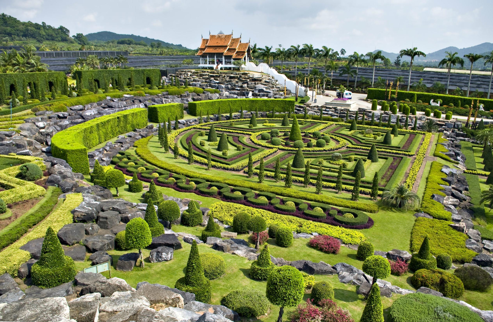
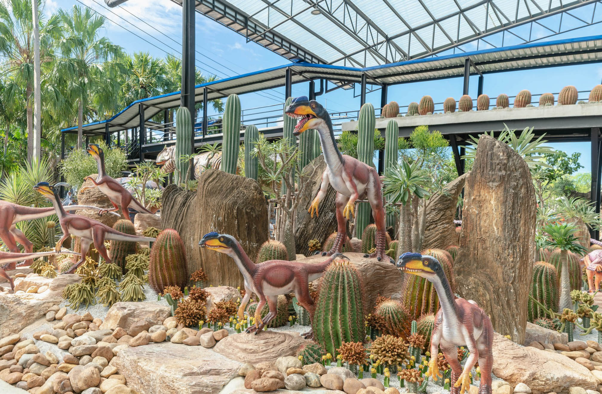
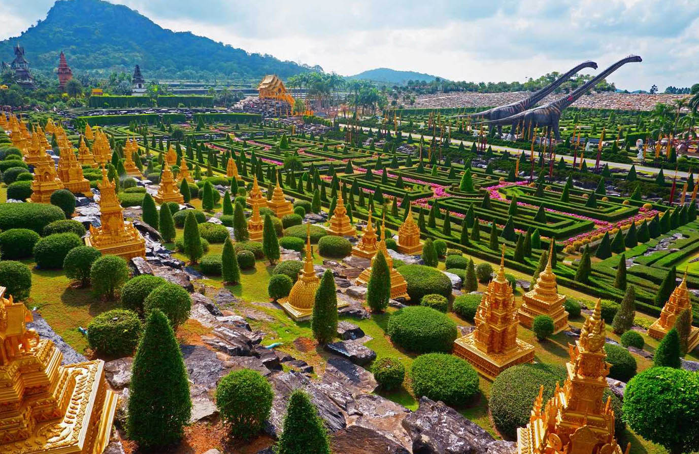
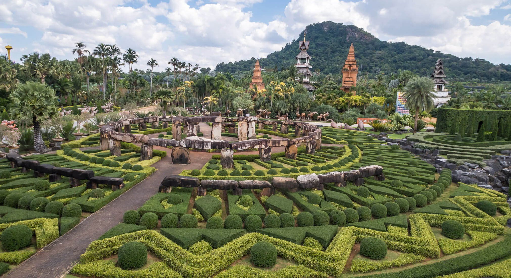
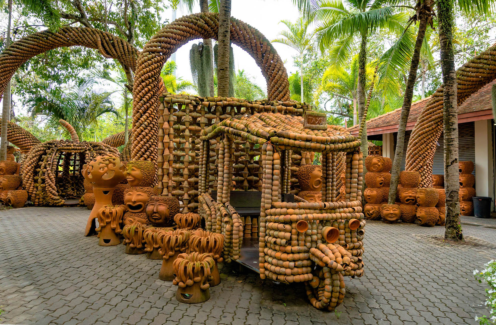
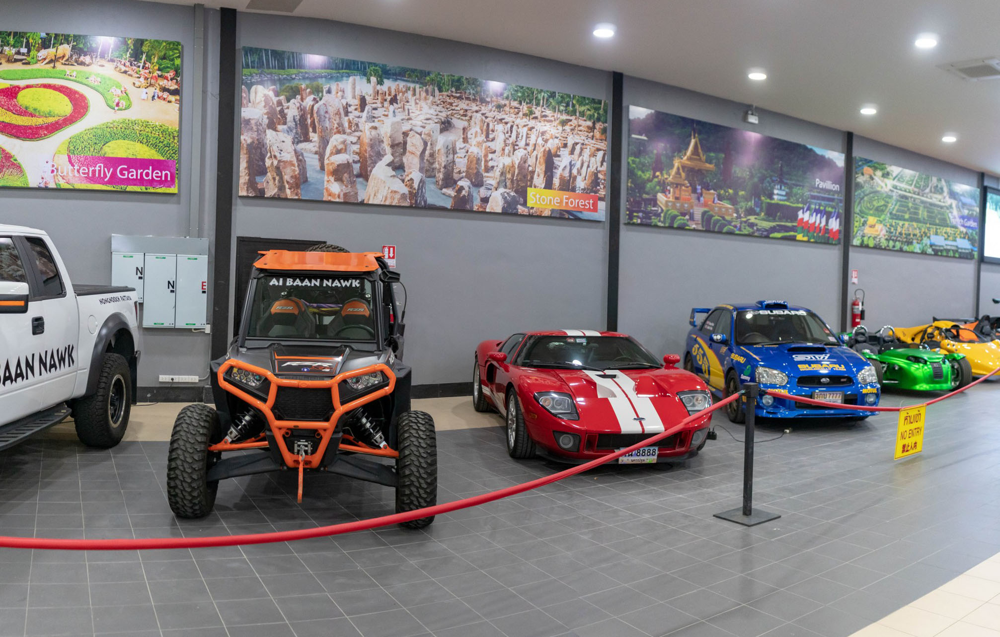
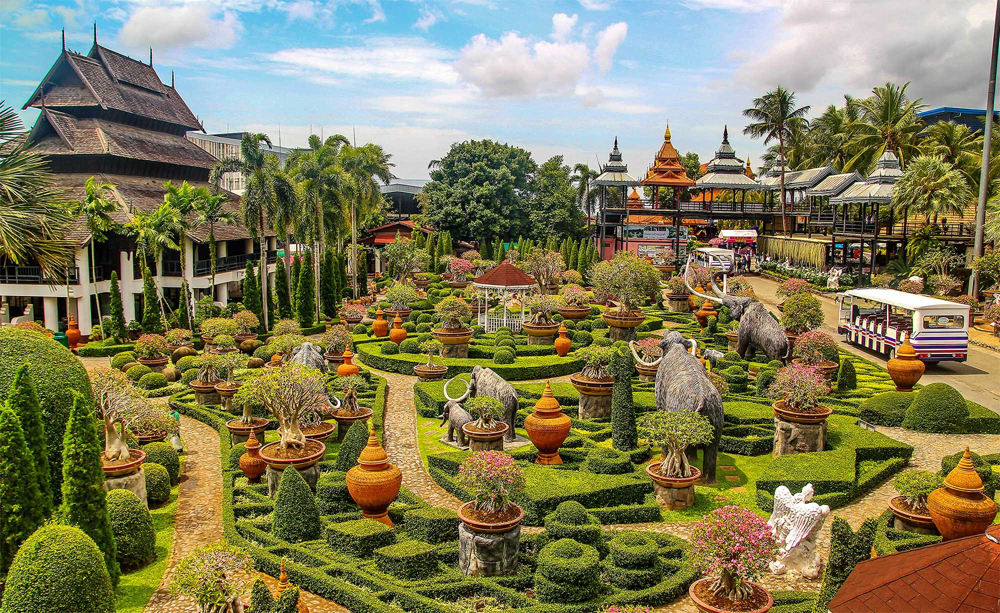

## Немного о достопримечательности
Парк Нонг Нуч является культовым местом и относиться к разряду обязательным к посещению. Тропический сад попал в книгу рекордов Гиннесса как крупнейшая частная коллекция растений и самый большой ботанический сад в юго-восточной Азии.

Парк постоянно развивается и меняется, теперь это не просто дендрарий, а настоящий развлекательный центр. 

В состав парка входит:
- *Сад орхидей*. Красивое место где собрано около 500 разновидностей. Орхидеи растут в горшках, и на обозрение посетителей выносят только цветущие в данный момент. Остальные находятся в теплице, где поддерживается специальный микроклимат.

- *Сад кактусов*. В этом саду собраны кактусы со всех уголков планеты, самых разнообразных форм и размеров. Некоторые из них даже цветут.
- *Голубой сад*. Нонг Нуч знаменит своей самой крупной коллекцией пальм, из 2800 видов известных человечеству, здесь растет более 1100, среди которых есть редкие исчезающие виды.

- *Французский сад*. Многие считают это место самым восхитительным местом в саду. Парк напоминающий Версаль и удивительным образом сочетается с тропическими пальмами и буддийскими храмами. Помимо французского стиля, есть сады в английском и итальянском стиле.

- *Стоунхендж*. В парке не так давно воздвигли уменьшенную копию знаменитого памятника древности. 
- *Зоопарк*. Он небольшой, зато травоядных животных можно покормить и потрогать. Тут есть тигры, обезьяны, олени, верблюды, черепахи, змеи.
- *Сад птиц*. В саду можно погулять среди экзотических птиц и покормить их, если у входа купили корм.
- *Сад бабочек*. Своего рода сетчатая “теплица”, где живет более 1500 бабочек. 

- *Сад горшков*. Этот сад необычен и интересен благодаря фигурам сделанных из обычных глиняных горшков.

- *Коллекция автомобилей*. Владелец парка свою страсть к машинам превратил в самый настоящий музей экзотических машин. Все машины на ходу и владелец периодически на них катается.
- *Пруд с гигантскими рыбами*. В пруду разводят хищных тропических рыб Arapaima, которые вырастают до 3 метров. И тут вы их можете покормить.
 
## Развлекательные шоу
Каждый день в парке Нонг Нуч проводится слоновье шоу и фольклорное шоу, оба идут примерно час и проводятся один за другим, чтобы посетители смогли попасть и туда и сюда. Попасть на них можно купив соответствующие билеты на входе в парк.

Слоновье шоу можно считать самым зрелищным шоу в Паттайе, слоны кидают дартс, играют в футбол, исполняют разные трюки и делают массаж добровольцам.

Фольклорное шоу — яркое и динамичное зрелище, в котором участвуют множество актеров в национальных костюмах и играет тайская музыка. 

 
## Информация для посещения
Стоимость билетов:
- Посмотреть сад для взрослых стоит 500 бат, для детей ростом 90-120 см 300 бат. Если ребенок меньше 90 см — бесплатно.
- Сад + культурное шоу + шоу слонов: 800 бат взрослый и 600 бат детский. 
- Билет в сад + шведский стол: взрослый 800 бат и детский 600 бат. 
- Все включено: 1200 бат для взрослых / 800 бат для детей.

Парк работает с 9:00 до 18:00, но лучше всего приезжать с самого утра, пока не так жарко, успеете спокойно обойти весь парк и посмотреть шоу.

На территории парка работают 3 разных буфета:
- Международный, вход стоит 550 бат, билет на него предлагают купить еще у входа в парк;
- С Индийской и Тайской едой, за посещение возьмут 300 бат;
- Тайский, цена блюд начинается от 50 бат.

При желании можно остаться на ночь в местном отеле Nong Nooch Tropical Garden Resort. Постояльцы отеля могут погулять по парку после его закрытия, понаблюдать за запуском небесных фонариков и увидеть парк в свете ночных огней.

Парк можно посетить в рамках экскурсии, обойдется это даже дешевле, но время будет ограничено, не сможете посмотреть весь парк, будете ходить за гидом и слушать его лекции.

Самостоятельно можно добраться на своем транспорте, на такси за 250-300 бат или на белом сонгтео, которые ездят по Сукхумвиту. 

`video: https://youtu.be/812hqsAQrqc`
