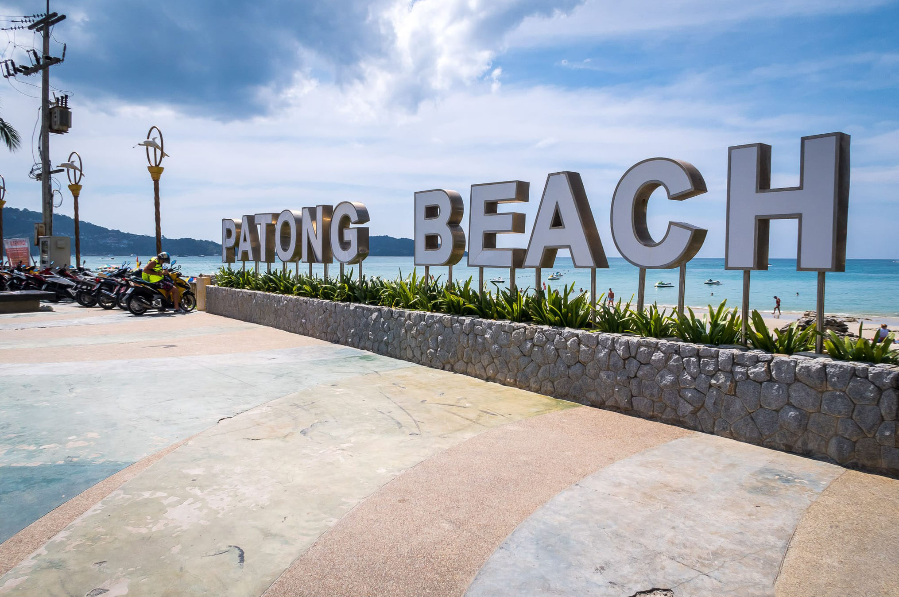
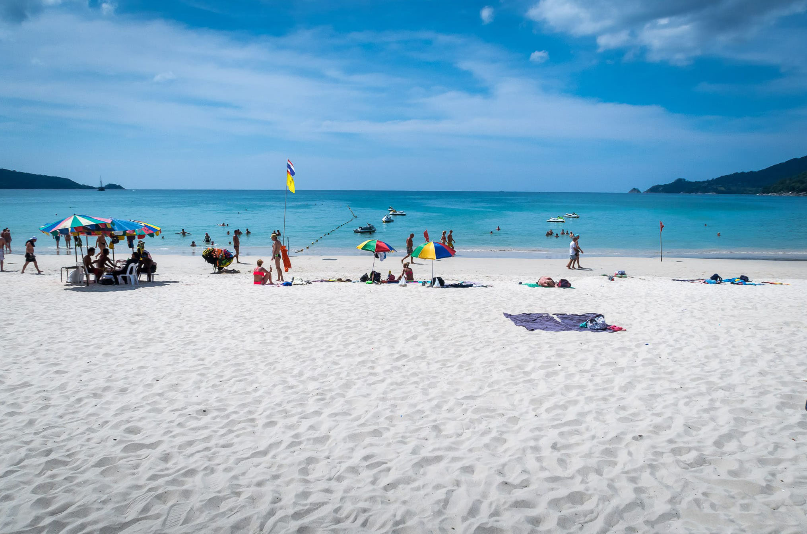
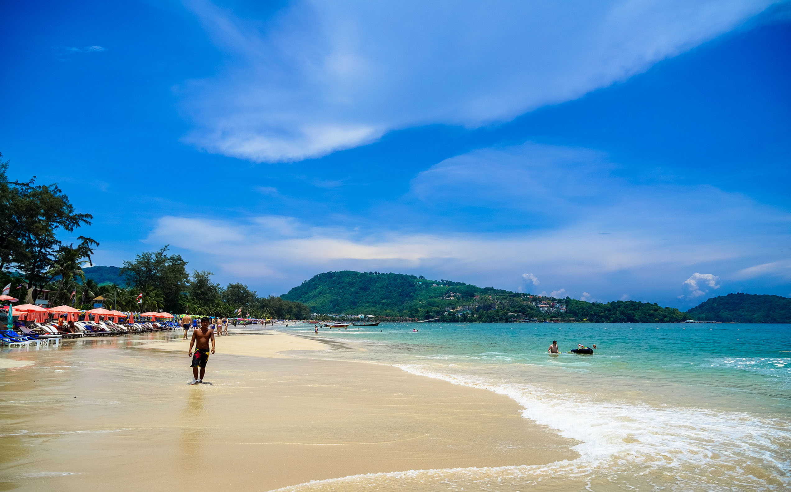
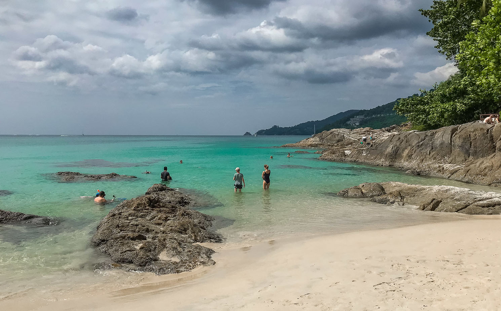
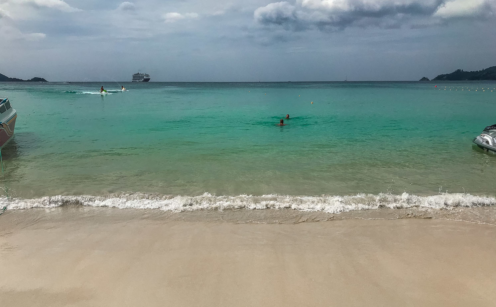

Когда можно посетить:  
**В любое время**

Цена:  
**Бесплатно**

## Немного о достопримечательности
Пляж Патонг — это самый шумный и популярный пляж на Пхукете.  Идеальное место для развлечений и активного отдыха. Пляж для тех, кто проводит день на пляже, а после заката устремляется в бары и ночные клубы в поисках приключений и новых знакомств на улицу Bangla Road.

Пляжа Патонг в длину около 3 км, но тут не так просторно как на пляже Карон — много технических зон, где нельзя купаться. Эти места выделены для водных развлечений, а южная часть пляжа отведена для лодок и кораблей. 

Песок на пляже приятный, но на других пляжах вода прозрачнее. Дно хорошее — без резких перепадов, иногда встречаются ракушки и камни. Пляж не сильно подвержен влиянию отливов, благодаря этому комфортно купаться в любое время. С ноября по апрель море в Патонге спокойное, редко поднимаются сильные волны. 

На пляж великолепные закаты, благодаря своему западному расположению, солнце садиться в море. Не удивляйтесь, если за час до заката на пляже стало больше народу, люди приходят любоваться закатом.

Патонг многолюдный пляж, в пик сезона здесь не протолкнуться, еще многие жалуются на грязь и мусор, но тайцы стараются быстро убирать, не всегда успевают. Особенно это заметно после заката, когда пляж пустеет.

Самое красивое место пляжа на севере, на самом краю где начинается каменная гряда. Здесь вода чище и меньше глубина, людей почти нет и можно уединиться.

 
## Инфраструктура 
На пляже Патонг инфраструктура развита лучше чем на других пляжах. Есть все что необходимо и даже больше: 
- туалеты и душевые распределены по пляжу равномерно, туалеты стоит 5 бат, душевые — 20 бат;
- много зон где можно арендовать шезлонги за 100 бат или 200 бат за 2 лежака и зонт;
- богатый выбор водных развлечений, можно покататься на водных лыжах, парашюте, гидроцикле, арендовать каяк или доску SUP и т.д;
- предоставляют много разных услуг, от массажа до маникюра;
- много уличных торговцев, кафе, баров;
- очень хорошо развита ночная жизнь;
- можно поиграть пляжный футбол или волейбол;
- есть бесплатная большая детская площадка;
- довольно много парковок, есть где оставить свой транспорт.

В самом городке много разных магазинов и торговых центров, любители шопинга будут довольны.

 
## Информация для посещения
Если купить в местных магазинах полотенце и зонт, за пару пляжных дней можно хорошо сэкономить на лежаках. Но имейте в виду, что спокойно расположиться вам дадут только в зонах свободных от шезлонгов.

На Патонге вы можете арендовать лодку лонгтейл и поплыть на более живописные пляжи: [Банана](https://we-travel.today/plyazh-banana), [Фридом](https://we-travel.today/plyazh-fridom-ekzoticheskij-raj), Парадиз. Или на остров Бон за 7 000 бат, острова Банана Рок или Рача за 12 000 бат, остров Корал за 8 000 бат.
 
`video: https://youtu.be/vYotKeaHAXw`