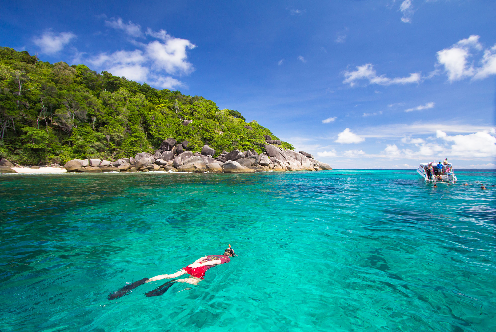

Когда можно посетить:  
**С 15 октября по 15 апреля**

Цена:  
**Экскурсия от 2450 бат за взрослого, от 2100 бат за ребенка**

## Немного о достопримечательности
Представьте тропический райский остров, представили? Хотите там побывать? Тогда вам на Симиланские острова в Андаманском море.

Яркость красок, изумительный цвет моря, буйная тропическая растительность, белоснежные пляжи и огромные валуны, лежащие на песке. Все это поражает и восхищает. Именно такая реакция у всех новоприбывших туристов. 

Вся эта красота сохранилась благодаря национальному парку и запрету на посещение острова ежегодно с 15 апреля по 15 октября. В этот момент природа отдыхает от людей и восстанавливается. 

Архипелаг состоит из 9 островов, а доступно к посещению только 4 из них. Остальные либо слишком маленькие, либо на них морские черепахи откладывают яйца. На 2 островах есть инфраструктура: кафе и место для ночлега.

К сожалению, у островов есть и минусы:
- Много желающих увидеть кусочек рая, поэтому вместе с вами приплывут на остров множество других туристов. У всех программа и расписание примерно одинаковые, из-за этого вы не раз будете стоять в очереди, чтобы сфотографироваться на обзорной точке. Если хотите насладиться островами без скопления людей, то лучше ехать с ночевкой. 
- Коралловые рифы погибли из-за цунами прошедший в 2004 году. Подводный мир потерял свои краски и очень сильно пострадал.

## Информация для посещения
В теории добраться до островов можно и самостоятельно, но это будет непросто и вряд ли дешевле, чем экскурсией, легче купить экскурсию с Пхукета или Као Лака.

Плыть до архипелага придется больше часа с Ка Лака и 3 часа с Пхукета. Спидбот плывет быстро, и даже в спокойном море прыгает на волнах, если не уверены в себе, садитесь ближе к концу лодки и выпейте таблетку от укачивания, которую вам дадут перед поездкой.

