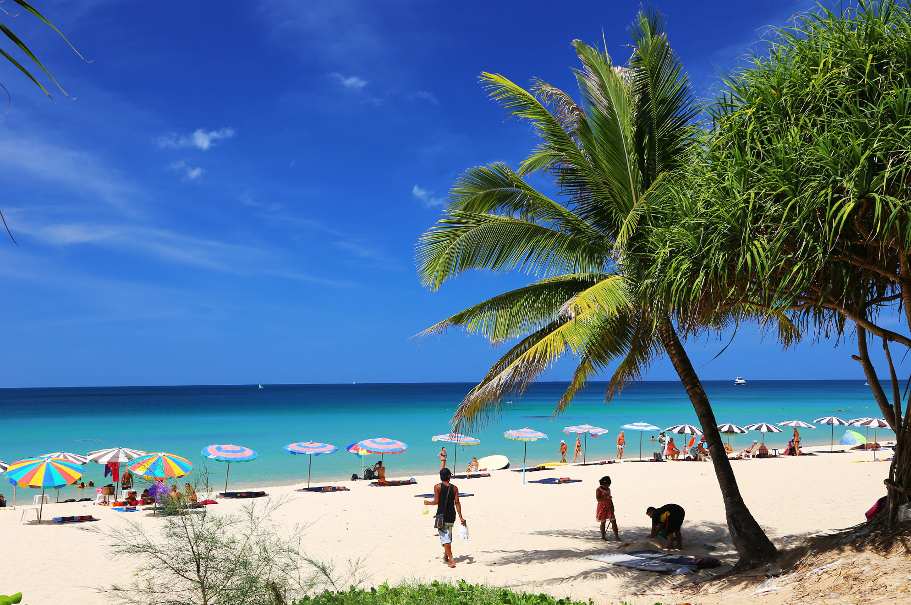

Когда можно посетить:  
**В любое время**

Цена:  
**Бесплатно. Лежак и зонтик от 150 бат**

## Немного о достопримечательности
Сурин популярный пляж как у туристов так и у местных, в длину около 800 метров, а в ширину около 50. По бокам пляж заканчивается большими камнями и коралловыми рифами. В солнечную погоду место хорошо подходит для снорклинга, а в шторм интересно наблюдать как волны разбиваются об эти камни.

Песок в Сурине мелкий и светло-желтого цвета, а вода чистая, бирюзового цвета. Во время прилива глубина увеличивается резко, а в отлив заход в воду становиться пологим. Смена уровня воды почти не заметна, купаться комфортно даже в отлив.

В сезон море приятное и ласковое, но обычно есть волны, штиль бывает редко. С апреля беспокойство воды усиливается, поднимается мощные волны.   

С декабря по февраль в Сурине многолюдно. Лежаки на пляже стоят плотно в 5 рядов, и в широком пляже становится не так просторно. Вечером люди встречают закат, а когда стемнеет, зажигаются огни кафе и ресторанов, начинает играть музыка. И днем и ночью на пляже царит атмосфера курорта. В низкий сезон закрываются многие заведения и убираются лежаки.

Край пляжа с северной стороны обычно более малолюдный и просторный. Если хотите больше уединения, лучше идите туда.

На пляже много естественной тени, но на них расположились столики от кафе и платные лежаки. Поэтому бесплатно в тени полежать вряд ли получиться.

<iframe src="https://www.google.com/maps/embed?pb=!4v1607148901477!6m8!1m7!1sMY-5RvqWLZ99R2W6JPbnyw!2m2!1d7.97614896230261!2d98.27827256045674!3f283.9573733093179!4f1.8446883448400513!5f0.7820865974627469" width="680" height="450" frameborder="0" style="border:0;" allowfullscreen="" aria-hidden="false" tabindex="0"></iframe>
  

 
## Инфраструктура 
Много кафе, ресторанов и баров, ночная жизнь развита. Есть бесплатный душ, но часто на него очередь большая. Если не хотите ждать, возле дороги стоит платный. В кафе есть платные туалеты.

В центральной части пляжа стоит тайский храм, а на северной стороне расположились дорогие заведения, даже есть детская площадка.

