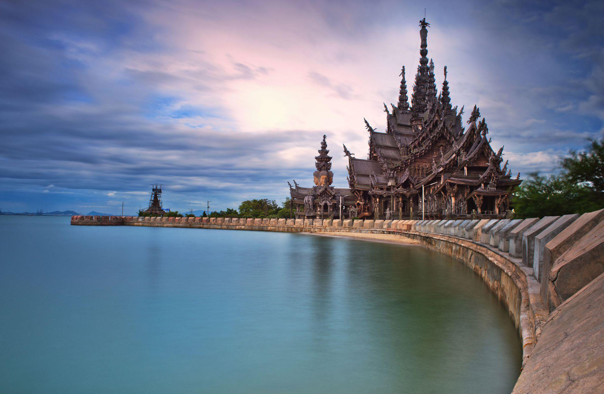

Когда можно посетить:  
**Ежедневно 9:00 – 17:00**

Цена:  
**От 450 бат за взрослого и 250 бат за ребенка**

## Немного о достопримечательности
Храм Истины (The Sanctuary of Truth) в Паттайе — воистину уникальное сооружение, похожего храма в мире больше нет. В высоту он достигает 105 метров, что равносильно 30 этажному дому, и построен полностью из дерева и без гвоздей.

Строительство начали еще 1981 году, на деньги тайского миллионера Лек Вирияпханта, а идеей стала объединение религии и культур соседних стран в поисках истины. После смерти миллионера, дело отца продолжает сын, строительство планируют закончить 2025 году.

Когда начинаешь рассматривать храм, охватывает настоящий восторг — тысячи фигур старательно вырезанные из дерева украшают здание. Эти фигуры везде: на колоннах, стенах, лестнице, потолке; проделана огромная работа, неудивительно, что строительство продолжается почти 40 лет. К сожалению время беспощадно, самые первые вырезанные фигуры потрескались и начали откалываться.

В храме есть 4 зала, посвященные культуре и религии соседствующих стран:
- *Тайский зал*, воплощает 7 планет, олицетворяющих дни недели, внутри горят свечи и звучат мантры.
- *Индийский зал* посвящен стихиям, украшен скульптурами драконов, животных и деревьев.
- *Китайский* посвящен Бодхисаттве, человеку ставший буддой и принесший блага всем людям.
- *Камбоджийский* посвящен родительской любви, в зале стоит скульптура отца и матери, держащие своих 3 детей.

 
## Информация для посещения
Ежедневно в храме в 11:30 и 15:30 проходит развлекательное представление: танцы и бои на мечах. Также в Храме Истины всегда есть русский гид, который проводит экскурсию как только наберется группа. Это все включено в стоимость билета.

На территории храма есть и платные услуги, такие как катания на слонах, катере, лошадях, массаж ног и стрельба из лука. Полный пакет стоит 1200 бат для взрослого или 1000 бат с ребенка.

У подножья Храма Истины есть кафе, контактный зоопарк и смотровая площадка.

Не забывайте про правила посещения храма, закрыть плечи и живот. На месте под залог 200 бат можно получить накидку, чтобы прикрыться.
 
`video: https://youtu.be/EaF5Avw3jfA`
