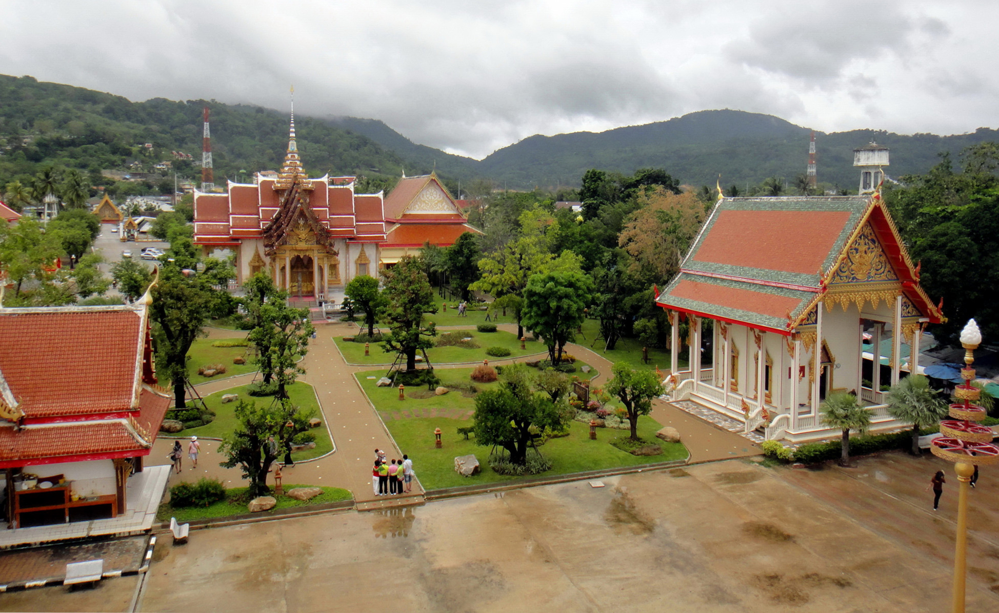
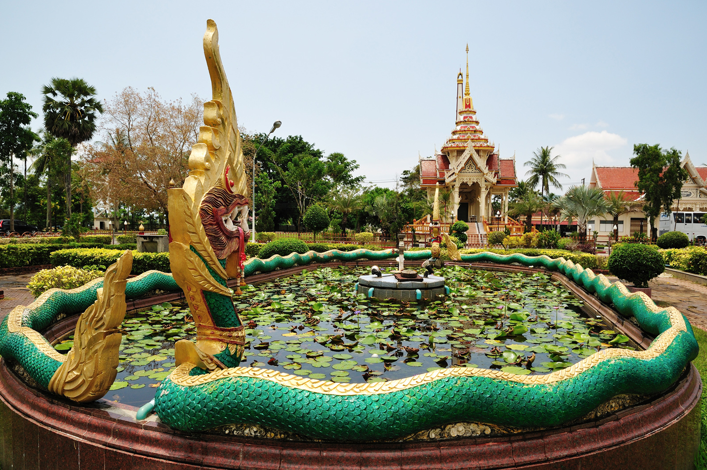
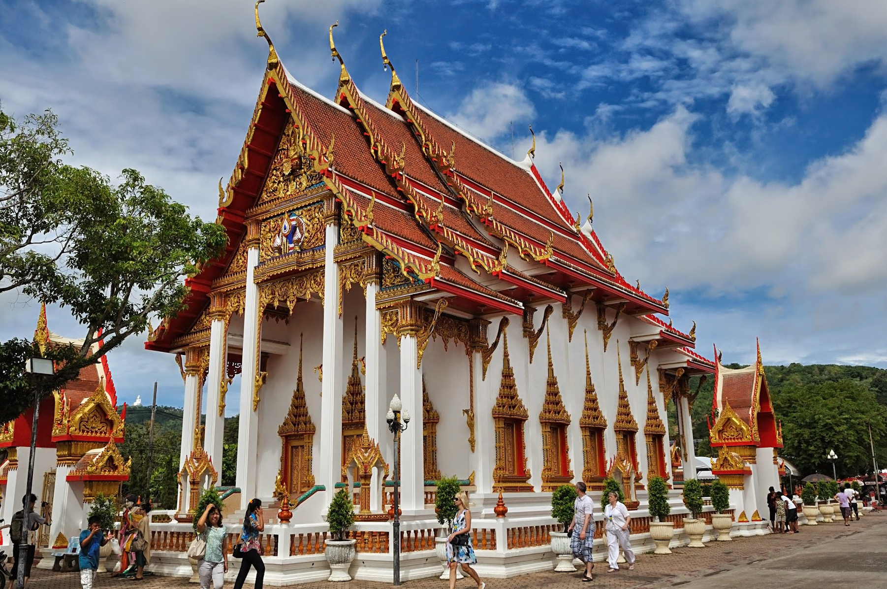

Когда можно посетить:  
**Ежедневно с 7:00 до 17:00**

Цена:  
**Бесплатно**

## Интересные факты

* В этом храме содержится прах Будды и фрагмент его ключицы.
* Возраст храма неизвестен, первые письменные упоминания о храме датируются в 1837 году.
* На территории храма стоит печь, в которой весь день жгут петарды; считается, что такой звук отпугивает злых духов.

## Коротко о храмовом комплексе

Храмовый комплекс Ват Чалонг — самый популярный храм на Пхукете. Комплекс состоит из нескольких зданий, сада, прудов и множества торговых точек. Комплекс старый, красивый и ухоженный, будет интересен для тех, кто любит архитектуру и хочет познакомиться с местной культурой.

И все же Ват Чалонг больше туристическая достопримечательность, чем буддийский храм. Пусть он и действующий, но множество туристов, торговых лавочек не дают погрузиться и прочувствовать буддийскую атмосферу. Поэтому посмотрев один раз, возвращаться не захочется.

Рядом с территорией комплекса есть несколько прудов, в которых можно покормить рыбок. А вокруг маленького озера есть беговая и велосипедная дорожки.

## История

Точной даты основания Ват Чалонга никто не знает, первое письменное упоминание встречается в 1837 году, когда храм перестраивался. А в 1876 защищал местных жителей от взбунтовавшихся китайских эмигрантов.

А в 1999 году правительство Шри-Ланки подарило королю Тайланда Раме IX прах и часть ключицы Будды. Для хранения построили новое сооружение — Чеди Пхра Махатхат, самая высокая постройка в комплексе.

## Здания храмового комплекса

* *Чеди Пхра Махатхат (Phra Mahathat Chedi)*. Здание возвышается на 60 метров и заметен издалека, именно тут хранятся часть останков Будды. Храм открыт для туристов, имеет 3 этажа, внутри впечатляет также как и снаружи. По пути наверх можно выйти на террасу, оттуда красивый панорамный вид на 360 градусов на храмовый комплекс.
* *Убосот*. Это главный храм комплекса предназначенный для обрядов, но к сожалению любоваться архитектурным шедевром получиться только снаружи, внутрь попасть нельзя. Войти внутрь разрешается только монахам и только во время проведения служб.
* *Крестообразная Вихана*. Интересен тем, что предназначен для простых обрядов, который может совершить любой желающий. Чтобы провести один из них, нужно приклеить фольгу именно туда где болит на статуе монаха-целителя, считается что это лечит и уменьшает боль. Второй обряд – это гадание на палочках или брусочке.
* *Кути*. Это воссозданный по чертежам дом, в котором когда то жил один из основателей и настоятелей храма. Некоторая мебель сохранилась с тех времен.
* Еще есть служебные здания, в которые туристов не пускают. Среди них *Дом текущего настоятеля*, *Крематорий* и *Зал прощаний*.

## Информация для посещения

Храм работает с 7:00 до 17:00. Обязательно соблюдайте дресс-код: закрытые плечи и прикрытые колени. Снимайте обувь, когда заходите в здание. Сувениры и подношения лучше покупайте в супермаркете, в лавках возле храма цены намного выше.

Посетить храма Ват Чалонг можете самостоятельно, а можете любой обзорной экскурсией.