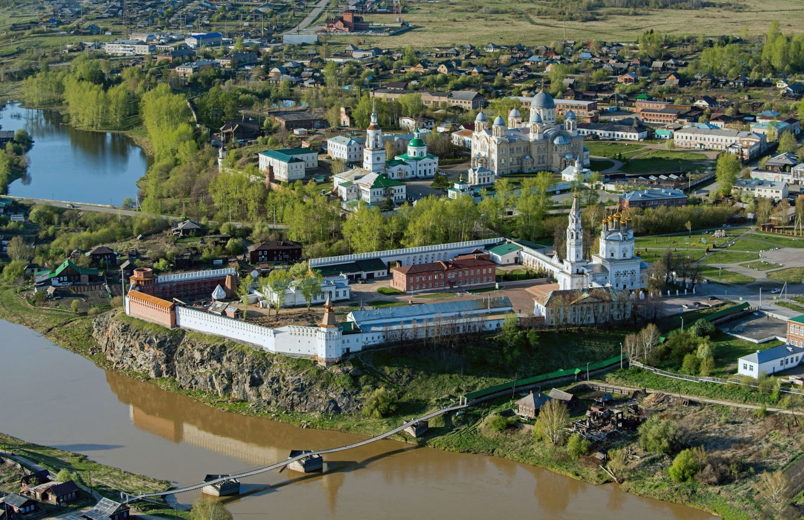
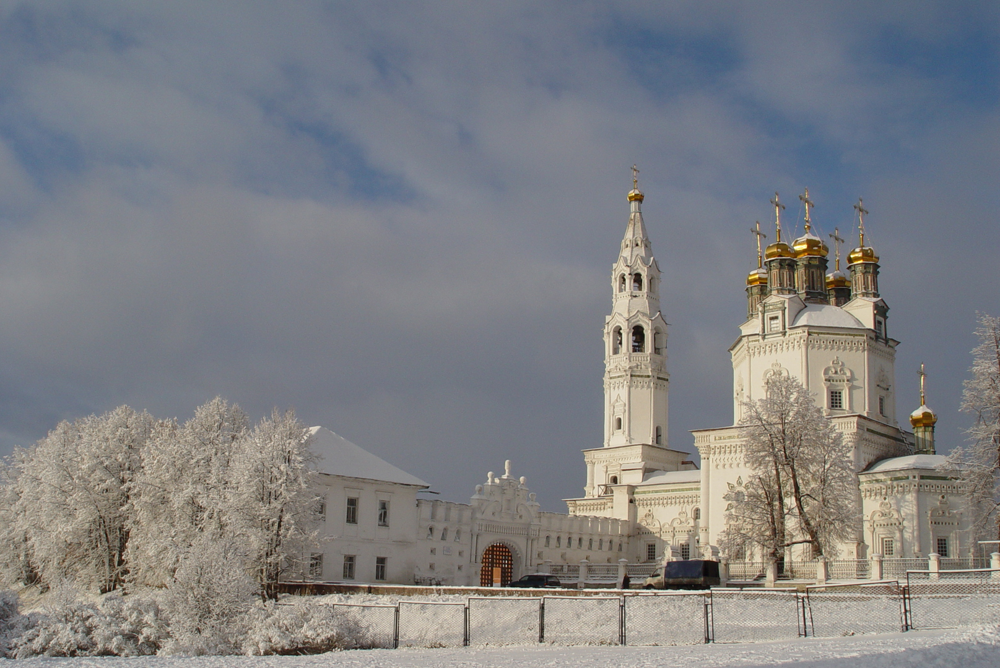
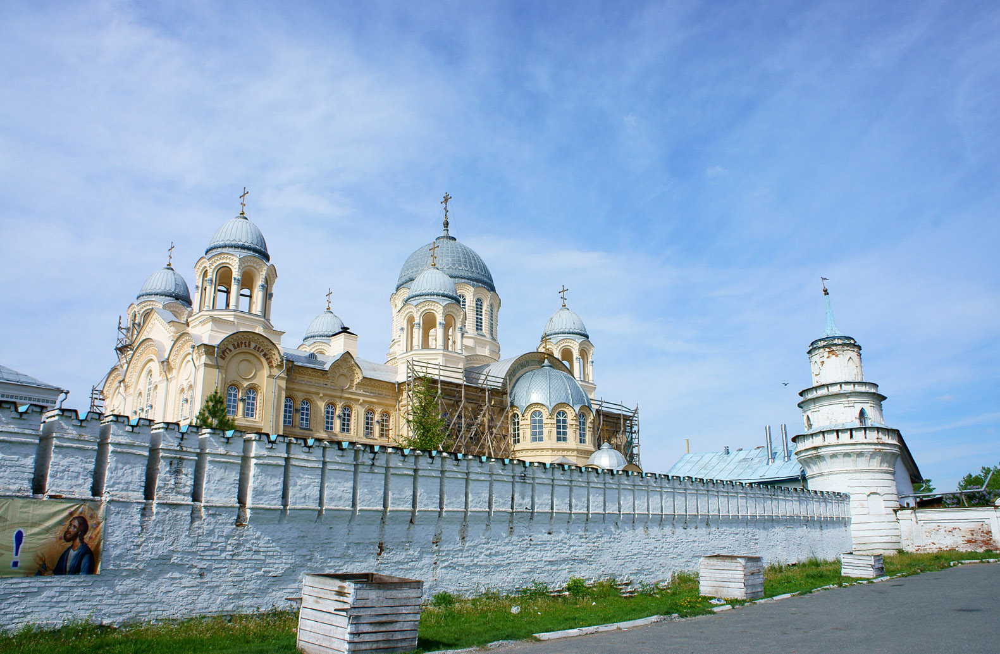
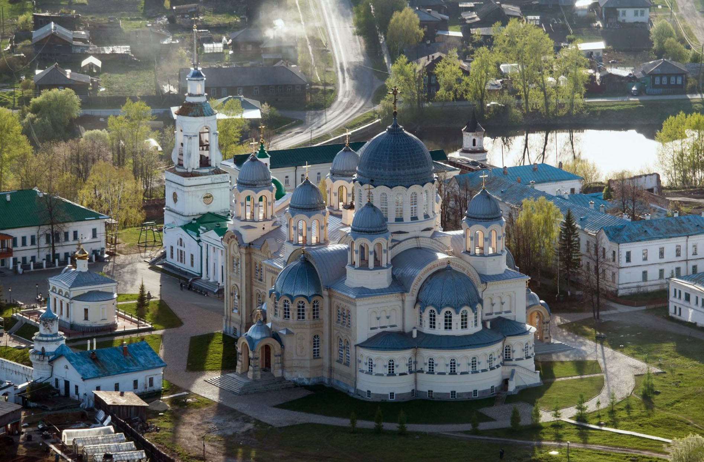
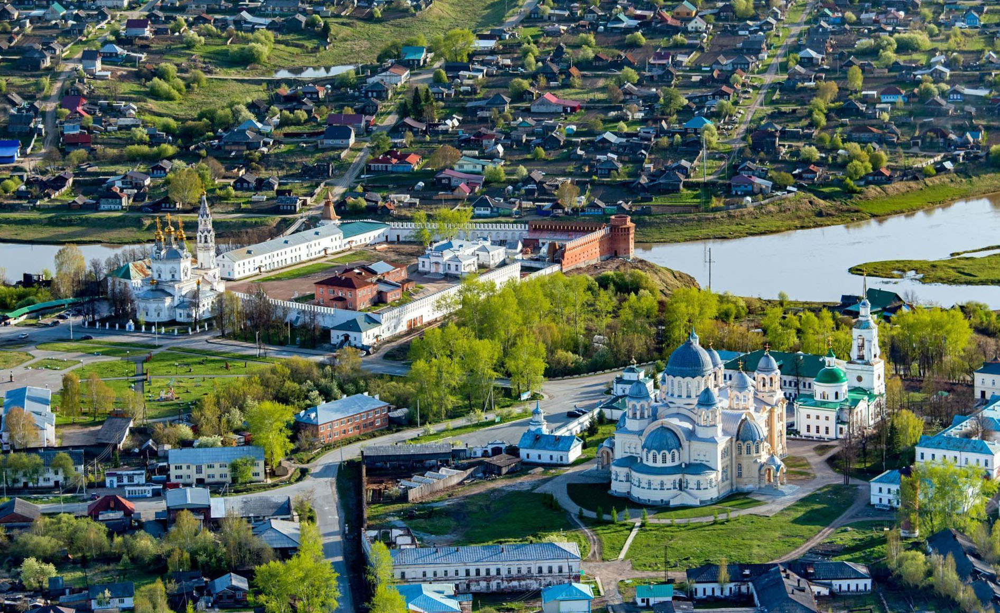
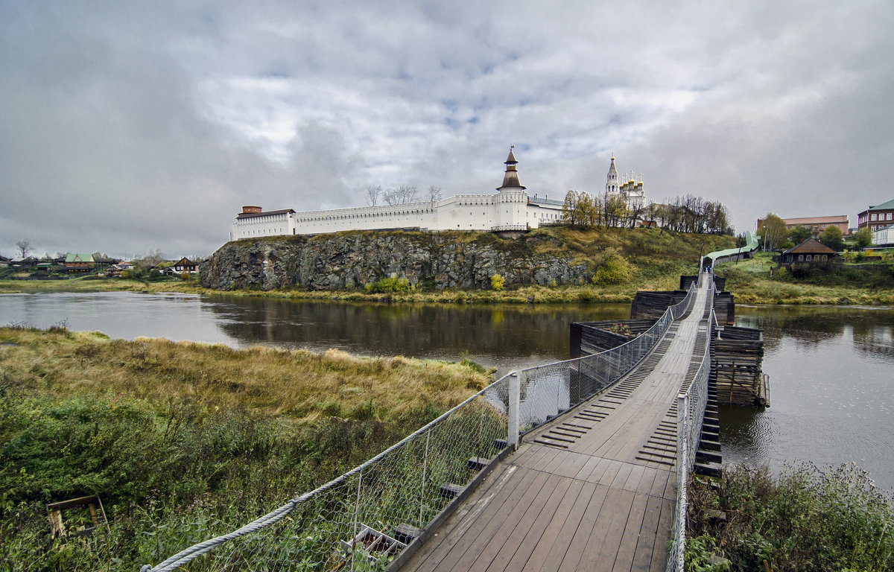

Когда можно посетить:  
**В любое время**

Цена:  
**Зависит от посещаемой достопримечательности**

## Немного о достопримечательностях
Ни один из многих городов Свердловской области не изобилует таким количеством религиозных, духовных и природных достопримечательностей, как Верхотурье – старинный город Урала, воздвигший внутри себя величественные монастыри, православные святыни, храмы, мосты и быстрые реки. 

Город с многовековой историей, Верхотурье хранит в себе память в виде изящной архитектуры и останков былых времен – в число самых известных и частопосещаемых входит Верхотурский кремль – самый малый из когда-либо построенных кремлей России. На территории кремля расположился краеведческий музей истории г. Верхотурья и Урала в целом, Троицкий собор, на чью колокольню может подняться любой желающий. 

Достопримечательность будет привлекательна людям, интересующихся историей и архитектурой старинных городов России, для посетителей достопримечательность открыта с 10:00 до 18:00, понедельник – выходной, вход – бесплатный, стоимость билета в музей – 100 руб. Достопримечательность находится по адресу: ул. Советская, 1-8

Следующим по популярности следует мужской Свято-Николаевский монастырь, где находится известный Крестовоздвиженский собор с мощами Симеона Верхотурского. Отсюда открывается прекрасный вид на кремль и городскую площадь, а также на каменный свод стен, которые обвивают монастырь по периметру. 

На территории монастыря расположено большое количество религиозных памятников, что делает его чуть ли не объектом паломничества среди православных христиан – Преображенский храм, Николаевская церковь и Симеоно-Аннинский храм (в нем хранятся мощи неизвестных монахов). Также сохранились и памятники архитектуры (училище, корпуса, лавка с иконами) и руины советского прошлого – во времена СССР на месте монастыря располагалась колония для несовершеннолетних. 

Церкви на территории монастыря действующие, поэтому требуется соблюдать православный дресс-код при посещении. Свято-Николаевский монастырь идеально подойдет для людей с христианской верой – в этом месте они ощущают прикосновение Бога и очищение от суетности жизни. Но и обычным туристам он может показаться приятным – прекрасная архитектура времен Руси, исторический ансамбль и близость природы подарят расслабление и отдых любому человеку, независимо от его вероисповедания и возраста. Вход – бесплатный. Достопримечательность находится по адресу: ул. Воинская, 1A

## Стоит посмотреть!
Религиозные места Верхотурья созданы для того, чтобы духовно обогащать своих почитателей атмосферой святости и умиротворения. В Верхотурье съезжаются обычные туристы и паломники – посмотреть на величественные соборы и монастыри (женский и мужской), росписи стен, позолоченные иконы и убранство церквей, прочувствовать всем телом чистый воздух и благоухание ладана. Здесь каждый найдет себе занятие по вкусу – обычная прогулка, романтическая поездка, молитва или историческая экскурсия по всем знаковым местам Верхотурья.

В православном центре Урала знающий турист может отыскать не только знамена с крестами и белые церкви – в Верхотурье находятся интересные природные памятники  – историко-архитектурный музей-заповедник, где расположен кремль, исторические экспозиции быта верхотурцев и интерьеры старинных заведений; размещенный в самом центре Верхотурья подвесной пешеходный мост над Турой, откуда открывается великолепный вид на панораму всего города; интерес представляет и застройка города – необычные здания выполнены в кирпиче и деревянном зодчестве, что делает Верхотурье еще более заманчивым для любителей индустриального туризма. Достопримечательности находится по адресу: ул. Советская.

## Информация для посещения
До города можно добраться на автобусе из Екатеринбурга за 5 часов, на поезде за 5 часов и на личном автотранспорте за 4 часа.

На территории многих достопримечательностей Верхотурья имеются кафе, столовые и рестораны, лавки с сувенирами и туалеты. Также на территории монастыря есть возможность бесплатного проживания и питания около 3-х дней.

Многие церкви Верхотурья являются действующими, поэтому необходимо соблюдать православный дресс-код женщинам и мужчинам.

`video: https://youtu.be/X6sUbmWd60Y`