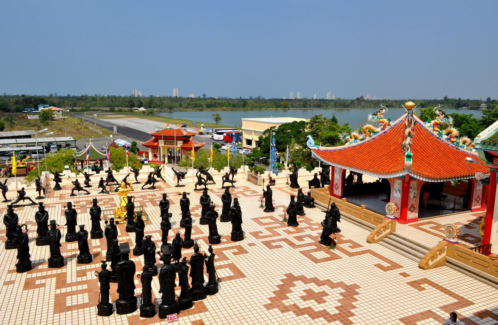

## Немного о достопримечательности
Китайский храм-музей Вихарнра Сиен (Viharnra Sien Pattaya) — это крупнейшая коллекция экспонатов китайской культуры, находящийся за пределами Китая. Храм-музей был построен в качестве подарка и знака дружбы королю Рамы IX от китайского правителя, за урегулирования вопросов миграции. 

На территории 3 га находится парк, трехэтажное здание в китайском стиле и тысячи самых разных фигур и статуй. 

Сам парк красив и аккуратен, украшен фонтанами, деревцами бонсай и скульптурами животных, людей и богов. Есть беседки и места, где можно уединиться и отдохнуть. 

Первый этаж здания примечателен тем, что тут можно увидеть нескольких воинов из знаменитой Терракотовой армии. Также на этаже расположились множество бронзовых статуй изображающих мифических существ и персонажей из буддийской и индуистской веры. Много антикварной деревянной мебели, расписанных ваз, и интерьер украшенный узорами и фресками.

Второй этаж — это терраса, где застыли изображение монахов в боевых позах, словно живые.  Рядом с ними стоят фигуры знаменитых людей прошлого.

Третий этаж посвящен Будде по имени Сиддхартхе Гаутама. И из окон открывается красивый вид на храмовый комплекс Ват Ян.

На территории дворца Вихарнра Сиен очень атмосферно, даже можно ненадолго забыть, что находишься в Тайланде. Если вам интересна китайская культура, то обязательно к посещению.  
 
## Информация для посещения
Цена за вход стоит 50 бат, детям бесплатно. 

При посещении храма-музея нужно прикрывать колени и плечи, как и в других храмах. У входа здание необходимо снять обувь, возьмите с собой носки, чтобы не обжечь ноги о пол террасы нагретой на солнце.

На территорию запрещают приносить свою еду и напитки.

Посетить дворец Вихарнра Сиен можно в рамках экскурсии или самостоятельно. Если приезжаете самостоятельно, обязательно посетите храмовый комплекс Ват Ян и гору Золотого Будды, они находятся рядом.

`video: https://youtu.be/gSeVS9zWKVM`
