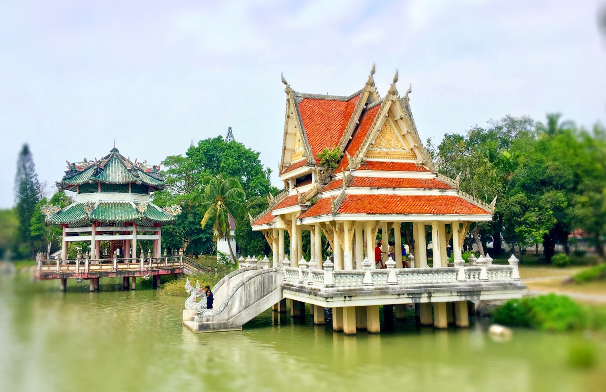
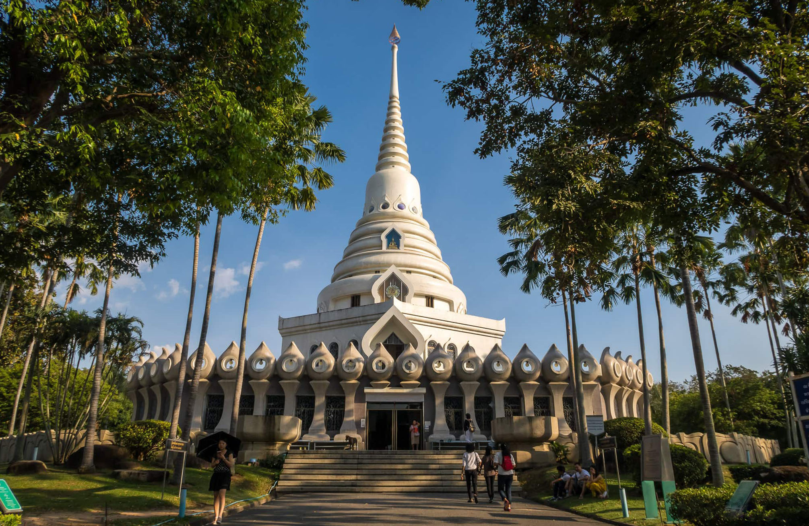
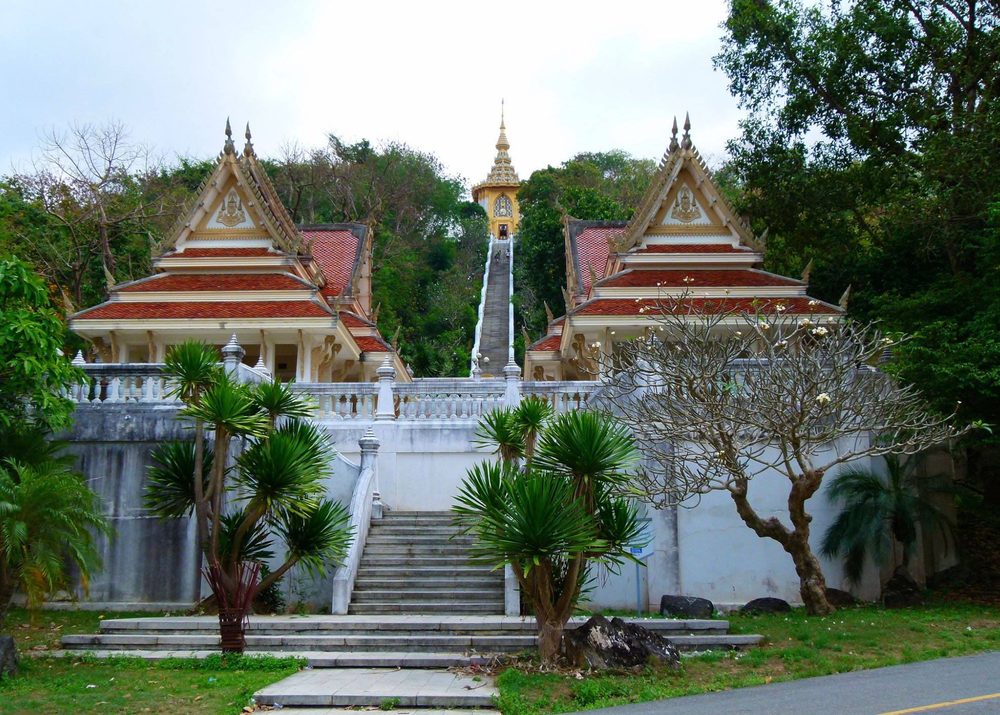

Когда можно посетить:  
**Ежедневно 8:00 – 17:00**

Цена:  
**Бесплатно**

## Немного о достопримечательности
Храмовый комплекс Ват Ян в Паттайе один из крупнейших в стране, на территории 145 Га находятся более 30 храмов, большой парк, озеро, пруд, фонтаны, огромный лес и даже музей.

Знаменит храм благодаря большому отпечатку на камне человеческой ноги — буддисты считают это след самого Будды.

В комплексе Ват Ян много интересных зданий, выполненных в разных стилях: китайские беседки, индуистские храмы, обычные тайские сооружения.

Самые популярные места в комплексе:
- Храм Ват Ян, очень красивое и привлекательное здание, самое высокое в комплексе. Внутри находится музей, где выставлены очень реалистичные восковые фигуры монахов, экспонаты современного искусства на тему Буддизма и прочее.

- *Ступа Phra Borommathat Chedi Maha Chakkri Phiphat*, это причудливый храм белого цвета неподалеку от Ват Ян. Внутри находятся маленькая часть мощей Будды и нескольких его учеников. Это священное место, внутри фотографировать и снимать на камеру запрещают.
- *Парк, озеро и пруд.* Вдоль озера расположились беседки в китайском и тайском стиле, где можно отдохнуть, помедитировать или покормить рыбок. Недалеко от озера есть пруд заросший красивыми лотосами и ухоженный парк с фонтанчиками, статуями и клумбами, где можно гулять часам и наслаждаться природой и тишиной. 

- Внутри *Храма Пхра Мондоп* находится отпечаток стопы Будды. Чтобы до него добраться, придется пройти пешком больше километра и взойти на холм по 300 ступеням, но оно того стоит. Оттуда открываются шикарные виды на окрестности храмового комплекса, а вдалеке видна Паттайя.
 
## Информация для посещения
Рядом с комплексом Ват Ян находятся Китайский дворец музей Вихарна Сьен, гора Золотого Будды и виноградники Силвер Лейк, если будет время и возможность — обязательно посетите.

Посетить храм можно как в рамках экскурсии, так и самостоятельно.

Помните о правилах посещения храмов, одевайте одежду, которая закрывает плечи, живот и колени.

`video: https://youtu.be/vh8RF48AwVM`
