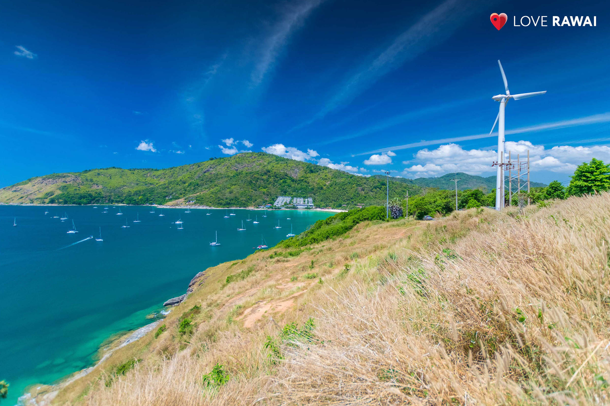
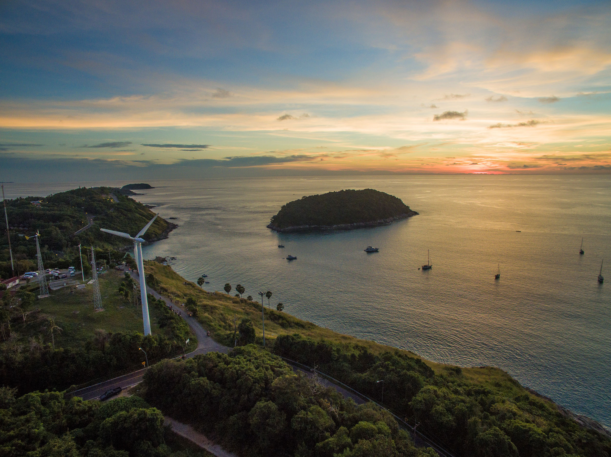
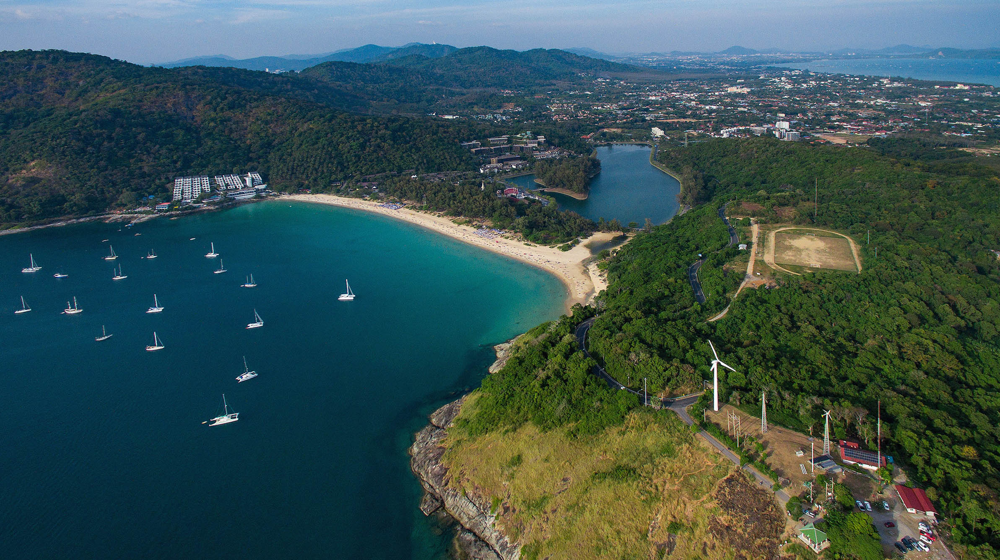

## Немного о смотровой площадке
Рядом с ветряными электростанциями расположилась замечательная обзорная точка. Это место назвали Windmill Viewpoint, русские называют просто “Ветряки”. Главный ветрогенератор видно издалека, и он является ориентиром для путешественников, исследующих остров самостоятельно.
Отсюда открывается замечательный  вид на пляж [Януи](https://we-travel.today/plyazh-yanui/) и [Най Харн](https://we-travel.today/plyazh-naj-harn/), небольшой остров Ман (Koh Man) и [мыс Промтеп](https://we-travel.today/mys-promtep/). В Windmill Viewpoint нет экскурсий, поэтому здесь нет больших столпотворений.

Посещать обзорную точку лучше днем, чтобы успеть насладиться видами в дневном свете, а после встретить закат.

Морскую гладь часто рассекают парусники, а вдалеке проходит круизный лайнер. На небе плывут парапланы, а рядом пролетают орлы и браминские коршуны, которые гнездятся на острове Ман.

В солнечную погоду, когда солнце в зените, открываются лучшие виды. Море красится в аквамариновый цвет, а волны разбиваются о прибрежные камни. На закате солнце красит небо и облака в изумительные цвета, а после заката море начинает сиять сотнями зеленых огней, так рыболовецкие шхуны ловят кальмаров.

<iframe src="https://www.google.com/maps/embed?pb=!4v1607103026260!6m8!1m7!1sCAoSLEFGMVFpcE9vN1JTZEF3Vm4xOGUxSjJyN1Y5NVFYb2ZUcG8wVHRoM3YxaGhD!2m2!1d7.7695574!2d98.30618609999999!3f241.24347188047955!4f-1.7286515482035725!5f0.5970117501821992" width="680" height="450" frameborder="0" style="border:0;" allowfullscreen="" aria-hidden="false" tabindex="0"></iframe>
  

 
## Информация для посещения
Инфраструктуры почти нет, но есть беседка со скамейками.  Естественной тени тоже нет, зато от жары спасает бриз. Днем бывают продавцы мороженого и напитков, а вечером почти никого нет, зато появляются комары и начинают кусать — лучше возьмите с собой репеллент.  

Для машин поблизости парковок нет, даже развернуться не получится. Для мотобайков есть небольшая парковка.

## Видео
`video: https://youtu.be/AhZIIhTlGkU`
