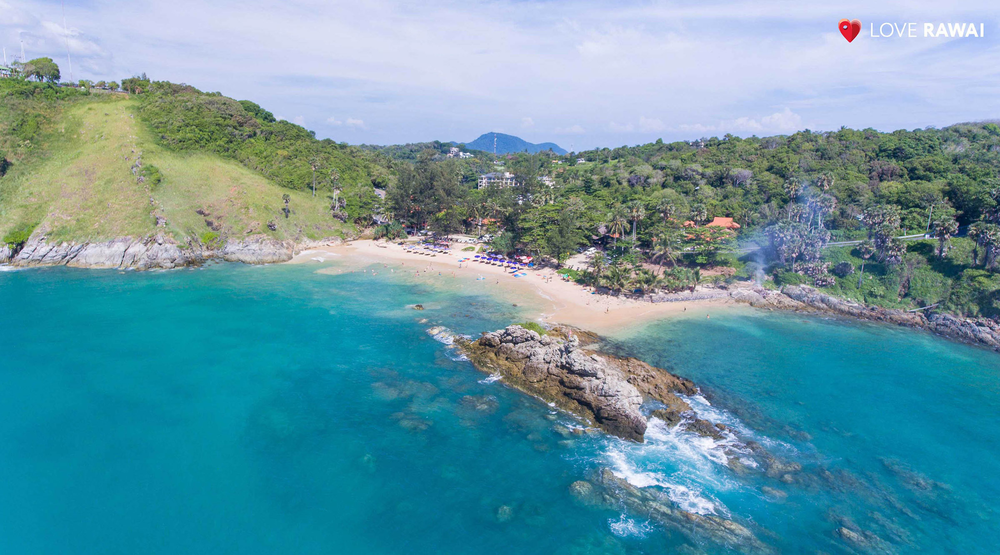
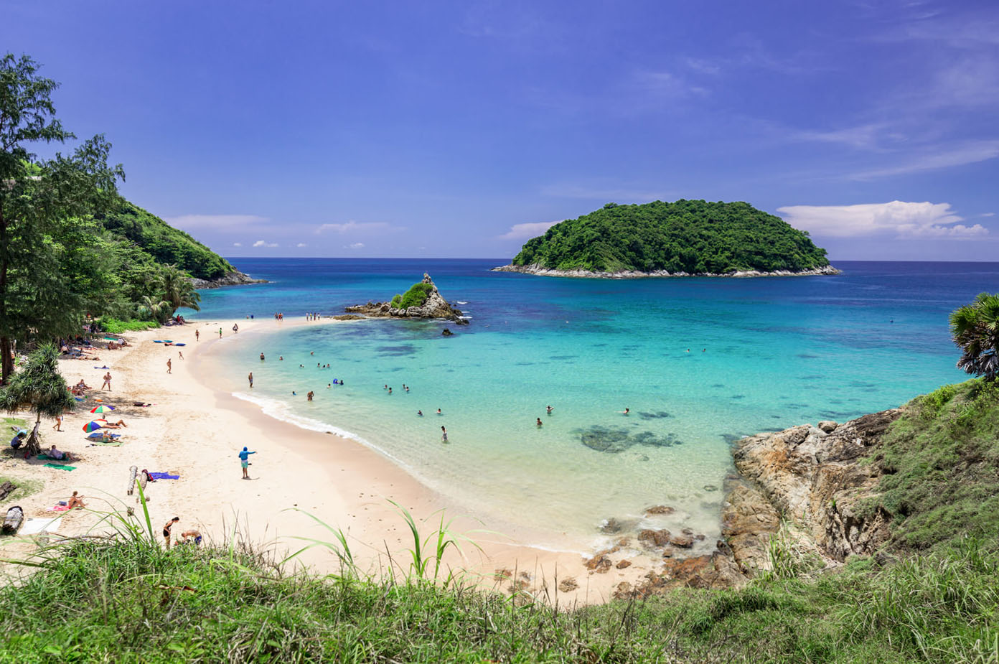
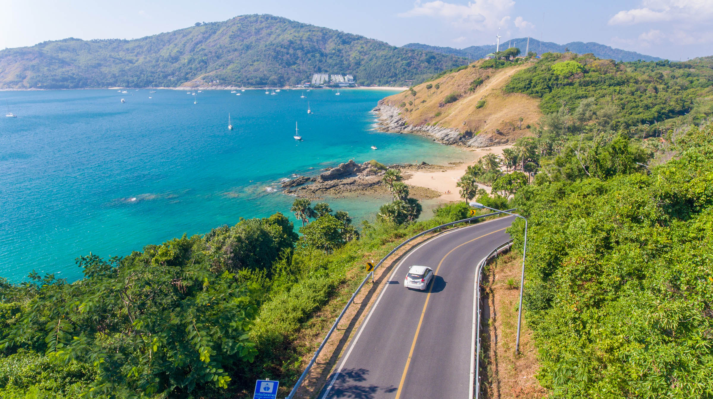

Когда можно посетить:  
**В любое время**

Цена:  
**Бесплатно. Лежак стоит 150 бат**

## Немного о достопримечательности
Пляж Януи очень маленький, в длину всего 100 метров. Зато пляж знаменит прозрачной, чистой водой и интересным коралловым дном, где можно посмотреть на обитателей подводного мира Андаманского моря. Помимо прекрасного снорклинга, Януи славиться своими закатами, считающимися лучшими на Пхукете.

Атмосфера на пляже уютная и спокойная, людей не так много, но в пик сезона становиться людно. Януи хорошо подходит для семейного отдыха.

Каменная гряда делит пляж на 2 части. Вход в воду песчаный, купаться удобно, но чуть подальше от берега дно становиться каменной. Из-за этого во время отливов купаться уже не так комфортно, поэтому лучше приезжать во время приливов. На пляже есть мелководная зона, где могут купаться дети. 

## Инфраструктура 
На пляж есть все необходимое для комфортного отдыха. Можно арендовать шезлонг за 150 бат или воспользоваться лежаком кафе, купив у них напиток. Но никто вам не запретит разложить плед в тени деревьев или на середине пляжа. 

Можно взять в прокат снаряжение для снорклинга за 100 бат в день и исследовать коралловые рифы, все таки это одно из лучших мест для снорклинга на Пхукете. Еще можно арендовать каяк или гидроцикл и поплыть на ближайший остров Ко Ман, там вода еще чище, но нет пляжа.

В пляжном кафе можно купить соки, смузи и прочие прохладительные напитки. Но большая часть кафешек и ресторанов находится примерно в 500 метрах от пляжа. В пик сезона по пляжу ходят навязчивые продавцы фруктов и сувениров.
 

## Информация для посещения
До пляжа можно добраться только на своем транспорте или такси, для машин возле дороги есть платная парковка, а байки оставляют возле пляжа.

Перед поездкой узнайте когда отлив на [специальном сайте](https://www.tide-forecast.com/locations/Phuket/tides/latest), иначе купаться будет неудобно.

Рядом с пляжем есть смотровая площадка Yanui View Point, где можно встретить закат, но если хотите вид получше, то поднимитесь на [смотровую площадку “Ветряки”](https://we-travel.today/smotrovaya-ploshadka-vetryaki/). Еще чуть южнее находится еще одна знаменитая обзорная площадка [Мыс Промтеп](https://we-travel.today/mys-promtep/).